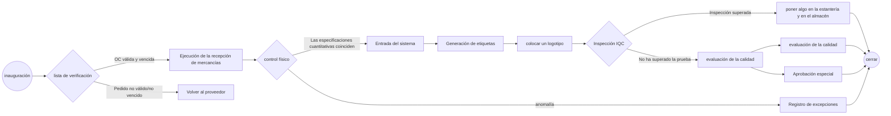
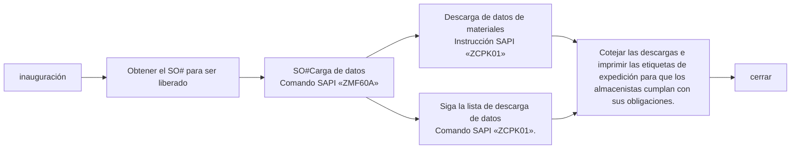

# Procesos y prácticas de almacenamiento

## Recepción de material
## Procesos estandarizados de recepción
### Resumen de procesos

### 1. Operaciones de comprobación de pedidos (operaciones del sistema SAP)
* **Sistema SAP**
    - Introduzca el código de operación `ZME2O'.
    - Introduzca la información de la orden de entrega en los campos «Centro» y «PO».
    - Haga clic en el icono del despertador en la esquina superior izquierda 🕥 o pulse `F8` para ejecutar
    - Comprobación cuádruple de la información clave:
       - ✅ Coherencia del código de material
       - ✅ Coherencia de la cantidad de pedido
       - ✅ Validez de la fecha de entrega (comparar FECHA OA).
       - ✅ Coherencia del plazo de entrega del sistema y del etiquetado físico
    - [ZME2O.gif](https://github.com/dlelyw/VTX_6501/blob/0ecf0e8decf70686fdc0656ab4f7a64b32ba7241/files/gif/ZME2O.gif)

> **Manejo de excepciones**:
> 🚨 Cuando exista un «PO countless/no delivery date», suspender inmediatamente el proceso de recepción y contactar con el proveedor para coordinar el proceso.

### 2. Especificación del recuento de puntos de recepción
1. Comparación a tres bandas:
   - Etiquetas físicas de embalaje
   - Albarán del proveedor
   - Pedido del sistema SAP
2. inspección de la calidad del aspecto
   - 🔍 Comprobar la integridad del embalaje
   - ⚠️ Descartar anomalías como deformaciones/daños/humedad, etc.
3. Operaciones posteriores a la firma
   - Operación posterior a la firma: Etiquetar la ubicación de la zona de inspección (formato: `QA01` o `QA02`).
   - Los envíos se trasladan a la zona de inspección amarilla
   

### 3. Operaciones de contabilización de entrada
* **WMS 4.2 **
    1. Introducción de datos:
       - Introducir Nº de factura → Nº de Packing List → Nº de PO → `[Enter]` en orden.
    2. Empaquetado:
       - Haga coincidir el número/cantidad de material físico en el área de vista superior derecha.
       - El cursor se posiciona en el campo de cantidad de recepción
    3. Confirmación de la información de embalaje:
       - Introduzca las especificaciones reales de embalaje de llegada (número de cajas/unidades de embalaje)
    4. Funcionamiento del sistema:
       - Haga clic en `[Save]` para generar el número de lote.  
       - Escriba el número de lote generado en el documento.
    5. [InRT_101.gif](https://github.com/dlelyw/VTX_6501/blob/78761c82f6bacd105d83a0eeb12adb896d5ab8bc/files/gif/InRT_101.gif)       

> **Prompt**:
> Temporary Storage Warehouse Enquiry Instruction: ZMM138 Los lotes vencidos no contabilizados se transfieren automáticamente al estado de almacenamiento temporal Esperando la caducidad Se aceptan en el almacén normal y, a continuación, se pasa el pedido a IQC.

### 4. Especificaciones de Colocación de Etiquetas
* Posicionamiento de la etiqueta.
    - Esquina superior derecha del envase Área limpia de 30cm
    - Colocación de la etiqueta: área limpia de 30cm en la esquina superior derecha del embalaje exterior ≥ 5cm del borde para evitar la abrasión.
* Requisitos de colocación.
    - Una etiqueta para cada artículo, no cubra el logotipo original de fábrica.
    - El número de lote tiene que ser visible en su totalidad
 

### 5. Proceso IQC para la transcripción
* **WMS 4.2**
    - Navegue hasta el menú de funciones:  
        - `Location` → `Move location` → `Introducir lote` → `Introducir nueva ubicación` → `Guardar`
    - Especificación de la introducción del número de lote :
        - Requisitos de formato: 10 dígitos fijos
        - Reglas complementarias: complemento inicial «0».  
        - Ejemplo: lote original «1234567» → introducir «00001234567».
     - [Movelocation323.gif](https://github.com/dlelyw/VTX_6501/blob/78761c82f6bacd105d83a0eeb12adb896d5ab8bc/files/gif/Movelocation323.gif)

> **archivo adjunto**  **<a href="https://github.com/dlelyw/VTX_6501/blob/0ecf0e8decf70686fdc0656ab4f7a64b32ba7241/files/gif/Download%20File%20Example.gif">Ejemplo de todas las descargas de archivos</a>**
- **categoría de software**
- [WMS.exe](https://github.com/dlelyw/VTX_6501/blob/19b5c6346e674e532626e966f523b64e8f6b57c0/files/apps/WMS.exe)
- [DFMS.exe （Servicios de impresión MES）](https://github.com/dlelyw/VTX_6501/blob/78761c82f6bacd105d83a0eeb12adb896d5ab8bc/files/apps/DFMS.exe)
- [Hairpin Label Printing Software.exe](https://github.com/dlelyw/VTX_6501/blob/78761c82f6bacd105d83a0eeb12adb896d5ab8bc/files/apps/Hairpin%20Label%20Printing%20Software.exe)
- [Herramienta de inicio de sesión específica.exe](https://github.com/dlelyw/VTX_6501/blob/78761c82f6bacd105d83a0eeb12adb896d5ab8bc/files/apps/Herramienta%20de%20inicio%20de%20sesión%20específica.exe)
- [wms_release_1.3.7.apk （versión móvil）](https://github.com/dlelyw/VTX_6501/blob/78761c82f6bacd105d83a0eeb12adb896d5ab8bc/files/apps/wms_release_1.3.7.apk)
- [dlelwprint.exe（Impresión de texto arbitrario）](https://github.com/dlelyw/VTX_6501/blob/78761c82f6bacd105d83a0eeb12adb896d5ab8bc/files/apps/dlelwprint.exe)
- [MESAPP_PRO.apk（Versión móvil de MES）](https://github.com/dlelyw/VTX_6501/blob/78761c82f6bacd105d83a0eeb12adb896d5ab8bc/files/apps/MESAPP_PRO.apk)
- [dlelyw.exe（versión alternativa）](https://github.com/dlelyw/VTX_6501/blob/78761c82f6bacd105d83a0eeb12adb896d5ab8bc/files/apps/dlelyw.exe)
- **Herramientas en línea**
- [web_MES](http://10.97.245.205:92/login)
- [web_MES_apk](http://10.97.245.205:93)
- [web_translator](https://www.deepl.com/zh/translator)
- **clase de archivo**
- [Invoice Number Lookup Guide.pdf](https://github.com/dlelyw/VTX_6501/blob/19b5c6346e674e532626e966f523b64e8f6b57c0/files/pdf/Invoice%20Number%20Lookup%20Guide.pdf)  
- [MES Receiving.pdf](https://github.com/dlelyw/VTX_6501/blob/78761c82f6bacd105d83a0eeb12adb896d5ab8bc/files/pdf/MES%20Receiving.pdf)

---

# Volver al proveedor
## Resumen del proceso

    

## 1. Retornos iniciados por el sistema
* **Frecuencia de ejecución**: operación diaria temporizada
  1. Acceder al sistema Notes y SAP
  2. Ir al módulo Devoluciones
  3. Descargar la lista de devoluciones del día
  4. Recoger estas devoluciones en el almacén de RTV
> **Pistas**:
> Un almacén de RTV es un área o almacén de un almacén dedicado a la mercancía de devolución al proveedor (RTV). Es un eslabón importante de la cadena de suministro y de la gestión de almacenes para almacenar y gestionar la mercancía que debe devolverse a los proveedores.

## 2. Proceso de recogida de devoluciones

### 2.1 Proceso de recogida de devoluciones MRB
* **Inicio de sesión en el sistema y descarga de información
   - Abra el sistema Notes y busque el menú `MX IQC Inspection Document on... `
   - Busque el botón `Gen Report` y haga clic sobre él, seleccione el número de serie `5 Sotre Reject Report`.
   - Siga la información descargada hasta el IQC para recoger la devolución.
   - [RTV_MRB.gif](https://github.com/dlelyw/VTX_6501/blob/d82ba10a0527b64e0d6fc44a51e3f5ec0db2ce7d/files/gif/RTV_MRB.gif)
### 2.2 Proceso de recogida de devoluciones de RN
* **Información de acceso al sistema y descarga**
   - Abra SAP e introduzca el código de transacción `ZIMWH`.
   - Introduzca `6501` en el campo `Plant`.
   - Haga clic en el icono del despertador en la esquina superior izquierda 🕥 o pulse `F8` para ejecutar.
   - Seleccione todos los datos a devolver y descárguelos en un formulario local.
   - Vaya a la sala de RN de IQC para recoger las devoluciones en el contenedor de RTV según la lista de devoluciones.
   - [RTV_RN.gif](https://github.com/dlelyw/VTX_6501/blob/d82ba10a0527b64e0d6fc44a51e3f5ec0db2ce7d/files/gif/RTV_RN.gif)

## 3 Devoluciones en la papelera de devoluciones
* **Sistema SAP**
   - Abra SAP Introduzca el código de transacción `MB1B`.
   - Introduzca `Doc.Header Text en el campo Enter date and return type` → `Plant enter 6501` → `Movement type enter 311` → `Storage Loation enter JB01(RN)/JA01(MRB)`.
   - Pulse Intro en el teclado para pasar a la siguiente pantalla
   - Introduzca `Material introduzca el número de material` → `Quantity introduzca la cantidad` → `Batch introduzca el lote` → `Rcvg SLoc introduzca el destino del movimiento` en el campo
   - Guardar
   - [RTV_movelocation.gif](https://github.com/dlelyw/VTX_6501/blob/d82ba10a0527b64e0d6fc44a51e3f5ec0db2ce7d/files/gif/RTV_movelocation.gif)

## 4 Devuelto al proveedor
* **Sistema de notas
    - Abra el sistema Notes y busque el menú «Orden de entregaMX en MEXCMS11».
    - Seleccione `Nuevo` en la esquina superior izquierda y haga clic en
    - Rellene los datos:
         1. Haga clic en el botón `add` en la parte central izquierda para seleccionar el proveedor o material a devolver.
         2. `Goods Ready Pick Date * :` Haga clic en ambos para seleccionar la fecha de devolución. 3. Haga clic en `Region * :`.
         3. `Región * :` Seleccione el lugar donde desea devolver la mercancía.
         4. `CC to PUR/PMT *: `Copie el correo electrónico al PUR y PMT correspondientes.
         5. `Prepago *:` Seleccione `No`.
         6. `Carrier *:` Seleccione o introduzca `LOCAL`.
         7. Seleccione el responsable de aprobación correspondiente
    - Enviar a PUT o PMT para su aprobación
    - Imprima dos copias del formulario de devolución (dos firmadas por el proveedor, una para el almacén y otra para el proveedor). 
    - No hay ejemplo para el 6591. La operación es la misma con el 9291. [RTV_tovender_9291.gif](https://github.com/dlelyw/VTX_6501/blob/d82ba10a0527b64e0d6fc44a51e3f5ec0db2ce7d/files/gif/RTV_tovender_9291.gif)

---
# Despacho de órdenes de trabajo

## Despacho de órdenes de trabajo «SO
### Resumen del proceso

### 1. Ver los formularios de órdenes de trabajo «SO» que necesitan ser liberados.
* **Sistema de notas***
    - Correo electrónico para ver la lista diaria de PMC de liberaciones de órdenes de trabajo para el día en cuestión `SO release form For 2/13a (B1)/(B2)`
    - Crear localmente una tabla con sólo dos columnas`Plant` `SO`
    - Ponga todas las órdenes de trabajo que necesitan ser liberadas en un `save` Excel local.
    - [SO_released_order_list.gif](https://github.com/dlelyw/VTX_6501/blob/68caeff4796d38c39a59355d96ecc5e7a46c8f6f/files/gif/SO_released_order_list.gif)
    - [Release of SO.xls](https://github.com/dlelyw/VTX_6501/blob/68caeff4796d38c39a59355d96ecc5e7a46c8f6f/files/Release%20of%20SO.xls)

### 2. Cargar las órdenes de trabajo en el sistema SAP
* **Sistema SAP
    - Abrir SAP Introducir código de transacción `ZMF60A`
    - pulse`Scanner Issue Order`botones
    - Selección de botones de radio`Upload` 
    - Coloque la ruta de Excel guardada en el primer paso en el campo`File Name`Cuadro de entrada después de
    - Haz clic en el icono del despertador de la esquina superior izquierda 🕥 o pulsa `F8` para ejecutarlo
    - [SO_released_order_UP.gif](https://github.com/dlelyw/VTX_6501/blob/68caeff4796d38c39a59355d96ecc5e7a46c8f6f/files/gif/SO_released_order_UP.gif)

::: alert-danger
**Nota**:
Todos los números de orden de trabajo cargados en SAP necesitan ser todos exitosos antes de que puedan ser liberados, si fallan, usted necesita encontrar PMC para tratar con él inmediatamente. La situación general es que el SO# se borra, o no se libera.
:::

### 3. Imprimir información de envío

#### 1. Imprimir información de despacho
* **Sistema SAP
    - Abra SAP e introduzca el código de transacción`ZCPK01A`
    - existe`Plant` Entrada `6501`.
    - `Production Order` Introducir el número de orden de trabajo a liberar puede introducirse en varias líneas Entrada por el mismo conjunto de órdenes de trabajo
    - `sort by` opción `summarized Pick list`Todo lo demás no es una opción.
    - Haz clic en el icono del despertador de la esquina superior izquierda 🕥 o pulsa `F8` para ejecutarlo
    - Seleccione el menú de la esquina superior izquierda`List`  → `Print` → `Seleccione la impresora en la que desea imprimir` → Selección del tiempo de impresión`Immediately`
    - O pulse el atajo de teclado`Ctrl + P`
    - [SO_released_order_print.gif](https://github.com/dlelyw/VTX_6501/blob/68caeff4796d38c39a59355d96ecc5e7a46c8f6f/files/gif/SO_released_order_print.gif)

#### 2. Imprimir información de la «lista de paquetes
* **Sistema SAP
    - Abra SAP e introduzca el código de transacción.`ZCPK01A`
    - existe`Plant` Entrada `6501`.
    - `Production Order` Introducir el número de orden de trabajo a liberar puede introducirse en varias líneas Entrada por el mismo conjunto de órdenes de trabajo
    - `sort by` opción `Follow list` Todo lo demás no es una opción.
    - Haz clic en el icono del despertador de la esquina superior izquierda 🕥 o pulsa `F8` para ejecutarlo
    - Seleccione el menú de la esquina superior izquierda`List`  → `Print` → `Seleccione la impresora en la que desea imprimir` → Selección del tiempo de impresión`Immediately`
    - O pulse el atajo de teclado `Ctrl + P`.
    - [SO_released_order_print_pick_list.gif](https://github.com/dlelyw/VTX_6501/blob/68caeff4796d38c39a59355d96ecc5e7a46c8f6f/files/gif/SO_released_order_print_pick_list.gif)

### 4. Descargue la información localmente
#### 1. Descargar las etiquetas a imprimir
* **Sistema SAP
    - Abra SAP e introduzca el código de transacción.`ZCPK01A`
    - existe`Plant` Entrada `6501`.
    - `Production Order` Introducir el número de orden de trabajo a liberar puede introducirse en varias líneas Entrada por el mismo conjunto de órdenes de trabajo
    - `sort by` opción `summarized Pick list`Todo lo demás no es una opción.
    - Haz clic en el icono del despertador de la esquina superior izquierda 🕥 o pulsa `F8` para ejecutarlo
    - Seleccione el menú de la esquina superior izquierda`List`  → `Save/Send` → `Local Flie..` →`Text with Tabs`
    - Seleccione la ubicación de almacenamiento Formato Seleccione el formato de Excel
    - [SO_released_order_print_downexcle.gif](https://github.com/dlelyw/VTX_6501/blob/68caeff4796d38c39a59355d96ecc5e7a46c8f6f/files/gif/SO_released_order_print_downexcle.gif)
    
#### 2. descargando "Follow List"
* **Sistema SAP
    - Abra SAP e introduzca el código de transacción.`ZCPK01A`
    - existe`Plant` importación `6501`
    - `Production Order` Introducir el número de orden de trabajo a liberar puede introducirse en varias líneas Entrada por el mismo conjunto de órdenes de trabajo
    - `sort by` opción `Follow list` responder cantando `Follow list > 0` Todo lo demás no es una opción.
    - Haz clic en el icono del despertador de la esquina superior izquierda 🕥 o pulsa `F8` para ejecutarlo
    - `Follow list` El archivo se guarda automáticamente en la carpeta`Follow list > 0`Vaya a la dirección de la ruta junto a
    - Busque esta información y envíela a PMC.
    - [SO_released_order_print_followlist.gif](https://github.com/dlelyw/VTX_6501/blob/68caeff4796d38c39a59355d96ecc5e7a46c8f6f/files/gif/SO_released_order_print_followlist.gif)
 
#### 3. Descarga de información SMT
* **Sistema SAP**
    - Abra la lista SO enviada por PMC
    - Copie la descripción específica SMT del SO que comienza con PCB y SMD y termina con capa R.
        - Método 1 `CO03` Los SO# individuales pueden descargarse Los SO# no liberados también pueden descargarse
            - Abrir SAP Introducir código de transacción`CO03`
            - Haga doble clic en este SO para entrar en la pantalla de detalles
            - Haga clic en el icono de la barra de herramientas denominado`Component Overview`
            - Haz clic de nuevo.`Component`icono
            - Haga clic con el botón derecho del ratón para descargar la información en su ordenador.
        - Método 2 `ZCPK01` Múltiples descargas por lotes de SO# Es necesario liberarlos y cargarlos antes de descargarlos
            - Abrir SAP Introducir código de transacción`ZCPK01A`
            - existe`Plant` importación `6501`
            - `Production Order` Introducir el número de orden de trabajo a liberar puede introducirse en varias líneas Entrada por el mismo conjunto de órdenes de trabajo
            - `sort by` opción `Follow list` Todo lo demás no es una opción.
            - Haz clic en el icono del despertador de la esquina superior izquierda 🕥 o pulsa `F8` para ejecutarlo
            - Guardar datos localmente
        - Organizar los datos SMT descargados
        - Sólo necesita el número de material y la cantidad y elimina el material con cantidad cero y el material con R8 al final del número de material.
        - utilizar[SmtAutoCalculated.xls](https://github.com/dlelyw/VTX_6501/blob/1aa59501516b797085faff3d34d238b0180b1f1f/files/SmtAutoCalculated.xls)Datos calculados
        - Hacer un documento de distribución según la plantilla[Sample SMT warehouse information.xls](https://github.com/dlelyw/VTX_6501/blob/1aa59501516b797085faff3d34d238b0180b1f1f/files/Sample%20SMT%20warehouse%20information.xls)
        - Hay un archivo de vídeo de 10 minutos en dos paquetes. Descárgalo localmente y descomprímelo [smt_document.7z.001](https://github.com/dlelyw/VTX_6501/blob/61d592a90bb72a70cf308b40459955676a4896af/files/mp4/smt_document.7z.001) [smt_document.7z.002](https://github.com/dlelyw/VTX_6501/blob/61d592a90bb72a70cf308b40459955676a4896af/files/mp4/smt_document.7z.002)

### 5. Imprimir etiquetas de expedición
* **dlelywpp_Impresión de etiquetas de horquilla programa***
    - Abrir el material descargado
    - Guardar como archivo Excle
    - Abrir el programa `dlelywpp_Impresión de etiquetas de horquilla.exe`
    - Arrastrar y soltar archivos en el software
    - Imprima todas las etiquetas
    - [Hairpin Label Printing Software.exe](https://github.com/dlelyw/VTX_6501/blob/78761c82f6bacd105d83a0eeb12adb896d5ab8bc/files/apps/Hairpin%20Label%20Printing%20Software.exe)
    - [SO_released_order_printlable.gif](https://github.com/dlelyw/VTX_6501/blob/650857b8bae306f793834e8798b6d0e8f078812c/files/gif/SO_released_order_printlable.gif)

> **archivo adjunto**<a href="https://github.com/dlelyw/VTX_6501/blob/0ecf0e8decf70686fdc0656ab4f7a64b32ba7241/files/gif/Download%20File%20Example.gif">Ejemplo de todas las descargas de archivos</a>**
- **clase de archivo**
- [Guidelines for Printing Warehouse Dispatch Labels（bilingualism）.pdf](https://github.com/dlelyw/VTX_6501/blob/b14a691dc7da014fbe7fc158a1661fea28ffd2f2/files/pdf/Guidelines%20for%20Printing%20Warehouse%20Dispatch%20Labels（bilingualism）.pdf)
- [SMT Dispatch Guidelines.pdf](https://github.com/dlelyw/VTX_6501/blob/b14a691dc7da014fbe7fc158a1661fea28ffd2f2/files/pdf/SMT%20Dispatch%20Guidelines.pdf)
