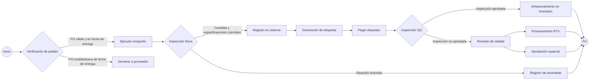
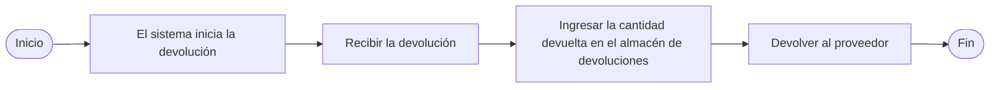
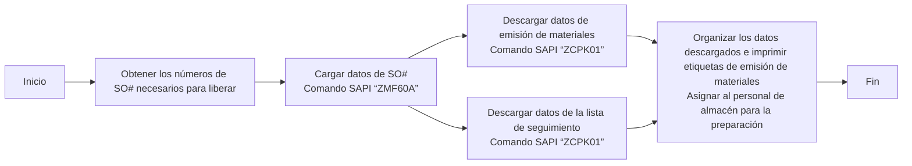
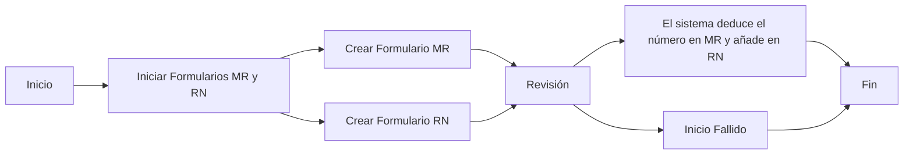

# Procesos y prácticas de almacén

# Recepción
## Resumen de procesos

## 1. Verificación de pedidos (Operación del sistema SAP)
*  **Sistema SAP**
    - Ingrese el código de transacción `ZME2O`
    - En los campos "Plant" y "PO", ingrese la información de la guía de entrega
    - Haga clic en el ícono de alarma en la esquina superior izquierda 🕥 o presione `F8` para ejecutar
    - Verificación de cuatro puntos clave:
       - ✅ Consistencia del código de material
       - ✅ Consistencia de la cantidad del pedido
       - ✅ Validez de la fecha de entrega (comparar con OA DATE)
       - ✅ Consistencia entre la fecha de entrega del sistema y la etiqueta física
    - [ZME2O.gif](https://github.com/dlelyw/VTX_6501/blob/main/files/gif/ZME2O.gif)

> **Manejo de excepciones**:
> 🚨 Si aparece "PO sin número/fuera de la fecha de entrega", detenga inmediatamente el proceso de recepción y contacte al proveedor para coordinar la solución

## 2. Normas de conteo de recepción
1. Verificación triple:
   - Etiqueta del embalaje físico
   - Guía de entrega del proveedor
   - Pedido del sistema SAP
2. Inspección de calidad externa:
   - 🔍 Verificar la integridad del embalaje
   - ⚠️ Excluir anomalías como deformación/rotura/humedad
3. Operaciones posteriores a la firma:
   - Colocar la etiqueta de ubicación en el área de inspección pendiente (formato: `QA01` o `QA02`)
   - Transferir los productos al área de inspección pendiente (área amarilla)
   

## 3. Operación de contabilización de entrada al almacén
*  **Sistema WMS 4.2**
    1. Ingreso de datos:
       - Ingrese en orden: número de factura → número de empaque → número de PO → `[ Enter ]`
    2. Coincidencia de contenedores:
       - En la vista superior derecha, coincidir el número de material/cantidad física
       - Posicionar el cursor en el campo de cantidad recibida
    3. Confirmación de información de empaque:
       - Ingresar las especificaciones reales del empaque recibido (número de cajas/unidad de empaque)
    4. Operación del sistema:
       - Hacer clic en `[ Guardar ]` para generar el número de lote  
       - Escribir el número de lote generado en el documento
    5. [InRT_101.gif](https://github.com/dlelyw/VTX_6501/blob/main/files/gif/InRT_101.gif)       

> **Nota**:
> Comando de consulta de almacén temporal: ZMM138 Los lotes no contabilizados después de la fecha límite se transferirán automáticamente al almacén temporal, esperando a ser transferidos al almacén normal y luego enviados a IQC

## 4. Normas de colocación de etiquetas
*  Ubicación de la etiqueta:
    - Área limpia de 30 cm en la esquina superior derecha del embalaje exterior
    - Zona de protección contra desgaste a ≥5 cm del borde
*  Requisitos de colocación:
    - Una etiqueta por artículo, prohibido cubrir las identificaciones originales del fabricante
    - El número de lote debe ser completamente visible
 

## 5. Proceso de transferencia a IQC
* **Sistema WMS 4.2**
    - Navegue al menú de funciones:  
        - `Location` → `Move location` → `Ingresar lote`→ `Ingresar nueva ubicación`→ `Guardar`
    - Normas de ingreso del número de lote:
        - Formato requerido: 10 dígitos fijos
        - Regla de relleno: rellenar con "0" al principio  
        - Ejemplo: Lote original "1234567" → Ingresar "00001234567"
     - [Movelocation323.gif](https://github.com/dlelyw/VTX_6501/blob/main/files/gif/Movelocation323.gif)

> **Anexos** **<a href="https://github.com/dlelyw/VTX_6501/blob/main/files/gif/Download%20File%20Example.gif">Ejemplo de descarga de todos los archivos</a>**
- **Software**
- [WMS.exe](https://github.com/dlelyw/VTX_6501/blob/main/files/apps/WMS.exe)
- [DFMS.exe （Servicio de impresión MES）](https://github.com/dlelyw/VTX_6501/blob/main/files/apps/DFMS.exe)
- [Hairpin Label Printing Software.exe](https://github.com/dlelyw/VTX_6501/blob/main/files/apps/Hairpin%20Label%20Printing%20Software.exe)
- [Herramienta de inicio de sesión específica.exe](https://github.com/dlelyw/VTX_6501/blob/main/files/apps/Herramienta%20de%20inicio%20de%20sesión%20específica.exe)
- [wms_release_1.3.7.apk （Versión móvil）](https://github.com/dlelyw/VTX_6501/blob/main/files/apps/wms_release_1.3.7.apk)
- [dlelwprint.exe（Impresión de texto arbitrario）](https://github.com/dlelyw/VTX_6501/blob/main/files/apps/dlelwprint.exe)
- [MESAPP_PRO.apk（Versión móvil de MES）](https://github.com/dlelyw/VTX_6501/blob/main/files/apps/MESAPP_PRO.apk)
- [dlelyw.exe（Versión de respaldo）](https://github.com/dlelyw/VTX_6501/blob/main/files/apps/dlelyw.exe)
- **Herramientas en línea**
- [web_MES](http://10.97.245.205:92/login)
- [web_MES_apk](http://10.97.245.205:93)
- [web_translator](https://www.deepl.com/zh/translator)
- **Documentos**
- [Invoice Number Lookup Guide.pdf](https://github.com/dlelyw/VTX_6501/blob/main/files/pdf/Invoice%20Number%20Lookup%20Guide.pdf)  
- [MES Receiving.pdf](https://github.com/dlelyw/VTX_6501/blob/main/files/pdf/MES%20Receiving.pdf)

---

# Volver al proveedor
## Resumen del proceso

    

## 1. Devoluciones iniciadas por el sistema
* **Frecuencia de ejecución**: Operación programada diariamente
  1. Iniciar sesión en los sistemas Notes y SAP
  2. Acceder al módulo de "Devoluciones"
  3. Descargar la lista de devoluciones del día
  4. Recoger estas devoluciones y llevarlas al almacén RTV
> **Nota**:
> El almacén RTV es un área o almacén específico dedicado a gestionar las devoluciones a proveedores (Return To Vendor, RTV). Es un eslabón crucial en la gestión de la cadena de suministro y almacenes, principalmente utilizado para almacenar y gestionar productos que deben ser devueltos a los proveedores.

## 2. Procesamiento de devoluciones recogidas

### 2.1 Proceso de recogida de devoluciones MRB
* **Inicio de sesión en el sistema y descarga de datos**
   - Abrir el sistema Notes y localizar el menú `MX IQC Inspection Document on...`
   - Hacer clic en el botón `Gen Report` y seleccionar la opción `5 Store Reject Report`
   - Utilizar los datos descargados para recoger las devoluciones de IQC
   - [RTV_MRB.gif](https://github.com/dlelyw/VTX_6501/blob/main/files/gif/RTV_MRB.gif)

### 2.2 Proceso de recogida de devoluciones RN
* **Inicio de sesión en el sistema y descarga de datos**
   - Abrir SAP e ingresar el código de transacción `ZIMWH`
   - En el campo "Plant", ingresar `6501`
   - Hacer clic en el ícono de alarma 🕥 en la esquina superior izquierda o presionar `F8` para ejecutar
   - Seleccionar todos los datos de devolución pendientes y descargarlos a una hoja de cálculo local
   - Seguir la lista de devoluciones para recoger los productos de la sala RN de IQC y llevarlos al almacén RTV
   - [RTV_RN.gif](https://github.com/dlelyw/VTX_6501/blob/main/files/gif/RTV_RN.gif)

## 3. Ingreso de cantidades de devolución en el almacén de devoluciones
* **Sistema SAP**
   - Abrir SAP e ingresar el código de transacción `MB1B`
   - En los campos, ingresar `Doc.Header Text` (fecha y tipo de devolución) → `Plant` (ingresar `6501`) → `Movement type` (ingresar `311`) → `Storage Location` (ingresar `JB01` para RN o `JA01` para MRB)
   - Presionar Enter para pasar a la siguiente pantalla
   - En los campos, ingresar `Material` (número de material) → `Quantity` (cantidad) → `Batch` (número de lote) → `Rcvg SLoc` (ubicación de destino)
   - Guardar
   - [RTV_movelocation.gif](https://github.com/dlelyw/VTX_6501/blob/main/files/gif/RTV_movelocation.gif)

## 4. Devolución de productos a proveedores
* **Sistema Notes**
    - Abrir el sistema Notes y localizar el menú `MX Delivery Order on MEXCMS11`
    - Hacer clic en el botón `New` en la esquina superior izquierda
    - Rellenar los datos:
         1. Hacer clic en el botón `add` en la sección media-izquierda para seleccionar el proveedor o material a devolver
         2. `Goods Ready Pick Date *:` Hacer clic en ambos campos y seleccionar la fecha de devolución
         3. `Region *:` Seleccionar la ubicación de devolución
         4. `CC to PUR/PMT *:` Copiar el correo electrónico a los responsables de PUR y PMT
         5. `Prepayment *:` Seleccionar `No`
         6. `Carrier *:` Seleccionar o ingresar `LOCAL`
         7. Seleccionar el aprobador correspondiente
    - Enviar a PUT o PMT para su aprobación
    - Imprimir dos copias del formulario de devolución (el proveedor firma ambas, una para el almacén y otra para el proveedor)
    - No hay ejemplo para 6591; usar 9291 ya que la operación es la misma [RTV_tovender_9291.gif](https://github.com/dlelyw/VTX_6501/blob/main/files/gif/RTV_tovender_9291.gif)
       
---

# Despacho de materiales de la orden de trabajo

## Proceso de liberación de la orden de venta "SO"
### Resumen del proceso

# Despacho de materiales de la orden de trabajo

## Proceso de liberación de la orden de venta "SO"
### Resumen del proceso

### 1. Verificar la lista de órdenes "SO" que necesitan ser liberadas
* **Sistema Notes**
    - Revisar el correo electrónico para ver la lista de liberación de órdenes enviada por PMC diariamente. Generalmente tiene el formato `SO release form For 2/13a (B1)/(B2)`.
    - Crear una tabla local con dos columnas: `Plant` y `SO`.
    - Copiar todas las órdenes que necesitan ser liberadas en un archivo Excel local y guardarlo.
    - [SO_released_order_list.gif](https://github.com/dlelyw/VTX_6501/blob/main/files/gif/SO_released_order_list.gif)
    - [Release of SO.xls](https://github.com/dlelyw/VTX_6501/blob/main/files/Release%20of%20SO.xls)

### 2. Cargar las órdenes en el sistema SAP
* **Sistema SAP**
    - Abrir SAP e ingresar el código de transacción `ZMF60A`.
    - Presionar el botón `Scanner Issue Order`.
    - Seleccionar la opción `Upload`.
    - Colocar la ruta del archivo Excel guardado en el campo `File Name`.
    - Hacer clic en el ícono de reloj 🕥 en la esquina superior izquierda o presionar `F8` para ejecutar.
    - [SO_released_order_UP.gif](https://github.com/dlelyw/VTX_6501/blob/main/files/gif/SO_released_order_UP.gif)

::: alert-danger
**Nota**:
Todas las órdenes cargadas en SAP deben ser exitosas. Si alguna falla, es necesario contactar a PMC inmediatamente. Los errores comunes incluyen que el número de SO haya sido eliminado o no esté liberado.
:::

### 3. Imprimir la documentación de despacho

#### 1. Imprimir la documentación de despacho
* **Sistema SAP**
    - Abrir SAP e ingresar el código de transacción `ZCPK01A`.
    - En `Plant`, ingresar `6501`.
    - En `Production Order`, ingresar los números de las órdenes que necesitan ser liberadas (se pueden ingresar múltiples órdenes).
    - En `sort by`, seleccionar `summarized Pick list`. No seleccionar ninguna otra opción.
    - Hacer clic en el ícono de reloj 🕥 o presionar `F8` para ejecutar.
    - Seleccionar `List` → `Print` → `Seleccionar la impresora` → `Immediately`.
    - O presionar `Ctrl + P`.
    - [SO_released_order_print.gif](https://github.com/dlelyw/VTX_6501/blob/main/files/gif/SO_released_order_print.gif)

#### 2. Imprimir la lista de empaque ("pack list")
* **Sistema SAP**
    - Abrir SAP e ingresar el código de transacción `ZCPK01A`.
    - En `Plant`, ingresar `6501`.
    - En `Production Order`, ingresar los números de las órdenes que necesitan ser liberadas (se pueden ingresar múltiples órdenes).
    - En `sort by`, seleccionar `Follow list`. No seleccionar ninguna otra opción.
    - Hacer clic en el ícono de reloj 🕥 o presionar `F8` para ejecutar.
    - Seleccionar `List` → `Print` → `Seleccionar la impresora` → `Immediately`.
    - O presionar `Ctrl + P`.
    - [SO_released_order_print_pick_list.gif](https://github.com/dlelyw/VTX_6501/blob/main/files/gif/SO_released_order_print_pick_list.gif)

### 4. Descargar la documentación a local

#### 1. Descargar la documentación para imprimir etiquetas
* **Sistema SAP**
    - Abrir SAP e ingresar el código de transacción `ZCPK01A`.
    - En `Plant`, ingresar `6501`.
    - En `Production Order`, ingresar los números de las órdenes que necesitan ser liberadas (se pueden ingresar múltiples órdenes).
    - En `sort by`, seleccionar `summarized Pick list`. No seleccionar ninguna otra opción.
    - Hacer clic en el ícono de reloj 🕥 o presionar `F8` para ejecutar.
    - Seleccionar `List` → `Save/Send` → `Local File...` → `Text with Tabs`.
    - Seleccionar la ubicación de guardado y el formato Excel.
    - [SO_released_order_print_downexcle.gif](https://github.com/dlelyw/VTX_6501/blob/main/files/gif/SO_released_order_print_downexcle.gif)

#### 2. Descargar la lista de seguimiento ("Follow List")
* **Sistema SAP**
    - Abrir SAP e ingresar el código de transacción `ZCPK01A`.
    - En `Plant`, ingresar `6501`.
    - En `Production Order`, ingresar los números de las órdenes que necesitan ser liberadas (se pueden ingresar múltiples órdenes).
    - En `sort by`, seleccionar `Follow list` y `Follow list > 0`. No seleccionar ninguna otra opción.
    - Hacer clic en el ícono de reloj 🕥 o presionar `F8` para ejecutar.
    - El archivo `Follow list` se guardará automáticamente en la ruta especificada junto a `Follow list > 0`.
    - Enviar este archivo a PMC.
    - [SO_released_order_print_followlist.gif](https://github.com/dlelyw/VTX_6501/blob/main/files/gif/SO_released_order_print_followlist.gif)

#### 3. Descargar la documentación para SMT
* **Sistema SAP**
    - Abrir la lista de SO enviada por PMC.
    - Copiar las descripciones específicas para SMT que comienzan con "PCB" o "SMD" y terminan con "R".
        - Método 1: Usar `CO03` para descargar un solo SO# (incluso si no está liberado).
            - Abrir SAP e ingresar el código de transacción `CO03`.
            - Hacer doble clic en el SO para ver los detalles.
            - Hacer clic en el ícono `Component Overview`.
            - Luego, hacer clic en el ícono `Component`.
            - Hacer clic derecho para descargar el archivo localmente.
        - Método 2: Usar `ZCPK01` para descargar múltiples SO# (solo si están liberados y cargados).
            - Abrir SAP e ingresar el código de transacción `ZCPK01A`.
            - En `Plant`, ingresar `6501`.
            - En `Production Order`, ingresar los números de las órdenes que necesitan ser liberadas (se pueden ingresar múltiples órdenes).
            - En `sort by`, seleccionar `Follow list`. No seleccionar ninguna otra opción.
            - Hacer clic en el ícono de reloj 🕥 o presionar `F8` para ejecutar.
            - Guardar el archivo localmente.
        - Organizar los datos descargados para SMT.
        - Solo se necesitan el número de material y la cantidad. Eliminar los materiales con cantidad cero y aquellos que terminen con "R8".
        - Usar [SmtAutoCalculated.xls](https://github.com/dlelyw/VTX_6501/blob/main/files/SmtAutoCalculated.xls) para calcular los datos.
        - Crear un documento de despacho siguiendo la plantilla [Sample SMT warehouse information.xls](https://github.com/dlelyw/VTX_6501/blob/main/files/Sample%20SMT%20warehouse%20information.xls).
        - Hay un video de 10 minutos dividido en 2 partes que se puede descargar y ver localmente: [smt_document.7z.001](https://github.com/dlelyw/VTX_6501/blob/main/files/mp4/smt_document.7z.001) y [smt_document.7z.002](https://github.com/dlelyw/VTX_6501/blob/main/files/mp4/smt_document.7z.002).

### 5. Imprimir etiquetas de despacho
* **Programa dlelywpp_Impresión de etiquetas de horquilla**
    - Abrir el archivo descargado.
    - Guardarlo como un archivo Excel.
    - Abrir el software `dlelywpp_Impresión de etiquetas de horquilla.exe`.
    - Arrastrar el archivo al software.
    - Imprimir todas las etiquetas.
    - [Hairpin Label Printing Software.exe](https://github.com/dlelyw/VTX_6501/blob/main/files/apps/Hairpin%20Label%20Printing%20Software.exe)
    - [SO_released_order_printlable.gif](https://github.com/dlelyw/VTX_6501/blob/main/files/gif/SO_released_order_printlable.gif)

> **Anexos** **<a href="https://github.com/dlelyw/VTX_6501/blob/0ecf0e8decf70686fdc0656ab4f7a64b32ba7241/files/gif/Download%20File%20Example.gif">Ejemplo de descarga de archivos</a>**
- **Documentos**
- [Guidelines for Printing Warehouse Dispatch Labels（bilingualism）.pdf](https://github.com/dlelyw/VTX_6501/blob/main/files/pdf/Guidelines%20for%20Printing%20Warehouse%20Dispatch%20Labels（bilingualism）.pdf)
- [SMT Dispatch Guidelines.pdf](https://github.com/dlelyw/VTX_6501/blob/main/files/pdf/SMT%20Dispatch%20Guidelines.pdf)

---

# Control de Inventario

## Formularios MR y RN
### Resumen del Proceso

### 1. Abrir MR o RN
* **Sistema Notes y SAP**
    - Abrir el sistema `MX MR & RN`
    - Hacer clic en el botón `New MR` si es RN, hacer clic en `NEW RN`
    - En `Select Type`, seleccionar `Departmental Drawing` y luego hacer clic en el botón `OK`
    - Seleccionar `Reason Code` (según sea necesario)
    - Seleccionar el departamento
    - Ingresar el número de línea de producción (si es para el departamento de producción)
    - En `Customer`, ingresar el código del cliente correspondiente
    - En `Remake`, ingresar notas
    - En `PN` y `Qty`, ingresar el número de pieza y la cantidad
    - Si hay demasiados datos, se puede usar la herramienta `Import` para importar los datos necesarios, solo se necesita completar el número de pieza y la cantidad en la tabla
    - Después de completar los pasos anteriores, iniciar la aprobación y esperar a que los líderes correspondientes aprueben antes de usar SAP
    - **MR**
        - En SAP, ingresar el código de transacción `ZMMMR`
        - En `MR NO`, ingresar el número generado por el MR, y en `Plant`, ingresar 6501
        - En la interfaz, marcar los materiales que necesitan ser deducidos
        - Hacer clic en `Post Goods Issue`
    - **RN**
        - En SAP, ingresar el código de transacción `ZRNWH`
        - En `MR/RN Number`, ingresar el número generado por el RN, y en `Plant`, ingresar 6501
        - En la interfaz, marcar los materiales que necesitan ser ingresados
        - En la barra de herramientas, seleccionar `Select Batch`
        - Luego marcar este material, en `SLoc` ingresar la ubicación y hacer clic en `OK`
        - Hacer clic en `Post Goods Issue`
    - [mr_new.gif](https://github.com/dlelyw/VTX_6501/blob/main/files/gif/mr_new.gif)
    - [mr_deductions.gif](https://github.com/dlelyw/VTX_6501/blob/main/files/gif/mr_deductions.gif)

**Códigos de razón comunes para MR** Los aprobadores son los responsables del departamento correspondiente (todos los tipos de RN no se seleccionan)

| Número | Código | Departamento | Número de línea de producción | Notas |
| ------ | ------ | ------------ | ---------------------------- | ----- |
| 1      | SA     | Almacén      |                              | Ajuste de inventario, desviación de inventario periódico, ajuste de materiales compartidos |
| 2      | SA     | Producción   |                              | PROD DISCREPANCY + B9821201680 Discrepancia de producción + número de discrepancia |
| 3      | LB     | Almacén      |                              | Para empaquetar luces LED 43 |
| 4      | LB     | SMT          | 1035                         | 012986,012247,012082,011530,k10098,KLA881,KOA879 Placas adicionales devueltas al almacén |
| 5      | LE     | SMT          | 1001                         | 8/7/2024 Ajuste de materiales compartidos para SMD |
| 6      | GF     | PMC          |                              | Material sin demanda, desecho. |
| 7      | G0     | PMC          |                              | Enviar a inspección aduanera, no usar baterías antes del informe de inspección. |
| 8      | G3     | PMC          |                              | Ajuste de muestras enviadas para pruebas, ajuste de productos de desgaste enviados |

**Códigos de razón comunes para RN** Los aprobadores son los responsables del departamento correspondiente (todos los tipos de RN seleccionan "Return to warehouse")

| Número | Código | Departamento | Número de línea de producción | Notas |
| ------ | ------ | ------------ | ---------------------------- | ----- |
| 1      | SA     | Almacén      |                              | Desviación de inventario periódico de agosto, materiales buenos ingresados al almacén, ajuste de materiales compartidos (materiales PASS no necesitan revisión de IOC) |
| 2      | LE     | SMT          | 1001                         | Ajuste de materiales compartidos para producción (materiales PASS no necesitan revisión de IOC) |
| 3      | G0     | Almacén      |                              | Ajuste de materiales compartidos para producción (materiales PASS no necesitan revisión de IOC) |
| 4      | G0     | PMC          |                              | Empaques recuperados de NEC, materiales buenos ingresados al almacén |

## Inventario periódico de materiales
### Materiales de clase A inventariados mensualmente
* **Frecuencia de ejecución** **`Mensual`**
    - **Sistema SAP**
    - Ingresar el código de transacción `ZPP096`
    - Ingresar `6501` en el campo `Plant`
    - Seleccionar la casilla `Only 80% Material`
    - Hacer clic en el ícono de reloj 🕥 en la esquina superior izquierda o presionar `F8` para ejecutar
    - Guardar los datos localmente
    - Organizar los datos e imprimir (primero ordenar por número de pieza, luego por ubicación)
    - [stock_Aitems.gif](https://github.com/dlelyw/VTX_6501/blob/main/files/gif/stock_Aitems.gif)

### Materiales valiosos con prefijo 02 15 29 inventariados cada dos semanas
* **Frecuencia de ejecución** **`Cada dos semanas`**
    - **Sistema SAP**
    - Ingresar el código de transacción `MB52`
    - En el campo `Material`, ingresar `02*` en una línea, `15*` en otra y `29*` en otra
    - Ingresar `6501` en el campo `Plant`
    - Hacer clic en el ícono de reloj 🕥 en la esquina superior izquierda o presionar `F8` para ejecutar
    - Guardar los datos localmente
    - Organizar los datos (usar la herramienta de suma automática de SMT)
    - Imprimir los datos
    - [stock_02.gif](https://github.com/dlelyw/VTX_6501/blob/main/files/gif/stock_02.gif)

---

::: alert-success
**Conjunto de comandos SAP**
> [SAP_Code.md](https://github.com/dlelyw/VTX_6501/blob/main/files/SAP_Code.md)
:::

--- 

# Entrada y Salida de Productos Terminados
## Resumen del Proceso

## FG IN
### Escaneo de SN de FG para almacenamiento
* **Versión móvil de WMS**
    - Recibir el pedido FG y los productos terminados del departamento de producción.
    - Primero, ejecutar VTS para el pedido FG:
        1. **Verificar el estado de la orden de trabajo**
            - Ingresar el código de transacción `CO03`.
            - Verificar si la tercera palabra en `Sys.Status` es `DLV`. DLV indica que VTS ha confirmado la finalización de la orden de trabajo; de lo contrario, es necesario ejecutar VTS.
        2. **Deducción de cantidades**
            - Abrir una ventana separada en SAP e ingresar el código de transacción `ZMB1A`.
            - Ingresar `6501` en el campo `Plant`.
            - En `Order`, ingresar todas las órdenes de trabajo vistas en `CO03`.
            - Hacer clic en el ícono de reloj 🕥 en la esquina superior izquierda o presionar `F8` para ejecutar.
        3. **Ejecutar VTS**
            - Abrir el sistema MES [MES](http://10.224.245.101:8080/Index.aspx#).
            - Navegar hasta la última opción del menú `SAP`.
            - Seleccionar `A02.Confirmation`.
            - En `Order Number:`, ingresar el número de la orden de trabajo (confirmar la producción de abajo hacia arriba según las órdenes de trabajo vistas en `CO03`).
            - **Presionar Enter**.
            - En `Quantity:`, ingresar la cantidad a confirmar.
            - Hacer clic en `Save`. El resultado se mostrará en `Result[SAP message]`.
            - Volver a SAP `CO03` y actualizar.
            - Verificar `Sys.Status`; la tercera palabra debería ser ahora `DLV`.
            - [vts.png](https://github.com/dlelyw/VTX_6501/blob/main/files/png/vts.png)
    - **Almacenamiento**
        1. Escaneo con PDA para almacenamiento  [wms.apk (Versión móvil)](https://github.com/dlelyw/VTX_6501/blob/main/files/apps/wms_release_1.3.7.apk)
            - Iniciar sesión en el PDA (Dirección del servidor: 10.224.245.101:8085).
            - Seleccionar el menú `01-FG In`.
            - En `SN Type`, seleccionar Customer SN.
            - En `FG No`, ingresar el número del pedido FG.
            - En `Doc No`, ingresar el número del documento. Si no hay, ingresar los últimos 4 dígitos del número de la orden de trabajo.
            - En `FG Order`, ingresar el número de la orden de trabajo.
            - Presionar Enter.
            - `Total Qty` se completará automáticamente con la cantidad.
            - En `P/N`, ingresar el número de parte del producto terminado.
            - En `Location`, ingresar la ubicación.
            - En `Scan SN`, escanear el número de la caja del producto terminado.
            - Después de escanear todos los números de caja, guardar. [pda_fgin01.png](https://github.com/dlelyw/VTX_6501/blob/main/files/png/pda_fgin01.png) [pda_fgin02.png](https://github.com/dlelyw/VTX_6501/blob/main/files/png/pda_fgin02.png)
        2. Entrada manual en SAP (Solo para clientes que no requieren números de caja)
            - Ingresar el código de transacción `MB31` en SAP. [mb31.png](https://github.com/dlelyw/VTX_6501/blob/main/files/png/mb31.png)
            - En `Movement Type`, ingresar 101.
            - En `Order`, ingresar el número de la orden de trabajo.
            - En `Plant`, ingresar 6501.
            - En `Storage Loc.`, ingresar la ubicación de almacenamiento.
            - Presionar Enter.
            - Luego modificar la cantidad a ingresar.
            - Guardar.
            - Aparecerá un mensaje para generar un número de caja.
            - Hacer clic en el botón inferior derecho de la barra de herramientas para generar automáticamente un número de caja.
            - Guardar.

## FG OUT
### Escaneo de SN de FG para salida
* **Verificar la lista de envíos**
    - Ingresar el código de transacción `ZSP1A` en SAP.
    - En `Planned GI Date`, ingresar una fecha unos días antes.
    - En `Shipping Point`, ingresar S650.
    - En `Sales Organization`, ingresar 6501.
    - En `GI Status`, ingresar A (A indica no completado).
    - Hacer clic en el ícono de reloj 🕥 en la esquina superior izquierda o presionar `F8` para ejecutar.
    - [ZSP1A.png](https://github.com/dlelyw/VTX_6501/blob/main/files/png/ZSP1A.png)
* **Salida**
    1. Escaneo con PDA para salida
        - Iniciar sesión en el PDA (Dirección del servidor: 10.224.245.101:8085).
        - Seleccionar el menú `03-FG Out`.
        - En `SN Type`, seleccionar Customer SN.
        - En `DN`, ingresar el número de DN.
        - Presionar Enter.
        - `DN Qty` se completará automáticamente con la cantidad.
        - En `Scan SN`, escanear el número de la caja del producto terminado.
        - `Scan Qty` contará automáticamente los números de caja escaneados.
        - Guardar. [pad_fgout.png](https://github.com/dlelyw/VTX_6501/blob/main/files/png/pad_fgout.png)
            - La interfaz de envío de SAP sincronizará automáticamente el estado `Pick Up`.
            - Si no se sincroniza durante mucho tiempo,
            - Usar el código de transacción `ZSD046` en SAP.
            - En `Sales Organization`, ingresar 6501.
            - En `DN`, ingresar el número de DN de envío.
            - Hacer clic en el ícono de reloj 🕥 en la esquina superior izquierda o presionar `F8` para ejecutar.
            - Luego actualizar la interfaz de envío para ver el estado `Pick Up` como exitoso (C).
            - [ZSD046.png](https://github.com/dlelyw/VTX_6501/blob/main/files/png/ZSD046.png)
    2. Salida manual en SAP (Solo para clientes que no requieren números de caja o para recogida propia)
        - Ingresar el código de transacción `ZSP1A` en SAP.
        - En `Planned GI Date`, ingresar una fecha unos días antes.
        - En `Shipping Point`, ingresar S650.
        - En `Sales Organization`, ingresar 6501.
        - En `GI Status`, ingresar A (A indica no completado).
        - Hacer clic en el ícono de reloj 🕥 en la esquina superior izquierda o presionar `F8` para ejecutar.
        - Referirse a esta imagen (si es un producto terminado, seleccionar el número de caja). [fg_handcarry.gif](https://github.com/dlelyw/VTX_6501/blob/main/files/gif/fg_handcarry.gif)

## RMA
* **Sistema SAP**
    - **Entrada de orden de trabajo normal**
        - Consultar el número de orden de trabajo normal para esta RMA, generalmente en el formato 65100006335.
        - Usar el número de orden de trabajo normal para ingresar la cantidad en el sistema usando el código de transacción MB31 en SAP.
        - En `Movement Type`, ingresar 101.
        - En `Order`, ingresar el número de orden de trabajo normal.
        - En `Plant`, ingresar el almacén correspondiente.
        - En `Storage Loc.`, ingresar la ubicación de almacenamiento.
        - Hacer clic en el ícono de reloj 🕥 en la esquina superior izquierda o presionar `F8` para ejecutar.
        - Luego proceder a la interfaz de información de entrada.
        - Ingresar la cantidad a ingresar y presionar Enter.
        - [rma_1.png](https://github.com/dlelyw/VTX_6501/blob/main/files/png/rma_1.png) [rma_2.png](https://github.com/dlelyw/VTX_6501/blob/main/files/png/rma_2.png)
    - **Deducción de cantidad a la orden de retrabajo**
        - Usar el código de transacción MB1A en SAP.
        - En `Movement Type`, ingresar 261.
        - En `Plant`, ingresar 6501.
        - En `Storage Location`, ingresar FG01.
        - Buscar `To Order`, hacer clic en él e ingresar el número de orden de retrabajo.
        - Luego guardar.
        - Las operaciones posteriores son las mismas que el escaneo normal para entrada.
        - [vts_p_3.png](https://github.com/dlelyw/VTX_6501/blob/main/files/png/vts_p_3.png)

## Transferencia manual de cantidades para materiales auxiliares
* **Sistema SAP**
    - Usar `CO03` en SAP para verificar la orden de trabajo. Los números de parte que terminan en P*** indican ejecutar VTS para el departamento de producción (de abajo hacia arriba).
    - Abrir el SAP del departamento de producción e ingresar `CO11N`. Ingresar SO# y presionar Enter.
    - En `Order`, ingresar el número de la orden de trabajo.
    - Hacer clic en `Actual Data`.
    - Luego hacer clic en `Goods Movements`.
    - Seleccionar todos los datos.
    - Hacer clic en `batch determination` para confirmar.
    - Luego guardar.
    - [vts_p_1.png](https://github.com/dlelyw/VTX_6501/blob/main/files/png/vts_p_1.png) [vts_p_2.png](https://github.com/dlelyw/VTX_6501/blob/main/files/png/vts_p_2.png) [vts_p_3.png](https://github.com/dlelyw/VTX_6501/blob/main/files/png/vts_p_3.png)