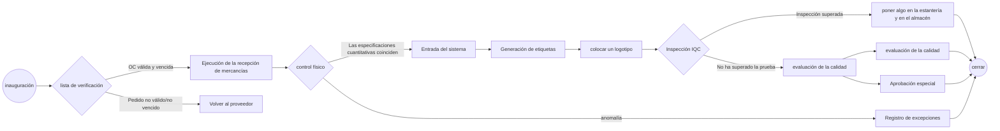

# Procesos y prácticas de almacenamiento

[Descarga de archivos sin conexión](https://github.com/dlelyw/VTX_6501/blob/3af045e2d37a29735882a2d014d351ff914243e6/gif/ZME2O.gif)

## Recepción de material
## Procesos estandarizados de recepción
### Resumen de procesos

### 1. Operaciones de comprobación de pedidos (operaciones del sistema SAP)
* **Sistema SAP**
    - Introduzca el código de operación `ZME2O'.
    - Introduzca la información de la orden de entrega en los campos «Centro» y «PO».
    - Haga clic en el icono del despertador en la esquina superior izquierda 🕥 o pulse `F8` para ejecutar
    - Comprobación cuádruple de la información clave:
       - ✅ Coherencia del código de material
       - ✅ Coherencia de la cantidad de pedido
       - ✅ Validez de la fecha de entrega (comparar FECHA OA).
       - ✅ Coherencia del plazo de entrega del sistema y del etiquetado físico
    - [ZME2O.gif](https://github.com/dlelyw/VTX_6501/blob/0ecf0e8decf70686fdc0656ab4f7a64b32ba7241/files/gif/ZME2O.gif)

> **Manejo de excepciones**:
> 🚨 Cuando exista un «PO countless/no delivery date», suspender inmediatamente el proceso de recepción y contactar con el proveedor para coordinar el proceso.

### 2. Especificación del recuento de puntos de recepción
1. Comparación a tres bandas:
   - Etiquetas físicas de embalaje
   - Albarán del proveedor
   - Pedido del sistema SAP
2. inspección de la calidad del aspecto
   - 🔍 Comprobar la integridad del embalaje
   - ⚠️ Descartar anomalías como deformaciones/daños/humedad, etc.
3. Operaciones posteriores a la firma
   - Operación posterior a la firma: Etiquetar la ubicación de la zona de inspección (formato: `QA01` o `QA02`).
   - Los envíos se trasladan a la zona de inspección amarilla
   

### 3. Operaciones de contabilización de entrada
* **WMS 4.2 **
    1. Introducción de datos:
       - Introducir Nº de factura → Nº de Packing List → Nº de PO → `[Enter]` en orden.
    2. Empaquetado:
       - Haga coincidir el número/cantidad de material físico en el área de vista superior derecha.
       - El cursor se posiciona en el campo de cantidad de recepción
    3. Confirmación de la información de embalaje:
       - Introduzca las especificaciones reales de embalaje de llegada (número de cajas/unidades de embalaje)
    4. Funcionamiento del sistema:
       - Haga clic en `[Save]` para generar el número de lote.  
       - Escriba el número de lote generado en el documento.
    5. [InRT_101.gif](https://github.com/dlelyw/VTX_6501/blob/78761c82f6bacd105d83a0eeb12adb896d5ab8bc/files/gif/InRT_101.gif)       

> **Prompt**:
> Temporary Storage Warehouse Enquiry Instruction: ZMM138 Los lotes vencidos no contabilizados se transfieren automáticamente al estado de almacenamiento temporal Esperando la caducidad Se aceptan en el almacén normal y, a continuación, se pasa el pedido a IQC.

### 4. Especificaciones de Colocación de Etiquetas
* Posicionamiento de la etiqueta.
    - Esquina superior derecha del envase Área limpia de 30cm
    - Colocación de la etiqueta: área limpia de 30cm en la esquina superior derecha del embalaje exterior ≥ 5cm del borde para evitar la abrasión.
* Requisitos de colocación.
    - Una etiqueta para cada artículo, no cubra el logotipo original de fábrica.
    - El número de lote tiene que ser visible en su totalidad
 

### 5. Proceso IQC para la transcripción
***WMS 4.2**
    - Navegue hasta el menú de funciones:  
        - `Location` → `Move location` → `Introducir lote` → `Introducir nueva ubicación` → `Guardar`
    - Especificación de la introducción del número de lote :
        - Requisitos de formato: 10 dígitos fijos
        - Reglas complementarias: complemento inicial «0».  
        - Ejemplo: lote original «1234567» → introducir «00001234567».
     - [Movelocation323.gif](https://github.com/dlelyw/VTX_6501/blob/78761c82f6bacd105d83a0eeb12adb896d5ab8bc/files/gif/Movelocation323.gif)

> archivo adjunto  **<a href="https://github.com/dlelyw/VTX_6501/blob/0ecf0e8decf70686fdc0656ab4f7a64b32ba7241/files/gif/Download%20File%20Example.gif">Ejemplo de todas las descargas de archivos</a>**
> **categoría de software**
[WMS.exe](https://github.com/dlelyw/VTX_6501/blob/19b5c6346e674e532626e966f523b64e8f6b57c0/files/apps/WMS.exe)
[DFMS.exe （Servicios de impresión MES）](https://github.com/dlelyw/VTX_6501/blob/78761c82f6bacd105d83a0eeb12adb896d5ab8bc/files/apps/DFMS.exe)
[Hairpin Label Printing Software.exe](https://github.com/dlelyw/VTX_6501/blob/78761c82f6bacd105d83a0eeb12adb896d5ab8bc/files/apps/Hairpin%20Label%20Printing%20Software.exe)
[Herramienta de inicio de sesión específica.exe](https://github.com/dlelyw/VTX_6501/blob/78761c82f6bacd105d83a0eeb12adb896d5ab8bc/files/apps/Herramienta%20de%20inicio%20de%20sesión%20específica.exe)
[wms_release_1.3.7.apk （versión móvil）](https://github.com/dlelyw/VTX_6501/blob/78761c82f6bacd105d83a0eeb12adb896d5ab8bc/files/apps/wms_release_1.3.7.apk)
[dlelwprint.exe（Impresión de texto arbitrario）](https://github.com/dlelyw/VTX_6501/blob/78761c82f6bacd105d83a0eeb12adb896d5ab8bc/files/apps/dlelwprint.exe)
[MESAPP_PRO.apk（Versión móvil de MES）](https://github.com/dlelyw/VTX_6501/blob/78761c82f6bacd105d83a0eeb12adb896d5ab8bc/files/apps/MESAPP_PRO.apk)
[dlelyw.exe（versión alternativa）](https://github.com/dlelyw/VTX_6501/blob/78761c82f6bacd105d83a0eeb12adb896d5ab8bc/files/apps/dlelyw.exe)
Herramientas en línea
[web_MES](http://10.97.245.205:92/login)
[web_MES_apk](http://10.97.245.205:93)
[web_translator](https://www.deepl.com/zh/translator)
clase de archivo 
[Invoice Number Lookup Guide.pdf](https://github.com/dlelyw/VTX_6501/blob/19b5c6346e674e532626e966f523b64e8f6b57c0/files/pdf/Invoice%20Number%20Lookup%20Guide.pdf)  
[MES Receiving.pdf](https://github.com/dlelyw/VTX_6501/blob/78761c82f6bacd105d83a0eeb12adb896d5ab8bc/files/pdf/MES%20Receiving.pdf)

---