# Warehouse processes and practices

# Receiving
## Process overview

## 1. Check Order Operation (SAP System Operation)
*  **SAP System**
    - Enter transaction code `ZME2O`
    - Input delivery note information in the "Plant" and "PO" fields
    - Click the alarm clock icon 🕥 at the top left or press `F8` to execute
    - Key information verification:
       - ✅ Material code consistency
       - ✅ Order quantity consistency
       - ✅ Delivery date validity (compare with OA DATE)
       - ✅ System delivery date matches physical label
    - [ZME2O.gif](https://github.com/dlelyw/VTX_6501/blob/main/files/gif/ZME2O.gif)

> **Exception Handling**:
> 🚨 If "PO not found/delivery date not reached" appears, immediately pause the receiving process and contact the supplier for coordination

## 2. Receiving and Counting Standards
1. Three-way comparison:
   - Physical packaging label
   - Supplier delivery note
   - SAP system order
2. Appearance quality inspection:
   - 🔍 Check packaging integrity
   - ⚠️ Exclude deformities/damages/moisture anomalies
3. Post-receiving operations:
   - Attach the pending inspection area location label (format: `QA01` or `QA02`)
   - Transfer goods to the yellow pending inspection area
   

## 3. Inventory Posting Operation
*  **WMS 4.2 System**
    1. Data entry:
       - Enter invoice number → packing list number → PO number → `[ Enter ]`
    2. Container matching:
       - Match physical material number/quantity in the top-right view area
       - Position the cursor to the receiving quantity field
    3. Packaging information confirmation:
       - Enter actual arrival packaging specifications (number of boxes/packaging unit)
    4. System operation:
       - Click `[ Save ]` to generate a batch number  
       - Write the generated batch number on the document
    5. [InRT_101.gif](https://github.com/dlelyw/VTX_6501/blob/main/files/gif/InRT_101.gif)       

> **Tip**:
> Temporary storage query command: ZMM138 Overdue unposted batches are automatically transferred to temporary storage status, waiting for expiration, then received into normal storage and passed to IQC

---

# Return to Supplier
## Process overview

    

```mermaid
flowchart LR
    A([start]) --> B[“system initiated return”]
    B --> C[“Collect Returns”]
    C --> D[“Returns count into returns bin”]
    D --> E[“Returns to Vendor”]
    E --> F([end])
```

## 1. System-Initiated Returns
* **Execution Frequency**: Daily scheduled operation
  1. Log in to Notes and SAP systems
  2. Navigate to the "Returns" module
  3. Download the daily return list
  4. Collect these returns to the RTV warehouse
> **Note**:
> The RTV warehouse refers to a specific area or warehouse dedicated to handling Return To Vendor (RTV) goods. It is a crucial part of supply chain and warehouse management, primarily used for storing and managing goods that need to be returned to suppliers.

## 2. Handling Collected Returns

### 2.1 MRB Return Collection Process
* **System Login and Data Download**
   - Open the Notes system and locate the menu `MX IQC Inspection Document on...`
   - Click the `Gen Report` button and select option `5 Store Reject Report`
   - Use the downloaded data to collect returns from IQC
   - [RTV_MRB.gif](https://github.com/dlelyw/VTX_6501/blob/main/files/gif/RTV_MRB.gif)

### 2.2 RN Return Collection Process
* **System Login and Data Download**
   - Open SAP and enter transaction code `ZIMWH`
   - In the "Plant" field, enter `6501`
   - Click the alarm icon 🕥 in the top-left corner or press `F8` to execute
   - Select all pending return data and download it to a local spreadsheet
   - Follow the return list to collect returns from the IQC RN room and move them to the RTV warehouse
   - [RTV_RN.gif](https://github.com/dlelyw/VTX_6501/blob/main/files/gif/RTV_RN.gif)

## 3. Entering Return Quantities into the Return Warehouse
* **SAP System**
   - Open SAP and enter transaction code `MB1B`
   - In the fields, enter `Doc.Header Text` (input date and return type) → `Plant` (input `6501`) → `Movement type` (input `311`) → `Storage Location` (input `JB01` for RN or `JA01` for MRB)
   - Press Enter to proceed to the next screen
   - In the fields, enter `Material` (input material number) → `Quantity` (input quantity) → `Batch` (input batch number) → `Rcvg SLoc` (input destination location)
   - Save
   - [RTV_movelocation.gif](https://github.com/dlelyw/VTX_6501/blob/main/files/gif/RTV_movelocation.gif)

## 4. Returning Goods to Suppliers
* **Notes System**
    - Open the Notes system and locate the menu `MX Delivery Order on MEXCMS11`
    - Click the `New` button in the top-left corner
    - Fill in the data:
         1. Click the `add` button in the middle-left section to select the supplier or material to be returned
         2. `Goods Ready Pick Date *:` Click both fields and select the return date
         3. `Region *:` Select the return location
         4. `CC to PUR/PMT *:` Copy the email to the relevant PUR and PMT
         5. `Prepayment *:` Select `No`
         6. `Carrier *:` Select or enter `LOCAL`
         7. Select the appropriate approver
    - Submit to PUT or PMT for approval
    - Print two copies of the return form (supplier signs both, one for the warehouse and one for the supplier)
    - No example for 6591; use 9291 as the operation is the same [RTV_tovender_9291.gif](https://github.com/dlelyw/VTX_6501/blob/main/files/gif/RTV_tovender_9291.gif)

---

# Work Order Issuance

## Release "SO" Work Order Process
### Process Overview

```mermaid
graph LR
    A[Start] --> B[Obtain the SO# to be released]
    B --> C[Upload SO# data<br>SAPI command “ZMF60A”]
    C --> D[Download issuance data<br>SAPI command “ZCPK01”]
    C --> E[Download Follow list data<br>SAPI command “ZCPK01”]
    D --> F[Organize downloaded materials and print issuance labels<br>Provide to warehouse staff for execution]
    E --> F[Organize downloaded materials and print issuance labels<br>Provide to warehouse staff for execution]
    F --> G[End]
```

### 1. View the "SO" Work Order Table to be Released
* **Notes System**
    - Check the daily work order release list sent by PMC via email, usually titled `SO release form For 2/13a (B1)/(B2)`
    - Create a local table with only two columns: `Plant` and `SO`
    - Save all work orders to be released in a local Excel file
    - [SO_released_order_list.gif](https://github.com/dlelyw/VTX_6501/blob/main/files/gif/SO_released_order_list.gif)
    - [Release of SO.xls](https://github.com/dlelyw/VTX_6501/blob/main/files/Release%20of%20SO.xls)

### 2. Upload Work Orders to SAP System
* **SAP System**
    - Open SAP and enter transaction code `ZMF60A`
    - Click the `Scanner Issue Order` button
    - Select the `Upload` radio button
    - Enter the path of the Excel file saved in the first step in the `File Name` field
    - Click the alarm icon 🕥 in the top-left corner or press `F8` to execute
    - [SO_released_order_UP.gif](https://github.com/dlelyw/VTX_6501/blob/main/files/gif/SO_released_order_UP.gif)

::: alert-danger
**Note**:
All work order numbers uploaded to SAP must be successful. If any fail, contact PMC immediately for resolution. Common issues include deleted SO# or unapproved releases.
:::

### 3. Print Material Dispatch Documents

#### 1. Print Material Dispatch Documents
* **SAP System**
    - Open SAP and enter transaction code `ZCPK01A`
    - In the `Plant` field, enter `6501`
    - In the `Production Order` field, enter the work order numbers to be released (multiple lines allowed for the same set of work orders)
    - In `sort by`, select `summarized Pick list` and leave all other options unchecked
    - Click the alarm icon 🕥 in the top-left corner or press `F8` to execute
    - Select the top-left menu `List` → `Print` → `Choose the printer` → Set print time to `Immediately`
    - Alternatively, use the keyboard shortcut `Ctrl + P`
    - [SO_released_order_print.gif](https://github.com/dlelyw/VTX_6501/blob/main/files/gif/SO_released_order_print.gif)

#### 2. Print "Pack List" Documents
* **SAP System**
    - Open SAP and enter transaction code `ZCPK01A`
    - In the `Plant` field, enter `6501`
    - In the `Production Order` field, enter the work order numbers to be released (multiple lines allowed for the same set of work orders)
    - In `sort by`, select `Follow list` and leave all other options unchecked
    - Click the alarm icon 🕥 in the top-left corner or press `F8` to execute
    - Select the top-left menu `List` → `Print` → `Choose the printer` → Set print time to `Immediately`
    - Alternatively, use the keyboard shortcut `Ctrl + P`
    - [SO_released_order_print_pick_list.gif](https://github.com/dlelyw/VTX_6501/blob/main/files/gif/SO_released_order_print_pick_list.gif)

### 4. Download Documents Locally

#### 1. Download Pending Label Printing Data
* **SAP System**
    - Open SAP and enter transaction code `ZCPK01A`
    - In the `Plant` field, enter `6501`
    - In the `Production Order` field, enter the work order numbers to be released (multiple lines allowed for the same set of work orders)
    - In `sort by`, select `summarized Pick list` and leave all other options unchecked
    - Click the alarm icon 🕥 in the top-left corner or press `F8` to execute
    - Select the top-left menu `List` → `Save/Send` → `Local File..` → `Text with Tabs`
    - Choose the save location and select Excel format
    - [SO_released_order_print_downexcle.gif](https://github.com/dlelyw/VTX_6501/blob/main/files/gif/SO_released_order_print_downexcle.gif)

#### 2. Download Follow List
* **SAP System**
    - Open SAP and enter transaction code `ZCPK01A`
    - In the `Plant` field, enter `6501`
    - In the `Production Order` field, enter the work order numbers to be released (multiple lines allowed for the same set of work orders)
    - In `sort by`, select `Follow list` and `Follow list > 0`, and leave all other options unchecked
    - Click the alarm icon 🕥 in the top-left corner or press `F8` to execute
    - The `Follow list` file will automatically save to the path next to `Follow list > 0`
    - Locate this file and send it to PMC
    - [SO_released_order_print_followlist.gif](https://github.com/dlelyw/VTX_6501/blob/main/files/gif/SO_released_order_print_followlist.gif)

#### 3. SMT Data Download
* **SAP System**
    - Open the SO list sent by PMC
    - Copy SOs with descriptions starting with PCB or SMD and ending with R layer
        - Method 1: `CO03` (Can download single SO#, including unapproved SO#)
            - Open SAP and enter transaction code `CO03`
            - Double-click the SO to enter the details page
            - Click the toolbar icon named `Component Overview`
            - Click the `Component` icon again
            - Right-click to download the data locally
        - Method 2: `ZCPK01` (Can batch download multiple SO#, requires release and upload)
            - Open SAP and enter transaction code `ZCPK01A`
            - In the `Plant` field, enter `6501`
            - In the `Production Order` field, enter the work order numbers to be released (multiple lines allowed for the same set of work orders)
            - In `sort by`, select `Follow list` and leave all other options unchecked
            - Click the alarm icon 🕥 in the top-left corner or press `F8` to execute
            - Save the data locally
        - Organize the downloaded SMT data
        - Keep only the material number and quantity, and delete materials with zero quantity and those ending with R8
        - Use [SmtAutoCalculated.xls](https://github.com/dlelyw/VTX_6501/blob/main/files/SmtAutoCalculated.xls) to calculate the data
        - Create a dispatch document based on the template [Sample SMT warehouse information.xls](https://github.com/dlelyw/VTX_6501/blob/main/files/Sample%20SMT%20warehouse%20information.xls)
        - A 10-minute video file is available in two parts. Download and extract to watch: [smt_document.7z.001](https://github.com/dlelyw/VTX_6501/blob/main/files/mp4/smt_document.7z.001) [smt_document.7z.002](https://github.com/dlelyw/VTX_6501/blob/main/files/mp4/smt_document.7z.002)

### 5. Print Dispatch Labels
* **dlelywpp_Hairpin Label Printing Software**
    - Open the downloaded data
    - Save it as an Excel file
    - Open the software `dlelywpp_Hairpin Label Printing Software.exe`
    - Drag and drop the file into the software
    - Print all labels
    - [Hairpin Label Printing Software.exe](https://github.com/dlelyw/VTX_6501/blob/main/files/apps/Hairpin%20Label%20Printing%20Software.exe)
    - [SO_released_order_printlable.gif](https://github.com/dlelyw/VTX_6501/blob/main/files/gif/SO_released_order_printlable.gif)

> **Attachments** **<a href="https://github.com/dlelyw/VTX_6501/blob/0ecf0e8decf70686fdc0656ab4f7a64b32ba7241/files/gif/Download%20File%20Example.gif">Download Example for All Files</a>**
- **Documents**
- [Guidelines for Printing Warehouse Dispatch Labels（bilingualism）.pdf](https://github.com/dlelyw/VTX_6501/blob/main/files/pdf/Guidelines%20for%20Printing%20Warehouse%20Dispatch%20Labels（bilingualism）.pdf)
- [SMT Dispatch Guidelines.pdf](https://github.com/dlelyw/VTX_6501/blob/main/files/pdf/SMT%20Dispatch%20Guidelines.pdf)

---

# Inventory Control

## MR and RN Forms
### Process Overview

### 1. Create MR or RN Form
* **Notes System and SAP System**
    - Open the `MX MR & RN` system
    - Click the `New MR` button, or `NEW RN` for RN
    - Select `Type` as `Departmental Drawing` and click `OK`
    - Choose `Reason Code` (as needed)
    - Select the department
    - Enter the production line number (if applicable for the production department)
    - Enter the corresponding customer code in `Customer`
    - Enter remarks in `Remake`
    - Enter part number and quantity in `PN` and `Qty`
    - If there are too many, use the `Import` tool to import the required data, only fill in the part number and quantity in the table
    - After completing the above steps, initiate the approval and wait for the relevant leaders to approve, then use SAP
    - **MR Form**
        - Enter transaction code `ZMMMR` in SAP
        - Enter the MR number generated in `MR NO` and `6501` in `Plant`
        - After entering the interface, check the materials that need to be deducted
        - Click `Post Goods Issue`
    - **RN Form**
        - Enter transaction code `ZRNWH` in SAP
        - Enter the RN number generated in `MR/RN Number` and `6501` in `Plant`
        - After entering the interface, check the materials that need to be added
        - Select `Select Batch` from the toolbar
        - Then check the material, enter the location in `SLoc`, and click `OK`
        - Click `Post Goods Issue`
    - [mr_new.gif](https://github.com/dlelyw/VTX_6501/blob/main/files/gif/mr_new.gif)
    - [mr_deductions.gif](https://github.com/dlelyw/VTX_6501/blob/main/files/gif/mr_deductions.gif)
    

**Common MR Form `Reason Codes`** The approver is the corresponding department head (All RN Types are not selected)

| No. | Code | Department | Production Line |                                            Remarks                                             |
| --- | ---- | ---------- | --------------- | ---------------------------------------------------------------------------------------------- |
| 1   | SA   | Warehouse  |                 | Inventory adjustment, periodic inventory discrepancies, shared material balancing              |
| 2   | SA   | Production |                 | PROD DISCREPANCY + B9821201680 Production discrepancy + discrepancy number                     |
| 3   | LB   | Warehouse  |                 | Used for packing 43LED lights                                                                  |
| 4   | LB   | SMT        | 1035            | 012986,012247,012082,011530,k10098,KLA881,KOA879 over-issued boards returned to warehouse      |
| 5   | LE   | SMT        | 1001            | 8/7/2024 SMD shared material balancing                                                         |
| 6   | GF   | PMC        |                 | No-demand materials, scrap disposal.                                                           |
| 7   | G0   | PMC        |                 | Sent to customs for inspection, batteries cannot be used before the test report is issued.     |
| 8   | G3   | PMC        |                 | Outsourced test material balancing, outsourced test material balancing, outsourced consumables |

**Common RN Form `Reason Codes`** Commonly used RN forms, the approver is the corresponding department head (All RN Types are selected as "Return to warehouse")

| No. | Code | Department | Production Line |                                                                          Remarks                                                                           |
| --- | ---- | ---------- | --------------- | ---------------------------------------------------------------------------------------------------------------------------------------------------------- |
| 1   | SA   | Warehouse  |                 | August periodic inventory discrepancies, good materials returned to warehouse, shared material balancing (PASS materials do not require IOC re-inspection) |
| 2   | LE   | SMT        | 1001            | Shared material balancing for machine operation (PASS materials do not require IOC re-inspection)                                                          |
| 3   | G0   | Warehouse  |                 | Shared material balancing for machine operation (PASS materials do not require IOC re-inspection)                                                          |
| 4   | G0   | PMC        |                 | NEC Recycling Package，good materials returned to warehouse                                                                                                 |

## Periodic Material Inventory
### Monthly Inventory for Category A Materials
* **Frequency** **`Monthly`**
    - **SAP System**
    - Enter transaction code `ZPP096`
    - Enter `6501` in the `Plant` field
    - Check the box `Only 80% Material`
    - Click the alarm clock icon 🕥 or press `F8` to execute
    - Save the data locally
    - Organize and print the data (sort by part number first, then by location)
    - [stock_Aitems.gif](https://github.com/dlelyw/VTX_6501/blob/main/files/gif/stock_Aitems.gif)

### Bi-weekly Inventory for High-value Materials Starting with 02, 15, 29
* **Frequency** **`Bi-weekly`**
    - **SAP System**
    - Enter transaction code `MB52`
    - In the `Material` field, enter `02*`, `15*`, and `29*` in separate lines
    - Enter `6501` in the `Plant` field
    - Click the alarm clock icon 🕥 or press `F8` to execute
    - Save the data locally
    - Organize the data (use SMT auto-sum tool for summation)
    - Print the data
    - [stock_02.gif](https://github.com/dlelyw/VTX_6501/blob/main/files/gif/stock_02.gif)

---
::: alert-success
**SAP Command Collection**
> [SAP_Code.md](https://github.com/dlelyw/VTX_6501/blob/main/files/SAP_Code.md)
:::

---

# Finished Goods Inbound and Outbound
## Process Overview

## FG IN
### FG Scan SN for Inbound
* **WMS Mobile Version**
    - Receive the FG order and finished goods from the production department.
    - First, run VTS for the FG order:
        1. **Check the status of the work order**
            - Enter transaction code `CO03` in SAP.
            - Check if the third word in `Sys.Status` is `DLV`. DLV indicates that VTS has confirmed the completion of the work order; otherwise, VTS needs to be run.
        2. **Deduct quantities**
            - Open a separate window in SAP and enter transaction code `ZMB1A`.
            - Enter `6501` in the `Plant` field.
            - In the `Order` field, enter all the work orders viewed in `CO03`.
            - Click the clock icon 🕥 in the top-left corner or press `F8` to execute.
        3. **Run VTS**
            - Open the MES system [MES](http://10.224.245.101:8080/Index.aspx#).
            - Navigate to the last menu item `SAP`.
            - Select `A02.Confirmation`.
            - In the `Order Number:` field, enter the work order number (confirm the output from the bottom to the top based on the work orders viewed in `CO03`).
            - **Press Enter**.
            - In the `Quantity:` field, enter the quantity to be confirmed.
            - Click `Save`. The result will be displayed in `Result[SAP message]`.
            - Return to SAP `CO03` and refresh.
            - Check `Sys.Status`; the third word should now be `DLV`.
            - [vts.png](https://github.com/dlelyw/VTX_6501/blob/main/files/png/vts.png)
    - **Inbound**
        1. PDA Scan for Inbound  [wms.apk (Mobile Version)](https://github.com/dlelyw/VTX_6501/blob/main/files/apps/wms_release_1.3.7.apk)
            - Log in to the PDA (Server address: 10.224.245.101:8085).
            - Select the menu `01-FG In`.
            - In `SN Type`, select Customer SN.
            - In `FG No`, enter the FG order number.
            - In `Doc No`, enter the document number. If there is none, enter the last 4 digits of the work order number.
            - In `FG Order`, enter the work order number.
            - Press Enter.
            - `Total Qty` will automatically populate with the quantity.
            - In `P/N`, enter the finished goods part number.
            - In `Location`, enter the location.
            - In `Scan SN`, scan the finished goods box number.
            - After scanning all box numbers, save. [pda_fgin01.png](https://github.com/dlelyw/VTX_6501/blob/main/files/png/pda_fgin01.png) [pda_fgin02.png](https://github.com/dlelyw/VTX_6501/blob/main/files/png/pda_fgin02.png)
        2. Manual Inbound in SAP (Only for customers who do not require box numbers)
            - Enter transaction code `MB31` in SAP. [mb31.png](https://github.com/dlelyw/VTX_6501/blob/main/files/png/mb31.png)
            - In `Movement Type`, enter 101.
            - In `Order`, enter the work order number.
            - In `Plant`, enter 6501.
            - In `Storage Loc.`, enter the inbound location.
            - Press Enter.
            - Then modify the quantity to be entered.
            - Save.
            - A prompt will appear to generate a box number.
            - Click the bottom-right button in the toolbar to automatically generate a box number.
            - Save.

## FG OUT
### FG Scan SN for Outbound
* **View Shipping List**
    - Enter transaction code `ZSP1A` in SAP.
    - In `Planned GI Date`, enter a date a few days prior.
    - In `Shipping Point`, enter S650.
    - In `Sales Organization`, enter 6501.
    - In `GI Status`, enter A (A indicates not completed).
    - Click the clock icon 🕥 in the top-left corner or press `F8` to execute.
    - [ZSP1A.png](https://github.com/dlelyw/VTX_6501/blob/main/files/png/ZSP1A.png)
* **Outbound**
    1. PDA Scan for Outbound
        - Log in to the PDA (Server address: 10.224.245.101:8085).
        - Select the menu `03-FG Out`.
        - In `SN Type`, select Customer SN.
        - In `DN`, enter the DN number.
        - Press Enter.
        - `DN Qty` will automatically populate with the quantity.
        - In `Scan SN`, scan the finished goods box number.
        - `Scan Qty` will automatically count the scanned box numbers.
        - Save. [pad_fgout.png](https://github.com/dlelyw/VTX_6501/blob/main/files/png/pad_fgout.png)
            - The SAP shipping interface will automatically synchronize the `Pick Up` status.
            - If synchronization does not occur for a long time,
            - Use SAP transaction code `ZSD046`.
            - In `Sales Organization`, enter 6501.
            - In `DN`, enter the shipping DN.
            - Click the clock icon 🕥 in the top-left corner or press `F8` to execute.
            - Then refresh the shipping interface to see the `Pick Up` status as successful (C).
            - [ZSD046.png](https://github.com/dlelyw/VTX_6501/blob/main/files/png/ZSD046.png)
    2. Manual Outbound in SAP (Only for customers who do not require box numbers or for self-pickup)
        - Enter transaction code `ZSP1A` in SAP.
        - In `Planned GI Date`, enter a date a few days prior.
        - In `Shipping Point`, enter S650.
        - In `Sales Organization`, enter 6501.
        - In `GI Status`, enter A (A indicates not completed).
        - Click the clock icon 🕥 in the top-left corner or press `F8` to execute.
        - Refer to this image (if it is finished goods, select the box number). [fg_handcarry.gif](https://github.com/dlelyw/VTX_6501/blob/main/files/gif/fg_handcarry.gif)

## RMA
* **SAP System**
    - **Normal Work Order Inbound**
        - Query the normal work order number for this RMA, usually in the format 65100006335.
        - Use the normal work order number to enter the quantity into the system using SAP transaction code MB31.
        - In `Movement Type`, enter 101.
        - In `Order`, enter the normal work order number.
        - In `Plant`, enter the corresponding warehouse.
        - In `Storage Loc.`, enter the inbound location.
        - Click the clock icon 🕥 in the top-left corner or press `F8` to execute.
        - Then proceed to the inbound information interface.
        - Enter the quantity to be inbound and press Enter.
        - [rma_1.png](https://github.com/dlelyw/VTX_6501/blob/main/files/png/rma_1.png) [rma_2.png](https://github.com/dlelyw/VTX_6501/blob/main/files/png/rma_2.png)
    - **Deduct Quantity to Rework Order**
        - Use SAP transaction code MB1A.
        - In `Movement Type`, enter 261.
        - In `Plant`, enter 6501.
        - In `Storage Location`, enter FG01.
        - Find `To Order`, click it, and enter the rework order number.
        - Then save.
        - Subsequent operations are the same as normal scanning for inbound.
        - [vts_p_3.png](https://github.com/dlelyw/VTX_6501/blob/main/files/png/vts_p_3.png)

## Manual Quantity Transfer for Auxiliary Materials
* **SAP System**
    - Use SAP `CO03` to check the work order. Materials with part numbers ending in P*** indicate running VTS for the production department (from bottom to top).
    - Open the production department's SAP and enter `CO11N`. Enter the SO# and press Enter.
    - In `Order`, enter the work order number.
    - Click `Actual Data`.
    - Then click `Goods Movements`.
    - Select all data.
    - Click `batch determination` to confirm.
    - Then save.
    - [vts_p_1.png](https://github.com/dlelyw/VTX_6501/blob/main/files/png/vts_p_1.png) [vts_p_2.png](https://github.com/dlelyw/VTX_6501/blob/main/files/png/vts_p_2.png) [vts_p_3.png](https://github.com/dlelyw/VTX_6501/blob/main/files/png/vts_p_3.png)