# Warehouse Processes and Operations Specifications

# Material Receiving
## Receiving standardized process
### Process overview

### 1. Order checking operation (SAP system operation)
* **SAP system **
    - Enter the transaction code `ZME2O`.
    - Enter the delivery order information in the “Plant” and “PO” fields.
    - Click on the alarm clock icon in the upper left corner 🕥 or press `F8`.
    - Key information quadruple check:
       - ✅ Material code consistency
       - ✅ Order quantity consistency
       - ✅ Delivery date validity (compare OA DATE)
       - ✅ System lead time and physical label consistency
    - [ZME2O.gif](https://github.com/dlelyw/VTX_6501/blob/0ecf0e8decf70686fdc0656ab4f7a64b32ba7241/files/gif/ZME2O.gif)

> **Exception Handling**:
> 🚨 When there is “PO countless/no delivery date”, immediately suspend the receiving process and contact the supplier to coordinate the process.

### 2. Receiving point count standardization
1. Three-way comparison:
   - Physical package label
   - Supplier delivery note
   - SAP system order
2. appearance quality inspection:
   - 🔍 Check the package integrity
   - ⚠️ Rule out abnormalities such as deformation/damage/moisture etc.
3. Post-signing operation:
   - Post-signing operation: Label the location of the waiting area (format: `QA01` or `QA02`).
   - Goods are moved to the yellow inspection area.
   

### 3. Post-signing operation: Post the QA locator tag (format: `QA01` or `QA02`).
**WMS 4.2 system** 1.
    1. Data entry:
       - Input Invoice No. → Packing List No. → PO No. → `[ Enter ]` in order.
    2. Packaging Matching:
       - Match the physical material number/quantity in the upper right view area
       - The cursor is positioned to the receiving quantity field
    3. Packaging information confirmation:
       - Enter the actual arrival package specifications (number of boxes/packing units)
    4. System Operation:
       - Click `[ Save ]` to generate the batch number.  
       - The generated batch number is written to the document.
    5. [InRT_101.gif](https://github.com/dlelyw/VTX_6501/blob/78761c82f6bacd105d83a0eeb12adb896d5ab8bc/files/gif/InRT_101.gif)       

> **Prompt**:
> Temporary Storage Warehouse Query Instruction: ZMM138 Overdue unaccounted batches are automatically transferred to temporary storage status Waiting for expiration Accepted to normal warehouse and then passed the order to IQC.

### 4. Label Posting Specifications
* Label Positioning.
    - Upper right corner of the package, 30cm clean area
    - Label positioning: 30cm clean area in upper right corner of package
* Posting requirements.
    - One label for each item, do not cover the original factory marking
    - Batch number must be fully visible
 

### 5. Over-the-counter IQC processes
* WMS 4.2 System
    - Navigate to the function menu:  
        - `Location` → `Move location` → `Enter batch` → `Enter new location` → `Save`.
    - Batch number entry specification :
        - Format requirements: fixed 10-digit number
        - Complementary rules: leading complement “0”.  
        - Example: Original batch “1234567” → Enter “00001234567”.
     -  [Movelocation323.gif](https://github.com/dlelyw/VTX_6501/blob/78761c82f6bacd105d83a0eeb12adb896d5ab8bc/files/gif/Movelocation323.gif)

> **attachment**  **<a href="https://github.com/dlelyw/VTX_6501/blob/0ecf0e8decf70686fdc0656ab4f7a64b32ba7241/files/gif/Download%20File%20Example.gif">Example of all file downloads</a>**
- **software category**
- [WMS.exe](https://github.com/dlelyw/VTX_6501/blob/19b5c6346e674e532626e966f523b64e8f6b57c0/files/apps/WMS.exe)
- [DFMS.exe （MES Printing Services）](https://github.com/dlelyw/VTX_6501/blob/78761c82f6bacd105d83a0eeb12adb896d5ab8bc/files/apps/DFMS.exe)
- [Hairpin Label Printing Software.exe](https://github.com/dlelyw/VTX_6501/blob/78761c82f6bacd105d83a0eeb12adb896d5ab8bc/files/apps/Hairpin%20Label%20Printing%20Software.exe)
- [Herramienta de inicio de sesión específica.exe](https://github.com/dlelyw/VTX_6501/blob/78761c82f6bacd105d83a0eeb12adb896d5ab8bc/files/apps/Herramienta%20de%20inicio%20de%20sesión%20específica.exe)
- [wms_release_1.3.7.apk （mobile version）](https://github.com/dlelyw/VTX_6501/blob/78761c82f6bacd105d83a0eeb12adb896d5ab8bc/files/apps/wms_release_1.3.7.apk)
- [dlelwprint.exe（Arbitrary text printing）](https://github.com/dlelyw/VTX_6501/blob/78761c82f6bacd105d83a0eeb12adb896d5ab8bc/files/apps/dlelwprint.exe)
- [MESAPP_PRO.apk（MES Mobile Edition）](https://github.com/dlelyw/VTX_6501/blob/78761c82f6bacd105d83a0eeb12adb896d5ab8bc/files/apps/MESAPP_PRO.apk)
- [dlelyw.exe（backup version）](https://github.com/dlelyw/VTX_6501/blob/78761c82f6bacd105d83a0eeb12adb896d5ab8bc/files/apps/dlelyw.exe)
- **Online Tools**
- [web_MES](http://10.97.245.205:92/login)
- [web_MES_apk](http://10.97.245.205:93)
- [web_translator](https://www.deepl.com/zh/translator)
- **file class**  
- [Invoice Number Lookup Guide.pdf](https://github.com/dlelyw/VTX_6501/blob/19b5c6346e674e532626e966f523b64e8f6b57c0/files/pdf/Invoice%20Number%20Lookup%20Guide.pdf)  
- [MES Receiving.pdf](https://github.com/dlelyw/VTX_6501/blob/78761c82f6bacd105d83a0eeb12adb896d5ab8bc/files/pdf/MES%20Receiving.pdf)

---
# Returned to vendor
## Process overview

    

## 1. System-initiated returns
* **Execution frequency**: daily timed operation
  1. Login to Notes and SAP system
  2. Enter the Returns module
  3. Download the list of returns for the day
  4. collect these returns to the RTV warehouse
> **Hints**:
> An RTV bin is an area or warehouse in a warehouse that is dedicated to handling Return To Vendor (RTV) merchandise. It is an important link in the supply chain and warehouse management for storing and managing merchandise that needs to be returned to suppliers.

## 2. Collection of Returns Processing

### 2.1 MRB Returns Collection Processing
* **System Login and Downloading Information
   - Open the Notes system and find the menu `MX IQC Inspection Document on... `
   - Find the button `Gen Report` and click on it, select the serial number `5 Sotre Reject Report`.
   - Follow the downloaded information to the IQC to collect the return.
   - [RTV_MRB.gif](https://github.com/dlelyw/VTX_6501/blob/d82ba10a0527b64e0d6fc44a51e3f5ec0db2ce7d/files/gif/RTV_MRB.gif)
### 2.2 RN Returns Collection Process
* **System login and download information**
   - Open SAP and enter the transaction code `ZIMWH`.
   - Enter `6501` in the `Plant` field.
   - Click on the alarm clock icon in the upper left corner 🕥 or press `F8` to execute.
   - Select all the data to be returned and download it to a local form.
   - Go to IQC RN room to collect the returns to RTV bin as per the returns list.
   - [RTV_RN.gif](https://github.com/dlelyw/VTX_6501/blob/d82ba10a0527b64e0d6fc44a51e3f5ec0db2ce7d/files/gif/RTV_RN.gif)

## 3 Returns into the returns bin
* **SAP system***
   - Open SAP Enter transaction code `MB1B`.
   - Enter `Doc.Header Text in the field Enter date and return type` → `Plant enter 6501` → `Movement type enter 311` → `Storage Loation enter JB01(RN)/JA01(MRB)`
   - Press the Enter key on the keyboard to go to the next screen
   - Enter `Material enter material number` → `Quantity enter quantity` → `Batch enter batch` → `Rcvg SLoc enter destination of move` in field
   - Save
   - [RTV_movelocation.gif](https://github.com/dlelyw/VTX_6501/blob/d82ba10a0527b64e0d6fc44a51e3f5ec0db2ce7d/files/gif/RTV_movelocation.gif)

## 4 Returned to vendor
* **Notes system***
    - Open the Notes system and find the menu `MX Delivery Order on MEXCMS11`.
    - Select `New` in the upper left corner and click on
    - Fill in the data:
         1. Click the `add` button in the center left to select the supplier or material to be returned. 2.
         2. `Goods Ready Pick Date * :` Click both to select the return date. 3.
         3. `Region * :` Select the place where you want to return the goods.
         4. `CC to PUR/PMT *: `Copy the email to the relevant PUR and PMT.
         5. `Prepayment *:` Select `No`.
         6. `Carrier *:` Select or enter `LOCAL`.
         7. Select the appropriate approving officer
    - Submit to PUT or PMT for approval
    - Print 2 copies of the return form (2 signed by the vendor, 1 for the warehouse and 1 for the vendor). 
    - There is no example for the 6591. The operation is the same with the 9291. [RTV_tovender_9291.gif](https://github.com/dlelyw/VTX_6501/blob/d82ba10a0527b64e0d6fc44a51e3f5ec0db2ce7d/files/gif/RTV_tovender_9291.gif)

---
# Work Order Issuance

## Release "SO" Work Order Process

### Process Overview

```mermaid
graph LR
    A[Start] --> B[Obtain the SO# to be released]
    B --> C[Upload SO# data<br>SAPI command “ZMF60A”]
    C --> D[Download issuance data<br>SAPI command “ZCPK01”]
    C --> E[Download Follow list data<br>SAPI command “ZCPK01”]
    D --> F[Organize downloaded materials and print issuance labels<br>Provide to warehouse staff for execution]
    E --> F[Organize downloaded materials and print issuance labels<br>Provide to warehouse staff for execution]
    F --> G[End]
```

### 1. View “SO” work order forms that need to be released.
***Notes system***
    - E-mail the release form for the day's work orders that PMC sends out each day. General `SO release form For 2/13a (B1)/(B2)`.
    - Create a table locally with only two columns `Plant` `SO`.
    - Put all work orders to be released in local Excel `Save`.
    - [SO_released_order_list.gif](https://github.com/dlelyw/VTX_6501/blob/68caeff4796d38c39a59355d96ecc5e7a46c8f6f/files/gif/SO_released_order_list.gif)
    - [Release of SO.xls](https://github.com/dlelyw/VTX_6501/blob/68caeff4796d38c39a59355d96ecc5e7a46c8f6f/files/Release%20of%20SO.xls)

### 2. Uploading work orders to the SAP system
***SAP system***
    - Open SAP and enter the transaction code `ZMF60A`.
    - Press the `Scanner Issue Order` button
    - Select the radio button `Upload`. 
    - Put the path to the Excel saved in the first step in the input box after `File Name`.
    - Click on the alarm clock icon in the upper left corner 🕥 or press `F8` to execute it
    - [SO_released_order_UP.gif](https://github.com/dlelyw/VTX_6501/blob/68caeff4796d38c39a59355d96ecc5e7a46c8f6f/files/gif/SO_released_order_UP.gif)

::: alert-danger
**Note**:
All the work order numbers uploaded to SAP need to be all successful before they can be released, if they fail, you need to find PMC to deal with them immediately. The general situation is that the SO# is deleted, or not released.
:::

### 3. Print out the dispatch information

#### 1. Print out the material dispatching information
* **SAP system
    - Open SAP and enter transaction code `ZCPK01A`.
    - In `Plant`, enter `6501`.
    - `Production Order` Enter the number of the work order to be released. You can enter multiple rows.
    - `sort by` select `summarized pick list` and leave everything else unselected.
    - Click on the alarm clock icon in the upper left corner 🕥 or press `F8` to execute.
    - Select `List` → `Print` → `Select Printer to Print` → Select `Immediately` for the print time.
    - Or press the keyboard shortcut `Ctrl + P`.
    - [SO_released_order_print.gif](https://github.com/dlelyw/VTX_6501/blob/68caeff4796d38c39a59355d96ecc5e7a46c8f6f/files/gif/SO_released_order_print.gif)

#### 2. Print “pack list” information
***SAP system***
    - Open SAP and enter transaction code `ZCPK01A`.
    - In `Plant`, enter `6501`.
    - `Production Order` Enter the work order number to be released, you can enter it in multiple lines, and enter it in the same set of work orders.
    - `sort by` select `Follow list` and leave everything else unselected.
    - Click on the alarm clock icon in the upper left corner 🕥 or press `F8` to execute.
    - Select `List` → `Print` → `Select Printer to Print` → Select `Immediately` for the print time.
    - Or press the keyboard shortcut `Ctrl + P`.
    - [SO_released_order_print_pick_list.gif](https://github.com/dlelyw/VTX_6501/blob/68caeff4796d38c39a59355d96ecc5e7a46c8f6f/files/gif/SO_released_order_print_pick_list.gif)

### 4. Download information locally
#### 1. Download labeling information to be printed
* **SAP system**
    - Open SAP and enter transaction code `ZCPK01A`.
    - In `Plant`, enter `6501`.
    - `Production Order` Enter the number of the work order to be released, you can enter it in multiple rows.
    - `sort by` select `summarized pick list` and leave everything else unselected.
    - Click on the alarm clock icon in the upper left corner 🕥 or press `F8` to execute.
    - Select the top left menu `List` → `Save/Send` → `Local Flie.... ` → `Text with Tabs`.
    - Select the storage location Select Excel for the format
    - [SO_released_order_print_downexcle.gif](https://github.com/dlelyw/VTX_6501/blob/68caeff4796d38c39a59355d96ecc5e7a46c8f6f/files/gif/SO_released_order_print_downexcle.gif)
    
#### 2. Download Follow List
* **SAP system**
    - Open SAP and enter the transaction code `ZCPK01A`.
    - In `Plant`, enter `6501`.
    - `Production Order` Enter the number of the work order to be released, you can enter it in multiple rows and enter it in the same set of work order.
    - `sort by` select `Follow list` and `Follow list > 0` and leave all the rest unselected.
    - Click on the alarm clock icon in the upper left corner 🕥 or press `F8`.
    - The `Follow list` file is automatically saved to the path address next to `Follow list > 0`.
    - Find this file and send it to PMC.
    - [SO_released_order_print_followlist.gif](https://github.com/dlelyw/VTX_6501/blob/68caeff4796d38c39a59355d96ecc5e7a46c8f6f/files/gif/SO_released_order_print_followlist.gif)
 
#### 3. SMT information download
* **SAP system**
    - Open the SO list sent by PMC
    - Copy the SMT-specific description of the SO that starts with PCB and SMD and ends with R layer.
        - Method 1 `CO03' can download single SO# Unreleased SO# can also be downloaded.
            - Open SAP and enter the transaction code `CO03`.
            - Double click on the SO to enter the details screen.
            - Click on the toolbar icon named `Component Overview`.
            - Click on the `Component` icon again.
            - Right-click to download the information locally
            -Method 2 `ZCPK01 
        - Method 2 `ZCPK01` Multiple SO# can be downloaded in batch Need to be released and uploaded before downloading.
            - Open SAP and enter transaction code `ZCPK01A`.
            - In `Plant` enter `6501`
            - `Production Order` Enter the work order number to be released, you can enter it in multiple lines, and enter it in the same work order.
            - `sort by` select `Follow list` and leave everything else unselected.
            - Click on the alarm clock icon in the upper left corner 🕥 or press `F8` to execute.
            - Saving data locally
        - Organize the downloaded SMT data.
        - You only need the number and quantity and delete the material with zero quantity and the material with R8 at the end of the number.
        - utilization[SmtAutoCalculated.xls](https://github.com/dlelyw/VTX_6501/blob/1aa59501516b797085faff3d34d238b0180b1f1f/files/SmtAutoCalculated.xls)Calculated data
        - Make a distribution document according to the template[Sample SMT warehouse information.xls](https://github.com/dlelyw/VTX_6501/blob/1aa59501516b797085faff3d34d238b0180b1f1f/files/Sample%20SMT%20warehouse%20information.xls)
        - There's a 10-minute video file in two packages. Download it locally and unzip it. [smt_document.7z.001](https://github.com/dlelyw/VTX_6501/blob/61d592a90bb72a70cf308b40459955676a4896af/files/mp4/smt_document.7z.001) [smt_document.7z.002](https://github.com/dlelyw/VTX_6501/blob/61d592a90bb72a70cf308b40459955676a4896af/files/mp4/smt_document.7z.002)

### 5. Printing of dispatch labels
***dlelywpp_Impresión de etiquetas de horquilla program***
    - Open the downloaded material
    - Save as Excle file
    - Open the software `dlelywpp_Impresión de etiquetas de horquilla.exe`.
    - Drag and drop the file into the program
    - Print all labels
    - [Hairpin Label Printing Software.exe](https://github.com/dlelyw/VTX_6501/blob/78761c82f6bacd105d83a0eeb12adb896d5ab8bc/files/apps/Hairpin%20Label%20Printing%20Software.exe)
    - [SO_released_order_printlable.gif](https://github.com/dlelyw/VTX_6501/blob/650857b8bae306f793834e8798b6d0e8f078812c/files/gif/SO_released_order_printlable.gif)

> **attachment** **<a href="https://github.com/dlelyw/VTX_6501/blob/0ecf0e8decf70686fdc0656ab4f7a64b32ba7241/files/gif/Download%20File%20Example.gif">Example of all file downloads</a>**
- **file class**
- [Guidelines for Printing Warehouse Dispatch Labels（bilingualism）.pdf](https://github.com/dlelyw/VTX_6501/blob/b14a691dc7da014fbe7fc158a1661fea28ffd2f2/files/pdf/Guidelines%20for%20Printing%20Warehouse%20Dispatch%20Labels（bilingualism）.pdf)
- [SMT Dispatch Guidelines.pdf](https://github.com/dlelyw/VTX_6501/blob/b14a691dc7da014fbe7fc158a1661fea28ffd2f2/files/pdf/SMT%20Dispatch%20Guidelines.pdf)
