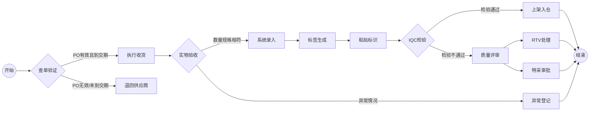
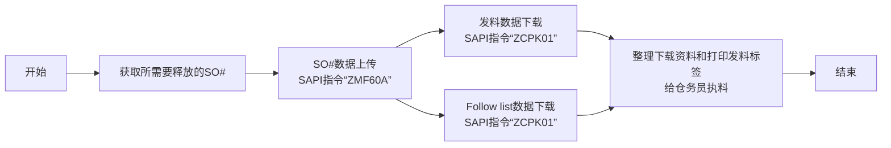
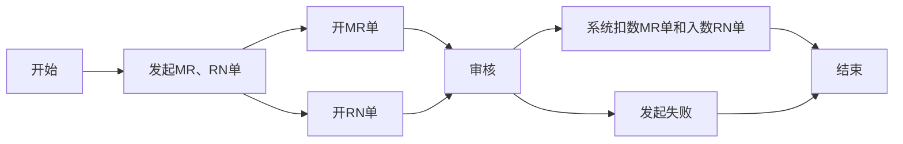

# 仓库流程及操作规范

# 收货
## 流程概览

## 1. 查单作业（SAP系统操作）
*  **SAP系统**
    - 输入事务代码 `ZME2O`
    - 在"Plant"和"PO"字段输入送货单信息
    - 点击左上角闹钟图标🕥或按`F8`执行
    - 关键信息四核对：
       - ✅ 物料编码一致性
       - ✅ 订单数量一致性
       - ✅ 交期有效性（比对OA DATE）
       - ✅ 系统交期与实物标签一致性
    - [ZME2O.gif](https://github.com/dlelyw/VTX_6501/blob/main/files/gif/ZME2O.gif)

> **异常处理**：
> 🚨 出现"PO无数/未到交期"时，立即暂停收货流程，联系供应商协调处理

## 2. 收货点数规范
1. 三向比对：
   - 实物包装标签
   - 供应商送货单
   - SAP系统订单
2. 外观质量检验：
   - 🔍 检查包装完整性
   - ⚠️ 排除变形/破损/受潮等异常
3. 签收后操作：
   - 张贴待检区定位标签（格式：`QA01` 或者 `QA02`）
   - 货物移转至黄色待检区
   

## 3. 入库过账操作
*  **WMS 4.2 系统**
    1. 数据录入：
       - 依次输入发票号→包装单号→PO号→`[ Enter ]`
    2. 容器匹配：
       - 在右上视图区匹配实物料号/数量
       - 光标定位至收货数量字段
    3. 包装信息确认：
       - 录入实际到货包装规格（箱数/包装单位）
    4. 系统操作：
       - 点击 `[ Save ]` 生成批次号  
       - 把生成的批次号 书写到文档上
    5. [InRT_101.gif](https://github.com/dlelyw/VTX_6501/blob/main/files/gif/InRT_101.gif)       

> **提示**：
> 暂存仓查询指令：ZMM138 超期未过账批次自动转到暂存仓状态 等待到期 接受到正常仓然后过单给IQC

## 4. 标签张贴规范
*  标签定位:
    - 外包装右上角30cm清洁区域
    - 距边缘≥5cm防磨损区域
*  张贴要求:
    - 一物一签，禁止覆盖原厂标识
    - 批次号需完整可视
 

## 5. 过单IQC流程
* **WMS 4.2 系统**
    - 导航至功能菜单：  
        - `Location` → `Move location` → `输入批次`→ `输入新位置`→ `保存`
    - 批次号录入规范 ：
        - 格式要求：固定10位数字
        - 补位规则：前导补"0"  
        - 示例：原始批次"1234567" → 输入"00001234567"
     - [Movelocation323.gif](https://github.com/dlelyw/VTX_6501/blob/main/files/gif/Movelocation323.gif)

> **附件** **<a href="https://github.com/dlelyw/VTX_6501/blob/main/files/gif/Download%20File%20Example.gif">所有文件下载示例</a>**
- **软件类**
- [WMS.exe](https://github.com/dlelyw/VTX_6501/blob/main/files/apps/WMS.exe)
- [DFMS.exe （MES打印服务）](https://github.com/dlelyw/VTX_6501/blob/main/files/apps/DFMS.exe)
- [Hairpin Label Printing Software.exe](https://github.com/dlelyw/VTX_6501/blob/main/files/apps/Hairpin%20Label%20Printing%20Software.exe)
- [Herramienta de inicio de sesión específica.exe](https://github.com/dlelyw/VTX_6501/blob/main/files/apps/Herramienta%20de%20inicio%20de%20sesión%20específica.exe)
- [wms_release_1.3.7.apk （移动版）](https://github.com/dlelyw/VTX_6501/blob/main/files/apps/wms_release_1.3.7.apk)
- [dlelwprint.exe（任意文本打印）](https://github.com/dlelyw/VTX_6501/blob/main/files/apps/dlelwprint.exe)
- [MESAPP_PRO.apk（MES移动版本）](https://github.com/dlelyw/VTX_6501/blob/main/files/apps/MESAPP_PRO.apk)
- [dlelyw.exe（备用版本）](https://github.com/dlelyw/VTX_6501/blob/main/files/apps/dlelyw.exe)
- **在线工具**
- [web_MES](http://10.97.245.205:92/login)
- [web_MES_apk](http://10.97.245.205:93)
- [web_translator](https://www.deepl.com/zh/translator)
- **文档类**
- [Invoice Number Lookup Guide.pdf](https://github.com/dlelyw/VTX_6501/blob/main/files/pdf/Invoice%20Number%20Lookup%20Guide.pdf)  
- [MES Receiving.pdf](https://github.com/dlelyw/VTX_6501/blob/main/files/pdf/MES%20Receiving.pdf)

---
# 退货至供应商
## 流程概览

    

## 1. 系统发起退货
* **执行频率**：每日定时操作
  1. 登录Notes和SAP系统
  2. 进入「退货」模块
  3. 下载当日退货清单
  4. 收集这些退货到RTV仓
> **提示**：
> RTV仓是指仓库中专门用于处理 Return To Vendor（退回供应商） 商品的区域或仓库。它是供应链和仓库管理中的一个重要 环节，主要用于存放和管理需要退回给供应商的商品。

## 2. 收取退货处理

### 2.1 MRB退货收集流程
* **系统登录与下载资料**
   - 打开Notes系统找到菜单`MX IQC  Inspection  Document on...`
   - 找到按钮`Gen Report`单击，选择序号`5 Sotre Reject Report`
   - 按照下载的资料去IQC哪里收集退货
   - [RTV_MRB.gif](https://github.com/dlelyw/VTX_6501/blob/main/files/gif/RTV_MRB.gif)
### 2.2 RN退货收集流程
* **系统登录与下载资料**
   - 打开SAP 输入事务代码 `ZIMWH`
   - 在"Plant"字段输入`6501`
   - 点击左上角闹钟图标🕥或按`F8`执行
   - 选择所有待退货的数据 下载到本地表格
   - 按照退货清单去IQC RN房间收集退货到RTV仓
   - [RTV_RN.gif](https://github.com/dlelyw/VTX_6501/blob/main/files/gif/RTV_RN.gif)

## 3 退货数入退货仓
* **SAP系统**
   - 打开SAP 输入事务代码 `MB1B`
   - 在字段输入`Doc.Header Text 输入日期和退货类型` → ` Plant 输入 6501` → `Movement type 输入 311` → `Storage Loation 输入JB01(RN)/JA01(MRB)`
   - 按下键盘回车键进入下一个界面
   - 在字段输入`Material 输入料号` → ` Quantity 输入数量` → `Batch 输入批次` → `Rcvg SLoc 输入移动的目的位置`
   - 保存
   - [RTV_movelocation.gif](https://github.com/dlelyw/VTX_6501/blob/main/files/gif/RTV_movelocation.gif)

## 4 退货至供应商
* **Notes系统**
    - 打开Notes系统找到菜单`MX Delivery Order on MEXCMS11`
    - 选择左上角`New`单击
    - 进行数据填写：
         1. 先点击左中位置的`add`按钮 选择需要退货的供应商或者物料
         2. `Goods Ready Pick Date * :`两个都要单击，选择退货日期
         3. `Region *:`选择退货的地方
         4. `CC to PUR/PMT *: `抄送邮件给相关的PUR和PMT
         5. `Prepayment *:`选择`No`
         6. `Carrier * :`选择或者输入`LOCAL`
         7. 选择相应的签批人员
    - 提交给PUT或者PMT签批
    - 打印退货单2份(供应商签名两份 仓库和供应商各留一份) 
    - 6591无例子 使用9291 操作是一样的 [RTV_tovender_9291.gif](https://github.com/dlelyw/VTX_6501/blob/main/files/gif/RTV_tovender_9291.gif)
        
---

# 工单发料

## 释放"SO"工单流程
### 流程概览

### 1. 查看需要释放的"SO"工单表
* **Notes系统**
    - 邮件查看PMC每天发出当天的工单释放清单表 一般字样`SO release form For 2/13a (B1)/(B2)`
    - 本地建立一个表格只留两列`Plant` `SO`
    - 把所有需要释放的工单放在本地Excel里面`保存`
    - [SO_released_order_list.gif](https://github.com/dlelyw/VTX_6501/blob/main/files/gif/SO_released_order_list.gif)
    - [Release of SO.xls](https://github.com/dlelyw/VTX_6501/blob/main/files/Release%20of%20SO.xls)

### 2. 上传工单至SAP系统
* **SAP系统**
    - 打开SAP 输入事务代码 `ZMF60A`
    - 按下`Scanner Issue Order`按钮
    - 选择单选按钮`Upload` 
    - 把第一步保存的Excel路径放在`File Name`后的输入框
    - 点击左上角闹钟图标🕥或按`F8`执行
    - [SO_released_order_UP.gif](https://github.com/dlelyw/VTX_6501/blob/main/files/gif/SO_released_order_UP.gif)

> **注意**：
所有上传到SAP的工单号，需要全部成功才可以，如果失败，需要找PMC立马处理。一般情况为SO#被删，或者没有释放。

### 3. 打印发料资料

#### 1.打印发料资料
* **SAP系统**
    - 打开SAP 输入事务代码`ZCPK01A`
    - 在`Plant` 输入 `6501`
    - `Production Order` 输入需要释放的工单号可以多行输入 按同套工单输入
    - `sort by` 选择 `summarized Pick list`其余所有都不选择
    - 点击左上角闹钟图标🕥或按`F8`执行
    - 选择左上角菜单`List`  → `Print` → `选择需要打印的打印机` → 打印时间选择`Immediately`
    - 或者按下键盘快捷键`Ctrl + P`
    - [SO_released_order_print.gif](https://github.com/dlelyw/VTX_6501/blob/main/files/gif/SO_released_order_print.gif)

#### 2.打印"pack list"资料
* **SAP系统**
    - 打开SAP 输入事务代码`ZCPK01A`
    - 在`Plant` 输入 `6501`
    - `Production Order` 输入需要释放的工单号可以多行输入 按同套工单输入
    - `sort by` 选择 `Follow list` 其余所有都不选择
    - 点击左上角闹钟图标🕥或按`F8`执行
    - 选择左上角菜单`List`  → `Print` → `选择需要打印的打印机` → 打印时间选择`Immediately`
    - 或者按下键盘快捷键`Ctrl + P`
    - [SO_released_order_print_pick_list.gif](https://github.com/dlelyw/VTX_6501/blob/main/files/gif/SO_released_order_print_pick_list.gif)

### 4. 下载资料到本地
#### 1. 下载待打印标签资料
* **SAP系统**
    - 打开SAP 输入事务代码`ZCPK01A`
    - 在`Plant` 输入 `6501`
    - `Production Order` 输入需要释放的工单号可以多行输入 按同套工单输入
    - `sort by` 选择 `summarized Pick list`其余所有都不选择
    - 点击左上角闹钟图标🕥或按`F8`执行
    - 选择左上角菜单`List`  → `Save/Send` → `Local Flie..` →`Text with Tabs`
    - 选择存储位置 格式选择Excel格式
    - [SO_released_order_print_downexcle.gif](https://github.com/dlelyw/VTX_6501/blob/main/files/gif/SO_released_order_print_downexcle.gif)
    
#### 2. 下载Follow List
* **SAP系统**
    - 打开SAP 输入事务代码`ZCPK01A`
    - 在`Plant` 输入 `6501`
    - `Production Order` 输入需要释放的工单号可以多行输入 按同套工单输入
    - `sort by` 选择 `Follow list` 和 `Follow list > 0` 其余所有都不选择
    - 点击左上角闹钟图标🕥或按`F8`执行
    - `Follow list` 文件自动会保存到`Follow list > 0`旁边的路径地址中去
    - 找到这个资料 发送给PMC
    - [SO_released_order_print_followlist.gif](https://github.com/dlelyw/VTX_6501/blob/main/files/gif/SO_released_order_print_followlist.gif)
 
#### 3. SMT资料下载
* **SAP系统**
    - 打开PMC发送的SO清单
    - 复制SMT专用描述为PCB和SMD开头 结尾为R层的SO
        - 方法1 `CO03` 可下载单个SO# 未释放的SO#也可下载
            - 打开SAP 输入事务代码`CO03`
            - 双击这个SO进入详情界面
            - 点击工具栏图标名为`Component Overview`
            - 再次点击`Component`图标
            - 点击右键下载资料到本地
        - 方法2 `ZCPK01` 可多个SO#批量下载 需释放并上传后才可下载
            - 打开SAP 输入事务代码`ZCPK01A`
            - 在`Plant` 输入 `6501`
            - `Production Order` 输入需要释放的工单号可以多行输入 按同套工单输入
            - `sort by` 选择 `Follow list` 其余所有都不选择
            - 点击左上角闹钟图标🕥或按`F8`执行
            - 保存资料到本地
        - 整理下载好的SMT资料
        - 只需要料号和数量 并且删除数量为零的物料和删除料号结尾为R8开头的物料
        - 使用[SmtAutoCalculated.xls](https://github.com/dlelyw/VTX_6501/blob/main/files/SmtAutoCalculated.xls)计算数据
        - 按模板做成发料文档[Sample SMT warehouse information.xls](https://github.com/dlelyw/VTX_6501/blob/main/files/Sample%20SMT%20warehouse%20information.xls)
        - 有10分钟的视频文件 分2个包 下载到本地解压观看 [smt_document.7z.001](https://github.com/dlelyw/VTX_6501/blob/main/files/mp4/smt_document.7z.001) [smt_document.7z.002](https://github.com/dlelyw/VTX_6501/blob/main/files/mp4/smt_document.7z.002)

### 5. 打印发料标签
* **dlelywpp_Impresión de etiquetas de horquilla程序**
    - 打开下载的资料
    - 另存为Excle文件
    - 打开软件 `dlelywpp_Impresión de etiquetas de horquilla.exe`
    - 把文件拖放到软件内
    - 打印所有标签
    - [Hairpin Label Printing Software.exe](https://github.com/dlelyw/VTX_6501/blob/main/files/apps/Hairpin%20Label%20Printing%20Software.exe)
    - [SO_released_order_printlable.gif](https://github.com/dlelyw/VTX_6501/blob/main/files/gif/SO_released_order_printlable.gif)

> **附件** **<a href="https://github.com/dlelyw/VTX_6501/blob/main/files/gif/Download%20File%20Example.gif">所有文件下载示例</a>**
- **文档类**
- [Guidelines for Printing Warehouse Dispatch Labels（bilingualism）.pdf](https://github.com/dlelyw/VTX_6501/blob/main/files/pdf/Guidelines%20for%20Printing%20Warehouse%20Dispatch%20Labels（bilingualism）.pdf)
- [SMT Dispatch Guidelines.pdf](https://github.com/dlelyw/VTX_6501/blob/main/files/pdf/SMT%20Dispatch%20Guidelines.pdf)

---
# 库存管控

## MR单和RN单
### 流程概览

### 1. 开MR单或者RN单
* **Notes系统 和 SAP系统**
    - 打开`MX MR & RN`系统
    - 点击按钮`New MR`如果是RN就点击`NEW RN`
    - `Select Type`选择`Departmental Drawing`然后点击`OK`按钮
    - 选择`Reason Code`（按需选择）
    - 选择部门
    - 输入生产拉号（如果为生产部时提供）
    - 在`Customer`输入相应的客户代码
    - 在`Remake`输入备注
    - 在`PN`和`Qty`输入料号和数量
    - 如果太多可以使用工具栏`Improt`导入需要的数据 只需要在表格中填写料号和数量
    - 上述步骤完成后 发起签批 等待相关领导签批完之后使用SAP
    - **MR单**
        - SAP输入事务代码`ZMMMR`
        - 在`MR NO`输入MR单产生的单号 在`Plant`输入6501
        - 进入界面后勾选需要扣数的物料
        - 点击`Post Goods Issue`
     - **RN单**
        - SAP输入事务代码`ZRNWH`
        - 在`MR/RN Number`输入RN单产生的单号 在`Plant`输入6501
        - 进入界面后勾选需要入数的物料
        - 在工具栏选择`Select Batch`
        - 然后勾选这个物料 在`SLoc`输入位置 然后点击`OK`
        - 点击`Post Goods Issue`
    - [mr_new.gif](https://github.com/dlelyw/VTX_6501/blob/main/files/gif/mr_new.gif)
    - [mr_deductions.gif](https://github.com/dlelyw/VTX_6501/blob/main/files/gif/mr_deductions.gif)
    

**常用的MR单`Reason Code`** 签批人为对应其部门负责人(所有的RN Type 不选择)

| 序号 | 代码 | 部门 | 生产拉号 |                            备注                            |
| ---- | ---- | ---- | -------- | --------------------------------------------------------- |
| 1    | SA   | 仓库 |          | 仓存调整，周期性盘点偏差，共用料平数                          |
| 2    | SA   | 生产 |          | PROD DISCREPANCY + B9821201680 生产差异 + 差异的单号        |
| 3    | LB   | 仓库 |          | 用于打包43LED灯                                            |
| 4    | LB   | SMT  | 1035     | 012986,012247,012082,011530,k10098,KLA881,KOA879多发板还仓 |
| 5    | LE   | SMT  | 1001     | 8/7/2024 SMD 打机共用料平数                                 |
| 6    | GF   | PMC  |          | 无需求物料，报废处理。                                       |
| 7    | G0   | PMC  |          | 送检索步海关，出检测报告前电池不能使用。                       |
| 8    | G3   | PMC  |          | 外发测试品平数,外发测试品平数,外发损耗品                       |

**常用的RN单`Reason Code`** RN单常用的几种，签批人对应其部门负责人(所有的RN Type 选择“Return to warehouse”)

| 序号 | 代码 | 部门 | 生产拉号 |                            备注                             |
| ---- | ---- | ---- | -------- | ---------------------------------------------------------- |
| 1    | SA   | 仓库 |          | 8月份周期性盘点偏差，好料入仓，共用料平数(PASS物料无需IOC再检查) |
| 2    | LE   | SMT  | 1001     | 打机共用料平数(PASS物料无需IOC再检查)                         |
| 3    | G0   | 仓库 |          | 打机共用料平数(PASS物料无需IOC再检查)                         |
| 4    | G0   | PMC  |          | NEC 回收包材，好料入仓                                       |

## 周期性物料盘点
### A类物料每月盘点
* **执行频率** **`每月一次`**
    - **SAP系统**
    - 输入事务指令`ZPP096`
    - 输入`6501`在字段`Plant`
    - 选择复选框`Only 80% Material`
    - 点击左上角闹钟图标🕥或按`F8`执行
    - 保存资料到本地
    - 整理资料打印（先按料号排序 再按位置排序）
    - [stock_Aitems.gif](https://github.com/dlelyw/VTX_6501/blob/main/files/gif/stock_Aitems.gif)
    

### 02 15 29字头贵重物料 每两周盘点
* **执行频率** **`每两周一次`**
    - **SAP系统**
    - 输入事务指令`MB52`
    - 在字段`Material`后面的按钮中输入`02*`分行`15*`分行`29*`
    - 输入`6501`在字段`Plant`
    - 点击左上角闹钟图标🕥或按`F8`执行
    - 保存资料到本地
    - 整理资料（使用SMT自动求和工具求和）
    - 打印资料
    - [stock_02.gif](https://github.com/dlelyw/VTX_6501/blob/main/files/gif/stock_02.gif)

---

> **相关指令**
> [SAP_Code.md](https://github.com/dlelyw/VTX_6501/blob/main/files/SAP_Code.md)
> [Movement_Code.md](https://github.com/dlelyw/VTX_6501/blob/main/files/Movement_Code.md)
> [MR_Code.md](https://github.com/dlelyw/VTX_6501/blob/main/files/MR_Code.md)

---
# 成品出入库
## 流程概述

## FG IN
### FG扫描SN入库
* **wms移动版**
    - 收到生产部提供的FG单和成品
    - 先按照FG单跑VTS
        1. **看工单的状态**
            - 输入事务指令`CO03`
            - 看`Sys.Status`中第三个单词是否是`DLV` DLV代表VTS确认工单完成否则需要跑VTS
        2. **扣数**
            - SAP单独开一个窗口输入事务指令`ZMB1A`
            - 在`Plant`输入`6501`
            - `Order`输入`CO03`查看的所有工单
            - 点击左上角闹钟图标🕥或按`F8`执行
        3. **跑VTS**
            - 打开MES系统 [MES](http://10.224.245.101:8080/Index.aspx#)
            - 找到菜单最后一栏`SAP`
            - 选择`A02.Confirmation`
            - 在`Order Number：`输入工单号（按照`CO03`查看到的工单号从下至上的确认产量）
            - **按下回车**
            - 在`Quantity：`输入需要确认的数量
            - 点击`Save` 在`Result[SAP message]`会给出结果
            - 返回SAP`CO03`重新刷新 
            - 看`Sys.Status`中第三个单词就会变成`DLV`
            - [vts.png](https://github.com/dlelyw/VTX_6501/blob/main/files/png/vts.png)
    - **入库**
        1. PDA扫描入库  [wms.apk （移动版）](https://github.com/dlelyw/VTX_6501/blob/main/files/apps/wms_release_1.3.7.apk)
            - 登录PDA (服务器地址: 10.224.245.101:8085)
            - 选择菜单`01-FG In`
            - `SN Type`选择 Customer SN
            - `FG No` 输入FG单号
            - `Doc No` 输入文件号 没有就输入工单号后4位
            - `FG Order`输入工单号
            - 按下回车
            - `Total Qty`会自动带出数量
            - `P/N`输入成品料号
            - `Location` 输入位置
            - `Scan SN` 扫描成品箱号
            - 扫描完所有箱号后保存 [pda_fgin01.png](https://github.com/dlelyw/VTX_6501/blob/main/files/png/pda_fgin01.png) [pda_fgin02.png](https://github.com/dlelyw/VTX_6501/blob/main/files/png/pda_fgin02.png)
        2. SAP手工入数 （仅限于客户不需要箱号使用）
            * SAP输入事务代码`MB31`  [mb31.png](https://github.com/dlelyw/VTX_6501/blob/main/files/png/mb31.png)
            * `Movement Type`输入101
            * `Order`输入工单号
            * `Plant`输入6501
            * `Storage Loc.`输入入库的位置 
            * 按下回车
            * 然后修改入数的数量
            * 保存
            * 然后会提示需要生成箱号
            * 单击工具栏最下最右的按钮 自动生成箱号
            * 保存

## FG OUT
### FG扫描SN出库
* **查看出货清单**
    * SAP输入事务代码`ZSP1A`
    * `Planned GI Date`日期向前几天填写
    * `Shipping Point`输入S650
    * `Sales Organization`输入6501
    * `GI Status`状态输入A（A表示没有完成）
    * 点击左上角闹钟图标🕥或按`F8`执行
    * [ZSP1A.png](https://github.com/dlelyw/VTX_6501/blob/main/files/png/ZSP1A.png)
* **出库**
    1. PDA扫描出库
        * 登录PDA (服务器地址: 10.224.245.101:8085)
        * 选择菜单`03-FG Out`
        * `SN Type`选择 Customer SN
        * `DN` 输入DN单号
        * 按下回车
        * `DN Qty`会自动带出数量
        * `Scan SN`扫描成品箱号
        * `Scan Qty`会自动计数已扫描的箱号
        * 保存 [pad_fgout.png](https://github.com/dlelyw/VTX_6501/blob/main/files/png/pad_fgout.png)
             * SAP出货界面会自动同步`Pick Up`状态
             * 如果长时间没有同步
             * 使用SAP输入事务指令`ZSD046`
             * `Sales Organization`输入6501
             * `DN`输入出货DN
             * 点击左上角闹钟图标🕥或按`F8`执行
             * 然后出货界面刷新下就可以看到`Pick Up`状态为成功了（C）
             * [ZSD046.png](https://github.com/dlelyw/VTX_6501/blob/main/files/png/ZSD046.png)
    2. SAP手工出数 （仅限于客户不需要箱号使用或者自提）
       * SAP输入事务代码`ZSP1A`
       * `Planned GI Date`日期向前几天填写
       * `Shipping Point`输入S650
       * `Sales Organization`输入6501
       * `GI Status`状态输入A（A表示没有完成）
       * 点击左上角闹钟图标🕥或按`F8`执行
       * 参考这图（如果是成品需要选择箱号）[fg_handcarry.gif](https://github.com/dlelyw/VTX_6501/blob/main/files/gif/fg_handcarry.gif)

## RMA
* **SAP系统**
    * **正常工单入数**
        * 需要查询到这个RMA机正常工单的单号 一般是65100006335样式的 
        * 按正常工单号，把这个工单入数到系统 使用SAP命令MB31入系统 
        * `Movement Type`输入101
        * `Order`输入正常工单号
        * `Plant`输入相应的仓别
        * `Srtorage Loc.`输入入仓的位置
        * 点击左上角闹钟图标🕥或按`F8`执行
        * 然后跳转至入数信息界面
        * 输入需要入数的数量 然后一直回车即可
        * [rma_1.png](https://github.com/dlelyw/VTX_6501/blob/main/files/png/rma_1.png) [rma_2.png](https://github.com/dlelyw/VTX_6501/blob/main/files/png/rma_2.png)
    * **扣数到返工订单中**
        * 使用SAP命令MB1A
        * `Movement Type`输入261
        * `Plant`输入6501
        * `Storage Location`输入FG01
        * 找到`To Order`单击它 然后输入返工工单号 
        * 然后保存即可
        * 后续操作跟正常扫描入库一样
        * [vts_p_3.png](https://github.com/dlelyw/VTX_6501/blob/main/files/png/vts_p_3.png)

## 辅料层手动过数
* **SAP系统**
    * SAP`CO03`查看工单 物料号后面尾号为P***的，表示跑生产部的VTS(从下至上)
    * 打开生产部的SAP 输入`CO11N` 输入SO# 按下回车 
    * `Order`输入工单号
    * 单击 `Actual Data` 
    * 再点击`Goods Movements`
    * 选择所有的数据
    * 单击`batch determination`确认
    * 然后保存
    * [vts_p_1.png](https://github.com/dlelyw/VTX_6501/blob/main/files/png/vts_p_1.png) [vts_p_2.png](https://github.com/dlelyw/VTX_6501/blob/main/files/png/vts_p_2.png) [vts_p_3.png](https://github.com/dlelyw/VTX_6501/blob/main/files/png/vts_p_3.png)