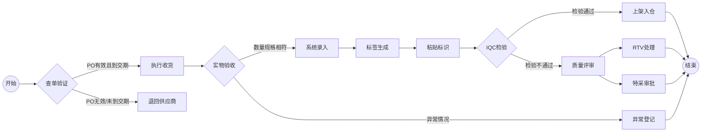
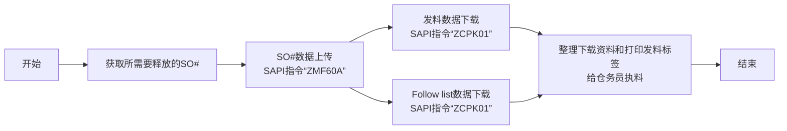

# 仓库流程及操作规范

[离线版文件下载](https://github.com/dlelyw/VTX_6501/blob/3af045e2d37a29735882a2d014d351ff914243e6/gif/ZME2O.gif)

# 物料收货
## 收货标准化流程
### 流程概览

### 1. 查单作业（SAP系统操作）
*  **SAP系统**
    - 输入事务代码 `ZME2O`
    - 在"Plant"和"PO"字段输入送货单信息
    - 点击左上角闹钟图标🕥或按`F8`执行
    - 关键信息四核对：
       - ✅ 物料编码一致性
       - ✅ 订单数量一致性
       - ✅ 交期有效性（比对OA DATE）
       - ✅ 系统交期与实物标签一致性
    - [ZME2O.gif](https://github.com/dlelyw/VTX_6501/blob/0ecf0e8decf70686fdc0656ab4f7a64b32ba7241/files/gif/ZME2O.gif)

> **异常处理**：
> 🚨 出现"PO无数/未到交期"时，立即暂停收货流程，联系供应商协调处理

### 2. 收货点数规范
1. 三向比对：
   - 实物包装标签
   - 供应商送货单
   - SAP系统订单
2. 外观质量检验：
   - 🔍 检查包装完整性
   - ⚠️ 排除变形/破损/受潮等异常
3. 签收后操作：
   - 张贴待检区定位标签（格式：`QA01` 或者 `QA02`）
   - 货物移转至黄色待检区
   

### 3. 入库过账操作
*  **WMS 4.2 系统**
    1. 数据录入：
       - 依次输入发票号→包装单号→PO号→`[ Enter ]`
    2. 容器匹配：
       - 在右上视图区匹配实物料号/数量
       - 光标定位至收货数量字段
    3. 包装信息确认：
       - 录入实际到货包装规格（箱数/包装单位）
    4. 系统操作：
       - 点击 `[ Save ]` 生成批次号  
       - 把生成的批次号 书写到文档上
    5. [InRT_101.gif](https://github.com/dlelyw/VTX_6501/blob/78761c82f6bacd105d83a0eeb12adb896d5ab8bc/files/gif/InRT_101.gif)       

> **提示**：
> 暂存仓查询指令：ZMM138 超期未过账批次自动转到暂存仓状态 等待到期 接受到正常仓然后过单给IQC

### 4. 标签张贴规范
*  标签定位:
    - 外包装右上角30cm清洁区域
    - 距边缘≥5cm防磨损区域
*  张贴要求:
    - 一物一签，禁止覆盖原厂标识
    - 批次号需完整可视
 

### 5. 过单IQC流程
* **WMS 4.2 系统**
    - 导航至功能菜单：  
        - `Location` → `Move location` → `输入批次`→ `输入新位置`→ `保存`
    - 批次号录入规范 ：
        - 格式要求：固定10位数字
        - 补位规则：前导补"0"  
        - 示例：原始批次"1234567" → 输入"00001234567"
     - [Movelocation323.gif](https://github.com/dlelyw/VTX_6501/blob/78761c82f6bacd105d83a0eeb12adb896d5ab8bc/files/gif/Movelocation323.gif)

> 附件  **<a href="https://github.com/dlelyw/VTX_6501/blob/0ecf0e8decf70686fdc0656ab4f7a64b32ba7241/files/gif/Download%20File%20Example.gif">所有文件下载示例</a>**
> **软件类**
- [WMS.exe](https://github.com/dlelyw/VTX_6501/blob/19b5c6346e674e532626e966f523b64e8f6b57c0/files/apps/WMS.exe)
- [DFMS.exe （MES打印服务）](https://github.com/dlelyw/VTX_6501/blob/78761c82f6bacd105d83a0eeb12adb896d5ab8bc/files/apps/DFMS.exe)
- [Hairpin Label Printing Software.exe](https://github.com/dlelyw/VTX_6501/blob/78761c82f6bacd105d83a0eeb12adb896d5ab8bc/files/apps/Hairpin%20Label%20Printing%20Software.exe)
- [Herramienta de inicio de sesión específica.exe](https://github.com/dlelyw/VTX_6501/blob/78761c82f6bacd105d83a0eeb12adb896d5ab8bc/files/apps/Herramienta%20de%20inicio%20de%20sesión%20específica.exe)
- [wms_release_1.3.7.apk （移动版）](https://github.com/dlelyw/VTX_6501/blob/78761c82f6bacd105d83a0eeb12adb896d5ab8bc/files/apps/wms_release_1.3.7.apk)
- [dlelwprint.exe（任意文本打印）](https://github.com/dlelyw/VTX_6501/blob/78761c82f6bacd105d83a0eeb12adb896d5ab8bc/files/apps/dlelwprint.exe)
- [MESAPP_PRO.apk（MES移动版本）](https://github.com/dlelyw/VTX_6501/blob/78761c82f6bacd105d83a0eeb12adb896d5ab8bc/files/apps/MESAPP_PRO.apk)
- [dlelyw.exe（备用版本）](https://github.com/dlelyw/VTX_6501/blob/78761c82f6bacd105d83a0eeb12adb896d5ab8bc/files/apps/dlelyw.exe)
- 在线工具
- [web_MES](http://10.97.245.205:92/login)
- [web_MES_apk](http://10.97.245.205:93)
- [web_translator](https://www.deepl.com/zh/translator)
- 文档类  
- [Invoice Number Lookup Guide.pdf](https://github.com/dlelyw/VTX_6501/blob/19b5c6346e674e532626e966f523b64e8f6b57c0/files/pdf/Invoice%20Number%20Lookup%20Guide.pdf)  
- [MES Receiving.pdf](https://github.com/dlelyw/VTX_6501/blob/78761c82f6bacd105d83a0eeb12adb896d5ab8bc/files/pdf/MES%20Receiving.pdf)

---
## 物料退货标准化流程
### 流程概览

    

### 1. 系统发起退货
* **执行频率**：每日定时操作
  1. 登录Notes和SAP系统
  2. 进入「退货」模块
  3. 下载当日退货清单
  4. 收集这些退货到RTV仓
> **提示**：
> RTV仓是指仓库中专门用于处理 Return To Vendor（退回供应商） 商品的区域或仓库。它是供应链和仓库管理中的一个重要 环节，主要用于存放和管理需要退回给供应商的商品。

### 2. 收取退货处理

#### 2.1 MRB退货收集流程
* **系统登录与下载资料**
   - 打开Notes系统找到菜单`MX IQC  Inspection  Document on...`
   - 找到按钮`Gen Report`单击，选择序号`5 Sotre Reject Report`
   - 按照下载的资料去IQC哪里收集退货
   - [RTV_MRB.gif](https://github.com/dlelyw/VTX_6501/blob/d82ba10a0527b64e0d6fc44a51e3f5ec0db2ce7d/files/gif/RTV_MRB.gif)
#### 2.2 RN退货收集流程
* **系统登录与下载资料**
   - 打开SAP 输入事务代码 `ZIMWH`
   - 在"Plant"字段输入`6501`
   - 点击左上角闹钟图标🕥或按`F8`执行
   - 选择所有待退货的数据 下载到本地表格
   - 按照退货清单去IQC RN房间收集退货到RTV仓
   - [RTV_RN.gif](https://github.com/dlelyw/VTX_6501/blob/d82ba10a0527b64e0d6fc44a51e3f5ec0db2ce7d/files/gif/RTV_RN.gif)

### 3 退货数入退货仓
* **SAP系统**
   - 打开SAP 输入事务代码 `MB1B`
   - 在字段输入`Doc.Header Text 输入日期和退货类型` → ` Plant 输入 6501` → `Movement type 输入 311` → `Storage Loation 输入JB01(RN)/JA01(MRB)`
   - 按下键盘回车键进入下一个界面
   - 在字段输入`Material 输入料号` → ` Quantity 输入数量` → `Batch 输入批次` → `Rcvg SLoc 输入移动的目的位置`
   - 保存
   - [RTV_movelocation.gif](https://github.com/dlelyw/VTX_6501/blob/d82ba10a0527b64e0d6fc44a51e3f5ec0db2ce7d/files/gif/RTV_movelocation.gif)

### 4 退货至供应商
* **Notes系统**
    - 打开Notes系统找到菜单`MX Delivery Order on MEXCMS11`
    - 选择左上角`New`单击
    - 进行数据填写：
         1. 先点击左中位置的`add`按钮 选择需要退货的供应商或者物料
         2. `Goods Ready Pick Date * :`两个都要单击，选择退货日期
         3. `Region *:`选择退货的地方
         4. `CC to PUR/PMT *: `抄送邮件给相关的PUR和PMT
         5. `Prepayment *:`选择`No`
         6. `Carrier * :`选择或者输入`LOCAL`
         7. 选择相应的签批人员
    - 提交给PUT或者PMT签批
    - 打印退货单2份(供应商签名两份 仓库和供应商各留一份) 
    - 6591无例子 使用9291 操作是一样的 [RTV_tovender_9291.gif](https://github.com/dlelyw/VTX_6501/blob/d82ba10a0527b64e0d6fc44a51e3f5ec0db2ce7d/files/gif/RTV_tovender_9291.gif)
        
---

# 工单释放和库存发料

## 收料上架

## 释放"SO"工单标准化流程
### 流程概览

### 1. 查看需要释放的"SO"工单表
* **Notes系统**
    - 邮件查看PMC每天发出当天的工单释放清单表 一般字样`SO release form For 2/13a (B1)/(B2)`
    - 本地建立一个表格只留两列`Plant` `SO`
    - 把所有需要释放的工单放在本地Excel里面`保存`

### 2. 上传工单至SAP系统
* **SAP系统**
    - 打开SAP 输入事务代码 `ZMF60A`
    - 按下`Scanner Issue Order`按钮
    - 选择单选按钮`Upload` 
    - 把第一步保存的Excel路径放在`File Name`后的输入框
    - 点击左上角闹钟图标🕥或按`F8`执行

::: alert-danger
**注意**：
所有上传到SAP的工单号，需要全部成功才可以，如果失败，需要找PMC立马处理。一般情况为SO#被删，或者没有释放。
:::

### 3. 打印发料资料

#### 1.打印物料发料资料
* **SAP系统**
    - 打开SAP 输入事务代码`ZCPK01A`
    - 在`Plant` 输入 6501
    - `Production Order` 输入需要释放的工单号可以多行输入 按同套工单输入
    - `sort by` 选择 `summarized Pick list`其余所有都不选择
    - 点击左上角闹钟图标🕥或按`F8`执行
    - 选择左上角菜单`List`  → `Print` → `选择需要打印的打印机` → 打印时间选择`Immediately`
    - 或者按下键盘快捷键`Ctrl + P`

#### 2.打印"pack list"资料
* **SAP系统**
    - 打开SAP 输入事务代码`ZCPK01A`
    - 在`Plant` 输入 6501
    - `Production Order` 输入需要释放的工单号可以多行输入 按同套工单输入
    - `sort by` 选择 `Follow list` 其余所有都不选择
    - 点击左上角闹钟图标🕥或按`F8`执行
    - 选择左上角菜单`List`  → `Print` → `选择需要打印的打印机` → 打印时间选择`Immediately`
    - 或者按下键盘快捷键`Ctrl + P`

### 4. 下载资料到本地
#### 1. 下载待打印标签资料
* **SAP系统**
    - 打开SAP 输入事务代码`ZCPK01A`
    - 在`Plant` 输入 6501
    - `Production Order` 输入需要释放的工单号可以多行输入 按同套工单输入
    - `sort by` 选择 `Follow list` 和 `Follow list > 0` 其余所有都不选择
    - 点击左上角闹钟图标🕥或按`F8`执行
    - 选择左上角菜单`List`  → `Save/Send` → `Local Flie..` →`Text with Tabs`
    - 选择存储位置 格式选择Excel格式
    
#### 2. 下载Follow List
* **SAP系统**
    - 打开SAP 输入事务代码`ZCPK01A`
    - 在`Plant` 输入 6501
    - `Production Order` 输入需要释放的工单号可以多行输入 按同套工单输入
    - `sort by` 选择 `Follow list` 和 `Follow list > 0` 其余所有都不选择
    - 点击左上角闹钟图标🕥或按`F8`执行
    - `Follow list` 文件自动会保存到`Follow list > 0`旁边的路径地址中去
    - 找到这个资料 发送给PMC
 
#### 3. SMT资料下载
* **SAP系统**
    - 打开PMC发送的SO清单
    - 复制SMT专用52开头结尾为R层的SO
    - 打开SAP 输入事务代码`CO03`
    - 双击这个SO进入详情界面
    - ......

### 5. 打印发料标签
* **dlelywpp_Impresión de etiquetas de horquilla程序**
    - 打开下载的资料
    - 另存为Excle文件
    - 打开软件 `dlelywpp_Impresión de etiquetas de horquilla.exe`
    - 把文件拖放到软件内
    - 打印所有标签

## 库存发料

# 库存管理
## 周期性物料盘点
### A类物料每月盘点
### 02 15 29字头贵重物料 每两周盘点

# 成品出入库
## 流程概述

> **下载附件**
**<a href="https://github.com/dlelyw/VTX_6501/blob/7f105ef64d639a53187a7a702426bed51dcbb2d1/Download%20File%20Example.gif">所有文件下载示例</a>**
<a href="https://github.com/dlelyw/VTX_6501/blob/c39a6921d8376c70f2af9b3e8e6fcf0235c06750/files/SmtAutoCalculated.xls" download> 自动计算文件Excle </a>