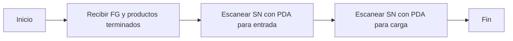

# Entrada y Salida de Productos Terminados
## Resumen del Proceso

## FG IN
### Escaneo de SN de FG para almacenamiento
* **Versión móvil de WMS**
    - Recibir el pedido FG y los productos terminados del departamento de producción.
    - Primero, ejecutar VTS para el pedido FG:
        1. **Verificar el estado de la orden de trabajo**
            - Ingresar el código de transacción `CO03`.
            - Verificar si la tercera palabra en `Sys.Status` es `DLV`. DLV indica que VTS ha confirmado la finalización de la orden de trabajo; de lo contrario, es necesario ejecutar VTS.
        2. **Deducción de cantidades**
            - Abrir una ventana separada en SAP e ingresar el código de transacción `ZMB1A`.
            - Ingresar `6501` en el campo `Plant`.
            - En `Order`, ingresar todas las órdenes de trabajo vistas en `CO03`.
            - Hacer clic en el ícono de reloj 🕥 en la esquina superior izquierda o presionar `F8` para ejecutar.
        3. **Ejecutar VTS**
            - Abrir el sistema MES [MES](http://10.224.245.101:8080/Index.aspx#).
            - Navegar hasta la última opción del menú `SAP`.
            - Seleccionar `A02.Confirmation`.
            - En `Order Number:`, ingresar el número de la orden de trabajo (confirmar la producción de abajo hacia arriba según las órdenes de trabajo vistas en `CO03`).
            - **Presionar Enter**.
            - En `Quantity:`, ingresar la cantidad a confirmar.
            - Hacer clic en `Save`. El resultado se mostrará en `Result[SAP message]`.
            - Volver a SAP `CO03` y actualizar.
            - Verificar `Sys.Status`; la tercera palabra debería ser ahora `DLV`.
            - [vts.png](https://github.com/dlelyw/VTX_6501/blob/main/files/png/vts.png)
    - **Almacenamiento**
        1. Escaneo con PDA para almacenamiento  [wms.apk (Versión móvil)](https://github.com/dlelyw/VTX_6501/blob/main/files/apps/wms_release_1.3.7.apk)
            - Iniciar sesión en el PDA (Dirección del servidor: 10.224.245.101:8085).
            - Seleccionar el menú `01-FG In`.
            - En `SN Type`, seleccionar Customer SN.
            - En `FG No`, ingresar el número del pedido FG.
            - En `Doc No`, ingresar el número del documento. Si no hay, ingresar los últimos 4 dígitos del número de la orden de trabajo.
            - En `FG Order`, ingresar el número de la orden de trabajo.
            - Presionar Enter.
            - `Total Qty` se completará automáticamente con la cantidad.
            - En `P/N`, ingresar el número de parte del producto terminado.
            - En `Location`, ingresar la ubicación.
            - En `Scan SN`, escanear el número de la caja del producto terminado.
            - Después de escanear todos los números de caja, guardar. [pda_fgin01.png](https://github.com/dlelyw/VTX_6501/blob/main/files/png/pda_fgin01.png) [pda_fgin02.png](https://github.com/dlelyw/VTX_6501/blob/main/files/png/pda_fgin02.png)
        2. Entrada manual en SAP (Solo para clientes que no requieren números de caja)
            - Ingresar el código de transacción `MB31` en SAP. [mb31.png](https://github.com/dlelyw/VTX_6501/blob/main/files/png/mb31.png)
            - En `Movement Type`, ingresar 101.
            - En `Order`, ingresar el número de la orden de trabajo.
            - En `Plant`, ingresar 6501.
            - En `Storage Loc.`, ingresar la ubicación de almacenamiento.
            - Presionar Enter.
            - Luego modificar la cantidad a ingresar.
            - Guardar.
            - Aparecerá un mensaje para generar un número de caja.
            - Hacer clic en el botón inferior derecho de la barra de herramientas para generar automáticamente un número de caja.
            - Guardar.

## FG OUT
### Escaneo de SN de FG para salida
* **Verificar la lista de envíos**
    - Ingresar el código de transacción `ZSP1A` en SAP.
    - En `Planned GI Date`, ingresar una fecha unos días antes.
    - En `Shipping Point`, ingresar S650.
    - En `Sales Organization`, ingresar 6501.
    - En `GI Status`, ingresar A (A indica no completado).
    - Hacer clic en el ícono de reloj 🕥 en la esquina superior izquierda o presionar `F8` para ejecutar.
    - [ZSP1A.png](https://github.com/dlelyw/VTX_6501/blob/main/files/png/ZSP1A.png)
* **Salida**
    1. Escaneo con PDA para salida
        - Iniciar sesión en el PDA (Dirección del servidor: 10.224.245.101:8085).
        - Seleccionar el menú `03-FG Out`.
        - En `SN Type`, seleccionar Customer SN.
        - En `DN`, ingresar el número de DN.
        - Presionar Enter.
        - `DN Qty` se completará automáticamente con la cantidad.
        - En `Scan SN`, escanear el número de la caja del producto terminado.
        - `Scan Qty` contará automáticamente los números de caja escaneados.
        - Guardar. [pad_fgout.png](https://github.com/dlelyw/VTX_6501/blob/main/files/png/pad_fgout.png)
            - La interfaz de envío de SAP sincronizará automáticamente el estado `Pick Up`.
            - Si no se sincroniza durante mucho tiempo,
            - Usar el código de transacción `ZSD046` en SAP.
            - En `Sales Organization`, ingresar 6501.
            - En `DN`, ingresar el número de DN de envío.
            - Hacer clic en el ícono de reloj 🕥 en la esquina superior izquierda o presionar `F8` para ejecutar.
            - Luego actualizar la interfaz de envío para ver el estado `Pick Up` como exitoso (C).
            - [ZSD046.png](https://github.com/dlelyw/VTX_6501/blob/main/files/png/ZSD046.png)
    2. Salida manual en SAP (Solo para clientes que no requieren números de caja o para recogida propia)
        - Ingresar el código de transacción `ZSP1A` en SAP.
        - En `Planned GI Date`, ingresar una fecha unos días antes.
        - En `Shipping Point`, ingresar S650.
        - En `Sales Organization`, ingresar 6501.
        - En `GI Status`, ingresar A (A indica no completado).
        - Hacer clic en el ícono de reloj 🕥 en la esquina superior izquierda o presionar `F8` para ejecutar.
        - Referirse a esta imagen (si es un producto terminado, seleccionar el número de caja). [fg_handcarry.gif](https://github.com/dlelyw/VTX_6501/blob/main/files/gif/fg_handcarry.gif)

## RMA
* **Sistema SAP**
    - **Entrada de orden de trabajo normal**
        - Consultar el número de orden de trabajo normal para esta RMA, generalmente en el formato 65100006335.
        - Usar el número de orden de trabajo normal para ingresar la cantidad en el sistema usando el código de transacción MB31 en SAP.
        - En `Movement Type`, ingresar 101.
        - En `Order`, ingresar el número de orden de trabajo normal.
        - En `Plant`, ingresar el almacén correspondiente.
        - En `Storage Loc.`, ingresar la ubicación de almacenamiento.
        - Hacer clic en el ícono de reloj 🕥 en la esquina superior izquierda o presionar `F8` para ejecutar.
        - Luego proceder a la interfaz de información de entrada.
        - Ingresar la cantidad a ingresar y presionar Enter.
        - [rma_1.png](https://github.com/dlelyw/VTX_6501/blob/main/files/png/rma_1.png) [rma_2.png](https://github.com/dlelyw/VTX_6501/blob/main/files/png/rma_2.png)
    - **Deducción de cantidad a la orden de retrabajo**
        - Usar el código de transacción MB1A en SAP.
        - En `Movement Type`, ingresar 261.
        - En `Plant`, ingresar 6501.
        - En `Storage Location`, ingresar FG01.
        - Buscar `To Order`, hacer clic en él e ingresar el número de orden de retrabajo.
        - Luego guardar.
        - Las operaciones posteriores son las mismas que el escaneo normal para entrada.
        - [vts_p_3.png](https://github.com/dlelyw/VTX_6501/blob/main/files/png/vts_p_3.png)

## Transferencia manual de cantidades para materiales auxiliares
* **Sistema SAP**
    - Usar `CO03` en SAP para verificar la orden de trabajo. Los números de parte que terminan en P*** indican ejecutar VTS para el departamento de producción (de abajo hacia arriba).
    - Abrir el SAP del departamento de producción e ingresar `CO11N`. Ingresar SO# y presionar Enter.
    - En `Order`, ingresar el número de la orden de trabajo.
    - Hacer clic en `Actual Data`.
    - Luego hacer clic en `Goods Movements`.
    - Seleccionar todos los datos.
    - Hacer clic en `batch determination` para confirmar.
    - Luego guardar.
    - [vts_p_1.png](https://github.com/dlelyw/VTX_6501/blob/main/files/png/vts_p_1.png) [vts_p_2.png](https://github.com/dlelyw/VTX_6501/blob/main/files/png/vts_p_2.png) [vts_p_3.png](https://github.com/dlelyw/VTX_6501/blob/main/files/png/vts_p_3.png)