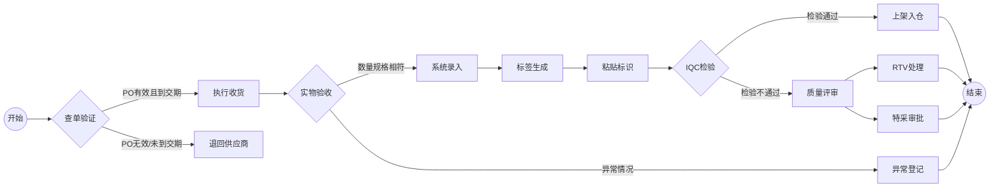

# 收货
## 流程概览

## 1. 查单作业（SAP系统操作）
*  **SAP系统**
    - 输入事务代码 `ZME2O`
    - 在"Plant"和"PO"字段输入送货单信息
    - 点击左上角闹钟图标🕥或按`F8`执行
    - 关键信息四核对：
       - ✅ 物料编码一致性
       - ✅ 订单数量一致性
       - ✅ 交期有效性（比对OA DATE）
       - ✅ 系统交期与实物标签一致性
    - [ZME2O.gif](https://github.com/dlelyw/VTX_6501/blob/0ecf0e8decf70686fdc0656ab4f7a64b32ba7241/files/gif/ZME2O.gif)

> **异常处理**：
> 🚨 出现"PO无数/未到交期"时，立即暂停收货流程，联系供应商协调处理

## 2. 收货点数规范
1. 三向比对：
   - 实物包装标签
   - 供应商送货单
   - SAP系统订单
2. 外观质量检验：
   - 🔍 检查包装完整性
   - ⚠️ 排除变形/破损/受潮等异常
3. 签收后操作：
   - 张贴待检区定位标签（格式：`QA01` 或者 `QA02`）
   - 货物移转至黄色待检区
   

## 3. 入库过账操作
*  **WMS 4.2 系统**
    1. 数据录入：
       - 依次输入发票号→包装单号→PO号→`[ Enter ]`
    2. 容器匹配：
       - 在右上视图区匹配实物料号/数量
       - 光标定位至收货数量字段
    3. 包装信息确认：
       - 录入实际到货包装规格（箱数/包装单位）
    4. 系统操作：
       - 点击 `[ Save ]` 生成批次号  
       - 把生成的批次号 书写到文档上
    5. [InRT_101.gif](https://github.com/dlelyw/VTX_6501/blob/78761c82f6bacd105d83a0eeb12adb896d5ab8bc/files/gif/InRT_101.gif)       

> **提示**：
> 暂存仓查询指令：ZMM138 超期未过账批次自动转到暂存仓状态 等待到期 接受到正常仓然后过单给IQC

## 4. 标签张贴规范
*  标签定位:
    - 外包装右上角30cm清洁区域
    - 距边缘≥5cm防磨损区域
*  张贴要求:
    - 一物一签，禁止覆盖原厂标识
    - 批次号需完整可视
 

## 5. 过单IQC流程
* **WMS 4.2 系统**
    - 导航至功能菜单：  
        - `Location` → `Move location` → `输入批次`→ `输入新位置`→ `保存`
    - 批次号录入规范 ：
        - 格式要求：固定10位数字
        - 补位规则：前导补"0"  
        - 示例：原始批次"1234567" → 输入"00001234567"
     - [Movelocation323.gif](https://github.com/dlelyw/VTX_6501/blob/78761c82f6bacd105d83a0eeb12adb896d5ab8bc/files/gif/Movelocation323.gif)

> **附件** **<a href="https://github.com/dlelyw/VTX_6501/blob/0ecf0e8decf70686fdc0656ab4f7a64b32ba7241/files/gif/Download%20File%20Example.gif">所有文件下载示例</a>**
- **软件类**
- [WMS.exe](https://github.com/dlelyw/VTX_6501/blob/19b5c6346e674e532626e966f523b64e8f6b57c0/files/apps/WMS.exe)
- [DFMS.exe （MES打印服务）](https://github.com/dlelyw/VTX_6501/blob/78761c82f6bacd105d83a0eeb12adb896d5ab8bc/files/apps/DFMS.exe)
- [Hairpin Label Printing Software.exe](https://github.com/dlelyw/VTX_6501/blob/78761c82f6bacd105d83a0eeb12adb896d5ab8bc/files/apps/Hairpin%20Label%20Printing%20Software.exe)
- [Herramienta de inicio de sesión específica.exe](https://github.com/dlelyw/VTX_6501/blob/78761c82f6bacd105d83a0eeb12adb896d5ab8bc/files/apps/Herramienta%20de%20inicio%20de%20sesión%20específica.exe)
- [wms_release_1.3.7.apk （移动版）](https://github.com/dlelyw/VTX_6501/blob/78761c82f6bacd105d83a0eeb12adb896d5ab8bc/files/apps/wms_release_1.3.7.apk)
- [dlelwprint.exe（任意文本打印）](https://github.com/dlelyw/VTX_6501/blob/78761c82f6bacd105d83a0eeb12adb896d5ab8bc/files/apps/dlelwprint.exe)
- [MESAPP_PRO.apk（MES移动版本）](https://github.com/dlelyw/VTX_6501/blob/78761c82f6bacd105d83a0eeb12adb896d5ab8bc/files/apps/MESAPP_PRO.apk)
- [dlelyw.exe（备用版本）](https://github.com/dlelyw/VTX_6501/blob/78761c82f6bacd105d83a0eeb12adb896d5ab8bc/files/apps/dlelyw.exe)
- **在线工具**
- [web_MES](http://10.97.245.205:92/login)
- [web_MES_apk](http://10.97.245.205:93)
- [web_translator](https://www.deepl.com/zh/translator)
- **文档类**
- [Invoice Number Lookup Guide.pdf](https://github.com/dlelyw/VTX_6501/blob/19b5c6346e674e532626e966f523b64e8f6b57c0/files/pdf/Invoice%20Number%20Lookup%20Guide.pdf)  
- [MES Receiving.pdf](https://github.com/dlelyw/VTX_6501/blob/78761c82f6bacd105d83a0eeb12adb896d5ab8bc/files/pdf/MES%20Receiving.pdf)
