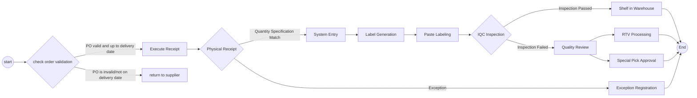

# Warehouse processes and practices

# Receiving
## Process overview

## 1. Check Order Operation (SAP System Operation)
*  **SAP System**
    - Enter transaction code `ZME2O`
    - Input delivery note information in the "Plant" and "PO" fields
    - Click the alarm clock icon 🕥 at the top left or press `F8` to execute
    - Key information verification:
       - ✅ Material code consistency
       - ✅ Order quantity consistency
       - ✅ Delivery date validity (compare with OA DATE)
       - ✅ System delivery date matches physical label
    - [ZME2O.gif](https://github.com/dlelyw/VTX_6501/blob/main/files/gif/ZME2O.gif)

> **Exception Handling**:
> 🚨 If "PO not found/delivery date not reached" appears, immediately pause the receiving process and contact the supplier for coordination

## 2. Receiving and Counting Standards
1. Three-way comparison:
   - Physical packaging label
   - Supplier delivery note
   - SAP system order
2. Appearance quality inspection:
   - 🔍 Check packaging integrity
   - ⚠️ Exclude deformities/damages/moisture anomalies
3. Post-receiving operations:
   - Attach the pending inspection area location label (format: `QA01` or `QA02`)
   - Transfer goods to the yellow pending inspection area
   

## 3. Inventory Posting Operation
*  **WMS 4.2 System**
    1. Data entry:
       - Enter invoice number → packing list number → PO number → `[ Enter ]`
    2. Container matching:
       - Match physical material number/quantity in the top-right view area
       - Position the cursor to the receiving quantity field
    3. Packaging information confirmation:
       - Enter actual arrival packaging specifications (number of boxes/packaging unit)
    4. System operation:
       - Click `[ Save ]` to generate a batch number  
       - Write the generated batch number on the document
    5. [InRT_101.gif](https://github.com/dlelyw/VTX_6501/blob/main/files/gif/InRT_101.gif)       

> **Tip**:
> Temporary storage query command: ZMM138 Overdue unposted batches are automatically transferred to temporary storage status, waiting for expiration, then received into normal storage and passed to IQC