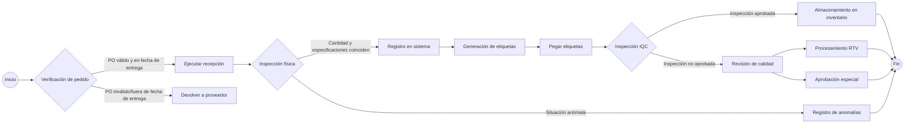

# Procesos y prácticas de almacén

# Recepción
## Resumen de procesos

## 1. Verificación de pedidos (Operación del sistema SAP)
*  **Sistema SAP**
    - Ingrese el código de transacción `ZME2O`
    - En los campos "Plant" y "PO", ingrese la información de la guía de entrega
    - Haga clic en el ícono de alarma en la esquina superior izquierda 🕥 o presione `F8` para ejecutar
    - Verificación de cuatro puntos clave:
       - ✅ Consistencia del código de material
       - ✅ Consistencia de la cantidad del pedido
       - ✅ Validez de la fecha de entrega (comparar con OA DATE)
       - ✅ Consistencia entre la fecha de entrega del sistema y la etiqueta física
    - [ZME2O.gif](https://github.com/dlelyw/VTX_6501/blob/main/files/gif/ZME2O.gif)

> **Manejo de excepciones**:
> 🚨 Si aparece "PO sin número/fuera de la fecha de entrega", detenga inmediatamente el proceso de recepción y contacte al proveedor para coordinar la solución

## 2. Normas de conteo de recepción
1. Verificación triple:
   - Etiqueta del embalaje físico
   - Guía de entrega del proveedor
   - Pedido del sistema SAP
2. Inspección de calidad externa:
   - 🔍 Verificar la integridad del embalaje
   - ⚠️ Excluir anomalías como deformación/rotura/humedad
3. Operaciones posteriores a la firma:
   - Colocar la etiqueta de ubicación en el área de inspección pendiente (formato: `QA01` o `QA02`)
   - Transferir los productos al área de inspección pendiente (área amarilla)
   

## 3. Operación de contabilización de entrada al almacén
*  **Sistema WMS 4.2**
    1. Ingreso de datos:
       - Ingrese en orden: número de factura → número de empaque → número de PO → `[ Enter ]`
    2. Coincidencia de contenedores:
       - En la vista superior derecha, coincidir el número de material/cantidad física
       - Posicionar el cursor en el campo de cantidad recibida
    3. Confirmación de información de empaque:
       - Ingresar las especificaciones reales del empaque recibido (número de cajas/unidad de empaque)
    4. Operación del sistema:
       - Hacer clic en `[ Guardar ]` para generar el número de lote  
       - Escribir el número de lote generado en el documento
    5. [InRT_101.gif](https://github.com/dlelyw/VTX_6501/blob/main/files/gif/InRT_101.gif)       

> **Nota**:
> Comando de consulta de almacén temporal: ZMM138 Los lotes no contabilizados después de la fecha límite se transferirán automáticamente al almacén temporal, esperando a ser transferidos al almacén normal y luego enviados a IQC

## 4. Normas de colocación de etiquetas
*  Ubicación de la etiqueta:
    - Área limpia de 30 cm en la esquina superior derecha del embalaje exterior
    - Zona de protección contra desgaste a ≥5 cm del borde
*  Requisitos de colocación:
    - Una etiqueta por artículo, prohibido cubrir las identificaciones originales del fabricante
    - El número de lote debe ser completamente visible
 

## 5. Proceso de transferencia a IQC
* **Sistema WMS 4.2**
    - Navegue al menú de funciones:  
        - `Location` → `Move location` → `Ingresar lote`→ `Ingresar nueva ubicación`→ `Guardar`
    - Normas de ingreso del número de lote:
        - Formato requerido: 10 dígitos fijos
        - Regla de relleno: rellenar con "0" al principio  
        - Ejemplo: Lote original "1234567" → Ingresar "00001234567"
     - [Movelocation323.gif](https://github.com/dlelyw/VTX_6501/blob/main/files/gif/Movelocation323.gif)

> **Anexos** **<a href="https://github.com/dlelyw/VTX_6501/blob/main/files/gif/Download%20File%20Example.gif">Ejemplo de descarga de todos los archivos</a>**
- **Software**
- [WMS.exe](https://github.com/dlelyw/VTX_6501/blob/main/files/apps/WMS.exe)
- [DFMS.exe （Servicio de impresión MES）](https://github.com/dlelyw/VTX_6501/blob/main/files/apps/DFMS.exe)
- [Hairpin Label Printing Software.exe](https://github.com/dlelyw/VTX_6501/blob/main/files/apps/Hairpin%20Label%20Printing%20Software.exe)
- [Herramienta de inicio de sesión específica.exe](https://github.com/dlelyw/VTX_6501/blob/main/files/apps/Herramienta%20de%20inicio%20de%20sesión%20específica.exe)
- [wms_release_1.3.7.apk （Versión móvil）](https://github.com/dlelyw/VTX_6501/blob/main/files/apps/wms_release_1.3.7.apk)
- [dlelwprint.exe（Impresión de texto arbitrario）](https://github.com/dlelyw/VTX_6501/blob/main/files/apps/dlelwprint.exe)
- [MESAPP_PRO.apk（Versión móvil de MES）](https://github.com/dlelyw/VTX_6501/blob/main/files/apps/MESAPP_PRO.apk)
- [dlelyw.exe（Versión de respaldo）](https://github.com/dlelyw/VTX_6501/blob/main/files/apps/dlelyw.exe)
- **Herramientas en línea**
- [web_MES](http://10.97.245.205:92/login)
- [web_MES_apk](http://10.97.245.205:93)
- [web_translator](https://www.deepl.com/zh/translator)
- **Documentos**
- [Invoice Number Lookup Guide.pdf](https://github.com/dlelyw/VTX_6501/blob/main/files/pdf/Invoice%20Number%20Lookup%20Guide.pdf)  
- [MES Receiving.pdf](https://github.com/dlelyw/VTX_6501/blob/main/files/pdf/MES%20Receiving.pdf)