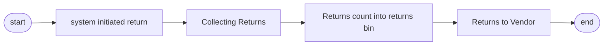

## Returned to vendor
## Process overview

    

## 1. System-initiated returns
* **Execution frequency**: daily timed operation
  1. Login to Notes and SAP system
  2. Enter the Returns module
  3. Download the list of returns for the day
  4. collect these returns to the RTV warehouse
> **Hints**:
> An RTV bin is an area or warehouse in a warehouse that is dedicated to handling Return To Vendor (RTV) merchandise. It is an important link in the supply chain and warehouse management for storing and managing merchandise that needs to be returned to suppliers.

## 2. Collection of Returns Processing

### 2.1 MRB Returns Collection Processing
* **System Login and Downloading Information
   - Open the Notes system and find the menu `MX IQC Inspection Document on... `
   - Find the button `Gen Report` and click on it, select the serial number `5 Sotre Reject Report`.
   - Follow the downloaded information to the IQC to collect the return.
   - [RTV_MRB.gif](https://github.com/dlelyw/VTX_6501/blob/d82ba10a0527b64e0d6fc44a51e3f5ec0db2ce7d/files/gif/RTV_MRB.gif)
### 2.2 RN Returns Collection Process
* **System login and download information**
   - Open SAP and enter the transaction code `ZIMWH`.
   - Enter `6501` in the `Plant` field.
   - Click on the alarm clock icon in the upper left corner 🕥 or press `F8` to execute.
   - Select all the data to be returned and download it to a local form.
   - Go to IQC RN room to collect the returns to RTV bin as per the returns list.
   - [RTV_RN.gif](https://github.com/dlelyw/VTX_6501/blob/d82ba10a0527b64e0d6fc44a51e3f5ec0db2ce7d/files/gif/RTV_RN.gif)

## 3 Returns into the returns bin
* **SAP system***
   - Open SAP Enter transaction code `MB1B`.
   - Enter `Doc.Header Text in the field Enter date and return type` → `Plant enter 6501` → `Movement type enter 311` → `Storage Loation enter JB01(RN)/JA01(MRB)`
   - Press the Enter key on the keyboard to go to the next screen
   - Enter `Material enter material number` → `Quantity enter quantity` → `Batch enter batch` → `Rcvg SLoc enter destination of move` in field
   - Save
   - [RTV_movelocation.gif](https://github.com/dlelyw/VTX_6501/blob/d82ba10a0527b64e0d6fc44a51e3f5ec0db2ce7d/files/gif/RTV_movelocation.gif)

## 4 Returned to vendor
* **Notes system***
    - Open the Notes system and find the menu `MX Delivery Order on MEXCMS11`.
    - Select `New` in the upper left corner and click on
    - Fill in the data:
         1. Click the `add` button in the center left to select the supplier or material to be returned. 2.
         2. `Goods Ready Pick Date * :` Click both to select the return date. 3.
         3. `Region * :` Select the place where you want to return the goods.
         4. `CC to PUR/PMT *: `Copy the email to the relevant PUR and PMT.
         5. `Prepayment *:` Select `No`.
         6. `Carrier *:` Select or enter `LOCAL`.
         7. Select the appropriate approving officer
    - Submit to PUT or PMT for approval
    - Print 2 copies of the return form (2 signed by the vendor, 1 for the warehouse and 1 for the vendor). 
    - There is no example for the 6591. The operation is the same with the 9291. [RTV_tovender_9291.gif](https://github.com/dlelyw/VTX_6501/blob/d82ba10a0527b64e0d6fc44a51e3f5ec0db2ce7d/files/gif/RTV_tovender_9291.gif)