 <h1>Return to Supplier</h1> 

## Process overview

```mermaid
flowchart LR
    A([start]) --> B[“system initiated return”]
    B --> C[“Collect Returns”]
    C --> D[“Returns count into returns bin”]
    D --> E[“Returns to Vendor”]
    E --> F([end])
```

    

## 1. System-Initiated Returns
* **Execution Frequency**: Daily scheduled operation
  1. Log in to Notes and SAP systems
  2. Navigate to the "Returns" module
  3. Download the daily return list
  4. Collect these returns to the RTV warehouse
> **Note**:
> The RTV warehouse refers to a specific area or warehouse dedicated to handling Return To Vendor (RTV) goods. It is a crucial part of supply chain and warehouse management, primarily used for storing and managing goods that need to be returned to suppliers.

## 2. Handling Collected Returns

### 2.1 MRB Return Collection Process
* **System Login and Data Download**
   - Open the Notes system and locate the menu `MX IQC Inspection Document on...`
   - Click the `Gen Report` button and select option `5 Store Reject Report`
   - Use the downloaded data to collect returns from IQC
   - [RTV_MRB.gif](https://github.com/dlelyw/VTX_6501/blob/main/files/gif/RTV_MRB.gif)

### 2.2 RN Return Collection Process
* **System Login and Data Download**
   - Open SAP and enter transaction code `ZIMWH`
   - In the "Plant" field, enter `6501`
   - Click the alarm icon 🕥 in the top-left corner or press `F8` to execute
   - Select all pending return data and download it to a local spreadsheet
   - Follow the return list to collect returns from the IQC RN room and move them to the RTV warehouse
   - [RTV_RN.gif](https://github.com/dlelyw/VTX_6501/blob/main/files/gif/RTV_RN.gif)

## 3. Entering Return Quantities into the Return Warehouse
* **SAP System**
   - Open SAP and enter transaction code `MB1B`
   - In the fields, enter `Doc.Header Text` (input date and return type) → `Plant` (input `6501`) → `Movement type` (input `311`) → `Storage Location` (input `JB01` for RN or `JA01` for MRB)
   - Press Enter to proceed to the next screen
   - In the fields, enter `Material` (input material number) → `Quantity` (input quantity) → `Batch` (input batch number) → `Rcvg SLoc` (input destination location)
   - Save
   - [RTV_movelocation.gif](https://github.com/dlelyw/VTX_6501/blob/main/files/gif/RTV_movelocation.gif)

## 4. Returning Goods to Suppliers
* **Notes System**
    - Open the Notes system and locate the menu `MX Delivery Order on MEXCMS11`
    - Click the `New` button in the top-left corner
    - Fill in the data:
         1. Click the `add` button in the middle-left section to select the supplier or material to be returned
         2. `Goods Ready Pick Date *:` Click both fields and select the return date
         3. `Region *:` Select the return location
         4. `CC to PUR/PMT *:` Copy the email to the relevant PUR and PMT
         5. `Prepayment *:` Select `No`
         6. `Carrier *:` Select or enter `LOCAL`
         7. Select the appropriate approver
    - Submit to PUT or PMT for approval
    - Print two copies of the return form (supplier signs both, one for the warehouse and one for the supplier)
    - No example for 6591; use 9291 as the operation is the same [RTV_tovender_9291.gif](https://github.com/dlelyw/VTX_6501/blob/main/files/gif/RTV_tovender_9291.gif)
       