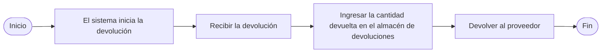

# Volver al proveedor
## Resumen del proceso

    

## 1. Devoluciones iniciadas por el sistema
* **Frecuencia de ejecución**: Operación programada diariamente
  1. Iniciar sesión en los sistemas Notes y SAP
  2. Acceder al módulo de "Devoluciones"
  3. Descargar la lista de devoluciones del día
  4. Recoger estas devoluciones y llevarlas al almacén RTV
> **Nota**:
> El almacén RTV es un área o almacén específico dedicado a gestionar las devoluciones a proveedores (Return To Vendor, RTV). Es un eslabón crucial en la gestión de la cadena de suministro y almacenes, principalmente utilizado para almacenar y gestionar productos que deben ser devueltos a los proveedores.

## 2. Procesamiento de devoluciones recogidas

### 2.1 Proceso de recogida de devoluciones MRB
* **Inicio de sesión en el sistema y descarga de datos**
   - Abrir el sistema Notes y localizar el menú `MX IQC Inspection Document on...`
   - Hacer clic en el botón `Gen Report` y seleccionar la opción `5 Store Reject Report`
   - Utilizar los datos descargados para recoger las devoluciones de IQC
   - [RTV_MRB.gif](https://github.com/dlelyw/VTX_6501/blob/main/files/gif/RTV_MRB.gif)

### 2.2 Proceso de recogida de devoluciones RN
* **Inicio de sesión en el sistema y descarga de datos**
   - Abrir SAP e ingresar el código de transacción `ZIMWH`
   - En el campo "Plant", ingresar `6501`
   - Hacer clic en el ícono de alarma 🕥 en la esquina superior izquierda o presionar `F8` para ejecutar
   - Seleccionar todos los datos de devolución pendientes y descargarlos a una hoja de cálculo local
   - Seguir la lista de devoluciones para recoger los productos de la sala RN de IQC y llevarlos al almacén RTV
   - [RTV_RN.gif](https://github.com/dlelyw/VTX_6501/blob/main/files/gif/RTV_RN.gif)

## 3. Ingreso de cantidades de devolución en el almacén de devoluciones
* **Sistema SAP**
   - Abrir SAP e ingresar el código de transacción `MB1B`
   - En los campos, ingresar `Doc.Header Text` (fecha y tipo de devolución) → `Plant` (ingresar `6501`) → `Movement type` (ingresar `311`) → `Storage Location` (ingresar `JB01` para RN o `JA01` para MRB)
   - Presionar Enter para pasar a la siguiente pantalla
   - En los campos, ingresar `Material` (número de material) → `Quantity` (cantidad) → `Batch` (número de lote) → `Rcvg SLoc` (ubicación de destino)
   - Guardar
   - [RTV_movelocation.gif](https://github.com/dlelyw/VTX_6501/blob/main/files/gif/RTV_movelocation.gif)

## 4. Devolución de productos a proveedores
* **Sistema Notes**
    - Abrir el sistema Notes y localizar el menú `MX Delivery Order on MEXCMS11`
    - Hacer clic en el botón `New` en la esquina superior izquierda
    - Rellenar los datos:
         1. Hacer clic en el botón `add` en la sección media-izquierda para seleccionar el proveedor o material a devolver
         2. `Goods Ready Pick Date *:` Hacer clic en ambos campos y seleccionar la fecha de devolución
         3. `Region *:` Seleccionar la ubicación de devolución
         4. `CC to PUR/PMT *:` Copiar el correo electrónico a los responsables de PUR y PMT
         5. `Prepayment *:` Seleccionar `No`
         6. `Carrier *:` Seleccionar o ingresar `LOCAL`
         7. Seleccionar el aprobador correspondiente
    - Enviar a PUT o PMT para su aprobación
    - Imprimir dos copias del formulario de devolución (el proveedor firma ambas, una para el almacén y otra para el proveedor)
    - No hay ejemplo para 6591; usar 9291 ya que la operación es la misma [RTV_tovender_9291.gif](https://github.com/dlelyw/VTX_6501/blob/main/files/gif/RTV_tovender_9291.gif)
       