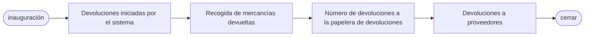

# Volver al proveedor
## Resumen del proceso

    

## 1. Retornos iniciados por el sistema
* **Frecuencia de ejecución**: operación diaria temporizada
  1. Acceder al sistema Notes y SAP
  2. Ir al módulo Devoluciones
  3. Descargar la lista de devoluciones del día
  4. Recoger estas devoluciones en el almacén de RTV
> **Pistas**:
> Un almacén de RTV es un área o almacén de un almacén dedicado a la mercancía de devolución al proveedor (RTV). Es un eslabón importante de la cadena de suministro y de la gestión de almacenes para almacenar y gestionar la mercancía que debe devolverse a los proveedores.

## 2. Proceso de recogida de devoluciones

### 2.1 Proceso de recogida de devoluciones MRB
* **Inicio de sesión en el sistema y descarga de información
   - Abra el sistema Notes y busque el menú `MX IQC Inspection Document on... `
   - Busque el botón `Gen Report` y haga clic sobre él, seleccione el número de serie `5 Sotre Reject Report`.
   - Siga la información descargada hasta el IQC para recoger la devolución.
   - [RTV_MRB.gif](https://github.com/dlelyw/VTX_6501/blob/d82ba10a0527b64e0d6fc44a51e3f5ec0db2ce7d/files/gif/RTV_MRB.gif)
### 2.2 Proceso de recogida de devoluciones de RN
* **Información de acceso al sistema y descarga**
   - Abra SAP e introduzca el código de transacción `ZIMWH`.
   - Introduzca `6501` en el campo `Plant`.
   - Haga clic en el icono del despertador en la esquina superior izquierda 🕥 o pulse `F8` para ejecutar.
   - Seleccione todos los datos a devolver y descárguelos en un formulario local.
   - Vaya a la sala de RN de IQC para recoger las devoluciones en el contenedor de RTV según la lista de devoluciones.
   - [RTV_RN.gif](https://github.com/dlelyw/VTX_6501/blob/d82ba10a0527b64e0d6fc44a51e3f5ec0db2ce7d/files/gif/RTV_RN.gif)

## 3 Devoluciones en la papelera de devoluciones
* **Sistema SAP**
   - Abra SAP Introduzca el código de transacción `MB1B`.
   - Introduzca `Doc.Header Text en el campo Enter date and return type` → `Plant enter 6501` → `Movement type enter 311` → `Storage Loation enter JB01(RN)/JA01(MRB)`.
   - Pulse Intro en el teclado para pasar a la siguiente pantalla
   - Introduzca `Material introduzca el número de material` → `Quantity introduzca la cantidad` → `Batch introduzca el lote` → `Rcvg SLoc introduzca el destino del movimiento` en el campo
   - Guardar
   - [RTV_movelocation.gif](https://github.com/dlelyw/VTX_6501/blob/d82ba10a0527b64e0d6fc44a51e3f5ec0db2ce7d/files/gif/RTV_movelocation.gif)

## 4 Devuelto al proveedor
* **Sistema de notas
    - Abra el sistema Notes y busque el menú «Orden de entregaMX en MEXCMS11».
    - Seleccione `Nuevo` en la esquina superior izquierda y haga clic en
    - Rellene los datos:
         1. Haga clic en el botón `add` en la parte central izquierda para seleccionar el proveedor o material a devolver.
         2. `Goods Ready Pick Date * :` Haga clic en ambos para seleccionar la fecha de devolución. 3. Haga clic en `Region * :`.
         3. `Región * :` Seleccione el lugar donde desea devolver la mercancía.
         4. `CC to PUR/PMT *: `Copie el correo electrónico al PUR y PMT correspondientes.
         5. `Prepago *:` Seleccione `No`.
         6. `Carrier *:` Seleccione o introduzca `LOCAL`.
         7. Seleccione el responsable de aprobación correspondiente
    - Enviar a PUT o PMT para su aprobación
    - Imprima dos copias del formulario de devolución (dos firmadas por el proveedor, una para el almacén y otra para el proveedor). 
    - No hay ejemplo para el 6591. La operación es la misma con el 9291. [RTV_tovender_9291.gif](https://github.com/dlelyw/VTX_6501/blob/d82ba10a0527b64e0d6fc44a51e3f5ec0db2ce7d/files/gif/RTV_tovender_9291.gif)