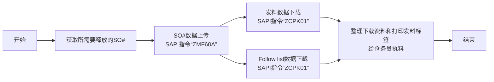

# 工单发料

## 释放"SO"工单流程
### 流程概览

### 1. 查看需要释放的"SO"工单表
* **Notes系统**
    - 邮件查看PMC每天发出当天的工单释放清单表 一般字样`SO release form For 2/13a (B1)/(B2)`
    - 本地建立一个表格只留两列`Plant` `SO`
    - 把所有需要释放的工单放在本地Excel里面`保存`
    - [SO_released_order_list.gif](https://github.com/dlelyw/VTX_6501/blob/68caeff4796d38c39a59355d96ecc5e7a46c8f6f/files/gif/SO_released_order_list.gif)
    - [Release of SO.xls](https://github.com/dlelyw/VTX_6501/blob/68caeff4796d38c39a59355d96ecc5e7a46c8f6f/files/Release%20of%20SO.xls)

### 2. 上传工单至SAP系统
* **SAP系统**
    - 打开SAP 输入事务代码 `ZMF60A`
    - 按下`Scanner Issue Order`按钮
    - 选择单选按钮`Upload` 
    - 把第一步保存的Excel路径放在`File Name`后的输入框
    - 点击左上角闹钟图标🕥或按`F8`执行
    - [SO_released_order_UP.gif](https://github.com/dlelyw/VTX_6501/blob/68caeff4796d38c39a59355d96ecc5e7a46c8f6f/files/gif/SO_released_order_UP.gif)

::: alert-danger
**注意**：
所有上传到SAP的工单号，需要全部成功才可以，如果失败，需要找PMC立马处理。一般情况为SO#被删，或者没有释放。
:::

### 3. 打印发料资料

#### 1.打印发料资料
* **SAP系统**
    - 打开SAP 输入事务代码`ZCPK01A`
    - 在`Plant` 输入 `6501`
    - `Production Order` 输入需要释放的工单号可以多行输入 按同套工单输入
    - `sort by` 选择 `summarized Pick list`其余所有都不选择
    - 点击左上角闹钟图标🕥或按`F8`执行
    - 选择左上角菜单`List`  → `Print` → `选择需要打印的打印机` → 打印时间选择`Immediately`
    - 或者按下键盘快捷键`Ctrl + P`
    - [SO_released_order_print.gif](https://github.com/dlelyw/VTX_6501/blob/68caeff4796d38c39a59355d96ecc5e7a46c8f6f/files/gif/SO_released_order_print.gif)

#### 2.打印"pack list"资料
* **SAP系统**
    - 打开SAP 输入事务代码`ZCPK01A`
    - 在`Plant` 输入 `6501`
    - `Production Order` 输入需要释放的工单号可以多行输入 按同套工单输入
    - `sort by` 选择 `Follow list` 其余所有都不选择
    - 点击左上角闹钟图标🕥或按`F8`执行
    - 选择左上角菜单`List`  → `Print` → `选择需要打印的打印机` → 打印时间选择`Immediately`
    - 或者按下键盘快捷键`Ctrl + P`
    - [SO_released_order_print_pick_list.gif](https://github.com/dlelyw/VTX_6501/blob/68caeff4796d38c39a59355d96ecc5e7a46c8f6f/files/gif/SO_released_order_print_pick_list.gif)

### 4. 下载资料到本地
#### 1. 下载待打印标签资料
* **SAP系统**
    - 打开SAP 输入事务代码`ZCPK01A`
    - 在`Plant` 输入 `6501`
    - `Production Order` 输入需要释放的工单号可以多行输入 按同套工单输入
    - `sort by` 选择 `summarized Pick list`其余所有都不选择
    - 点击左上角闹钟图标🕥或按`F8`执行
    - 选择左上角菜单`List`  → `Save/Send` → `Local Flie..` →`Text with Tabs`
    - 选择存储位置 格式选择Excel格式
    - [SO_released_order_print_downexcle.gif](https://github.com/dlelyw/VTX_6501/blob/68caeff4796d38c39a59355d96ecc5e7a46c8f6f/files/gif/SO_released_order_print_downexcle.gif)
    
#### 2. 下载Follow List
* **SAP系统**
    - 打开SAP 输入事务代码`ZCPK01A`
    - 在`Plant` 输入`6501`
    - `Production Order` 输入需要释放的工单号可以多行输入 按同套工单输入
    - `sort by` 选择 `Follow list` 和 `Follow list > 0` 其余所有都不选择
    - 点击左上角闹钟图标🕥或按`F8`执行
    - `Follow list` 文件自动会保存到`Follow list > 0`旁边的路径地址中去
    - 找到这个资料 发送给PMC
    - [SO_released_order_print_followlist.gif](https://github.com/dlelyw/VTX_6501/blob/68caeff4796d38c39a59355d96ecc5e7a46c8f6f/files/gif/SO_released_order_print_followlist.gif)
 
#### 3. SMT资料下载
* **SAP系统**
    - 打开PMC发送的SO清单
    - 复制SMT专用描述为PCB和SMD开头 结尾为R层的SO
        - 方法1 `CO03` 可下载单个SO# 未释放的SO#也可下载
            - 打开SAP 输入事务代码`CO03`
            - 双击这个SO进入详情界面
            - 点击工具栏图标名为`Component Overview`
            - 再次点击`Component`图标
            - 点击右键下载资料到本地
        - 方法2 `ZCPK01` 可多个SO#批量下载 需释放并上传后才可下载
            - 打开SAP 输入事务代码`ZCPK01A`
            - 在`Plant` 输入 `6501`
            - `Production Order` 输入需要释放的工单号可以多行输入 按同套工单输入
            - `sort by` 选择 `Follow list` 其余所有都不选择
            - 点击左上角闹钟图标🕥或按`F8`执行
            - 保存资料到本地
        - 整理下载好的SMT资料
        - 只需要料号和数量 并且删除数量为零的物料和删除料号结尾为R8开头的物料
        - 使用[SmtAutoCalculated.xls](https://github.com/dlelyw/VTX_6501/blob/1aa59501516b797085faff3d34d238b0180b1f1f/files/SmtAutoCalculated.xls)计算数据
        - 按模板做成发料文档[Sample SMT warehouse information.xls](https://github.com/dlelyw/VTX_6501/blob/1aa59501516b797085faff3d34d238b0180b1f1f/files/Sample%20SMT%20warehouse%20information.xls)
        - 有10分钟的视频文件 分2个包 下载到本地解压观看 [smt_document.7z.001](https://github.com/dlelyw/VTX_6501/blob/61d592a90bb72a70cf308b40459955676a4896af/files/mp4/smt_document.7z.001) [smt_document.7z.002](https://github.com/dlelyw/VTX_6501/blob/61d592a90bb72a70cf308b40459955676a4896af/files/mp4/smt_document.7z.002)

### 5. 打印发料标签
* **dlelywpp_Impresión de etiquetas de horquilla程序**
    - 打开下载的资料
    - 另存为Excle文件
    - 打开软件 `dlelywpp_Impresión de etiquetas de horquilla.exe`
    - 把文件拖放到软件内
    - 打印所有标签
    - [Hairpin Label Printing Software.exe](https://github.com/dlelyw/VTX_6501/blob/78761c82f6bacd105d83a0eeb12adb896d5ab8bc/files/apps/Hairpin%20Label%20Printing%20Software.exe)
    - [SO_released_order_printlable.gif](https://github.com/dlelyw/VTX_6501/blob/650857b8bae306f793834e8798b6d0e8f078812c/files/gif/SO_released_order_printlable.gif)

> **附件** **<a href="https://github.com/dlelyw/VTX_6501/blob/0ecf0e8decf70686fdc0656ab4f7a64b32ba7241/files/gif/Download%20File%20Example.gif">所有文件下载示例</a>**
- **文档类**
- [Guidelines for Printing Warehouse Dispatch Labels（bilingualism）.pdf](https://github.com/dlelyw/VTX_6501/blob/b14a691dc7da014fbe7fc158a1661fea28ffd2f2/files/pdf/Guidelines%20for%20Printing%20Warehouse%20Dispatch%20Labels（bilingualism）.pdf)
- [SMT Dispatch Guidelines.pdf](https://github.com/dlelyw/VTX_6501/blob/b14a691dc7da014fbe7fc158a1661fea28ffd2f2/files/pdf/SMT%20Dispatch%20Guidelines.pdf)
