# Work Order Issuance

## Release "SO" Work Order Process
### Process Overview

```mermaid
graph LR
    A[Start] --> B[Obtain the SO# to be released]
    B --> C[Upload SO# data<br>SAPI command “ZMF60A”]
    C --> D[Download issuance data<br>SAPI command “ZCPK01”]
    C --> E[Download Follow list data<br>SAPI command “ZCPK01”]
    D --> F[Organize downloaded materials and print issuance labels<br>Provide to warehouse staff for execution]
    E --> F[Organize downloaded materials and print issuance labels<br>Provide to warehouse staff for execution]
    F --> G[End]
```

### 1. View the "SO" Work Order Table to be Released
* **Notes System**
    - Check the daily work order release list sent by PMC via email, usually titled `SO release form For 2/13a (B1)/(B2)`
    - Create a local table with only two columns: `Plant` and `SO`
    - Save all work orders to be released in a local Excel file
    - [SO_released_order_list.gif](https://github.com/dlelyw/VTX_6501/blob/main/files/gif/SO_released_order_list.gif)
    - [Release of SO.xls](https://github.com/dlelyw/VTX_6501/blob/main/files/Release%20of%20SO.xls)

### 2. Upload Work Orders to SAP System
* **SAP System**
    - Open SAP and enter transaction code `ZMF60A`
    - Click the `Scanner Issue Order` button
    - Select the `Upload` radio button
    - Enter the path of the Excel file saved in the first step in the `File Name` field
    - Click the alarm icon 🕥 in the top-left corner or press `F8` to execute
    - [SO_released_order_UP.gif](https://github.com/dlelyw/VTX_6501/blob/main/files/gif/SO_released_order_UP.gif)

::: alert-danger
**Note**:
All work order numbers uploaded to SAP must be successful. If any fail, contact PMC immediately for resolution. Common issues include deleted SO# or unapproved releases.
:::

### 3. Print Material Dispatch Documents

#### 1. Print Material Dispatch Documents
* **SAP System**
    - Open SAP and enter transaction code `ZCPK01A`
    - In the `Plant` field, enter `6501`
    - In the `Production Order` field, enter the work order numbers to be released (multiple lines allowed for the same set of work orders)
    - In `sort by`, select `summarized Pick list` and leave all other options unchecked
    - Click the alarm icon 🕥 in the top-left corner or press `F8` to execute
    - Select the top-left menu `List` → `Print` → `Choose the printer` → Set print time to `Immediately`
    - Alternatively, use the keyboard shortcut `Ctrl + P`
    - [SO_released_order_print.gif](https://github.com/dlelyw/VTX_6501/blob/main/files/gif/SO_released_order_print.gif)

#### 2. Print "Pack List" Documents
* **SAP System**
    - Open SAP and enter transaction code `ZCPK01A`
    - In the `Plant` field, enter `6501`
    - In the `Production Order` field, enter the work order numbers to be released (multiple lines allowed for the same set of work orders)
    - In `sort by`, select `Follow list` and leave all other options unchecked
    - Click the alarm icon 🕥 in the top-left corner or press `F8` to execute
    - Select the top-left menu `List` → `Print` → `Choose the printer` → Set print time to `Immediately`
    - Alternatively, use the keyboard shortcut `Ctrl + P`
    - [SO_released_order_print_pick_list.gif](https://github.com/dlelyw/VTX_6501/blob/main/files/gif/SO_released_order_print_pick_list.gif)

### 4. Download Documents Locally

#### 1. Download Pending Label Printing Data
* **SAP System**
    - Open SAP and enter transaction code `ZCPK01A`
    - In the `Plant` field, enter `6501`
    - In the `Production Order` field, enter the work order numbers to be released (multiple lines allowed for the same set of work orders)
    - In `sort by`, select `summarized Pick list` and leave all other options unchecked
    - Click the alarm icon 🕥 in the top-left corner or press `F8` to execute
    - Select the top-left menu `List` → `Save/Send` → `Local File..` → `Text with Tabs`
    - Choose the save location and select Excel format
    - [SO_released_order_print_downexcle.gif](https://github.com/dlelyw/VTX_6501/blob/main/files/gif/SO_released_order_print_downexcle.gif)

#### 2. Download Follow List
* **SAP System**
    - Open SAP and enter transaction code `ZCPK01A`
    - In the `Plant` field, enter `6501`
    - In the `Production Order` field, enter the work order numbers to be released (multiple lines allowed for the same set of work orders)
    - In `sort by`, select `Follow list` and `Follow list > 0`, and leave all other options unchecked
    - Click the alarm icon 🕥 in the top-left corner or press `F8` to execute
    - The `Follow list` file will automatically save to the path next to `Follow list > 0`
    - Locate this file and send it to PMC
    - [SO_released_order_print_followlist.gif](https://github.com/dlelyw/VTX_6501/blob/main/files/gif/SO_released_order_print_followlist.gif)

#### 3. SMT Data Download
* **SAP System**
    - Open the SO list sent by PMC
    - Copy SOs with descriptions starting with PCB or SMD and ending with R layer
        - Method 1: `CO03` (Can download single SO#, including unapproved SO#)
            - Open SAP and enter transaction code `CO03`
            - Double-click the SO to enter the details page
            - Click the toolbar icon named `Component Overview`
            - Click the `Component` icon again
            - Right-click to download the data locally
        - Method 2: `ZCPK01` (Can batch download multiple SO#, requires release and upload)
            - Open SAP and enter transaction code `ZCPK01A`
            - In the `Plant` field, enter `6501`
            - In the `Production Order` field, enter the work order numbers to be released (multiple lines allowed for the same set of work orders)
            - In `sort by`, select `Follow list` and leave all other options unchecked
            - Click the alarm icon 🕥 in the top-left corner or press `F8` to execute
            - Save the data locally
        - Organize the downloaded SMT data
        - Keep only the material number and quantity, and delete materials with zero quantity and those ending with R8
        - Use [SmtAutoCalculated.xls](https://github.com/dlelyw/VTX_6501/blob/main/files/SmtAutoCalculated.xls) to calculate the data
        - Create a dispatch document based on the template [Sample SMT warehouse information.xls](https://github.com/dlelyw/VTX_6501/blob/main/files/Sample%20SMT%20warehouse%20information.xls)
        - A 10-minute video file is available in two parts. Download and extract to watch: [smt_document.7z.001](https://github.com/dlelyw/VTX_6501/blob/main/files/mp4/smt_document.7z.001) [smt_document.7z.002](https://github.com/dlelyw/VTX_6501/blob/main/files/mp4/smt_document.7z.002)

### 5. Print Dispatch Labels
* **dlelywpp_Hairpin Label Printing Software**
    - Open the downloaded data
    - Save it as an Excel file
    - Open the software `dlelywpp_Hairpin Label Printing Software.exe`
    - Drag and drop the file into the software
    - Print all labels
    - [Hairpin Label Printing Software.exe](https://github.com/dlelyw/VTX_6501/blob/main/files/apps/Hairpin%20Label%20Printing%20Software.exe)
    - [SO_released_order_printlable.gif](https://github.com/dlelyw/VTX_6501/blob/main/files/gif/SO_released_order_printlable.gif)

> **Attachments** **<a href="https://github.com/dlelyw/VTX_6501/blob/0ecf0e8decf70686fdc0656ab4f7a64b32ba7241/files/gif/Download%20File%20Example.gif">Download Example for All Files</a>**
- **Documents**
- [Guidelines for Printing Warehouse Dispatch Labels（bilingualism）.pdf](https://github.com/dlelyw/VTX_6501/blob/main/files/pdf/Guidelines%20for%20Printing%20Warehouse%20Dispatch%20Labels（bilingualism）.pdf)
- [SMT Dispatch Guidelines.pdf](https://github.com/dlelyw/VTX_6501/blob/main/files/pdf/SMT%20Dispatch%20Guidelines.pdf)
