# Work Order Issuance

## Release "SO" Work Order Process

### Process Overview

```mermaid
graph LR
    A[Start] --> B[Obtain the SO# to be released]
    B --> C[Upload SO# data<br>SAPI command “ZMF60A”]
    C --> D[Download issuance data<br>SAPI command “ZCPK01”]
    C --> E[Download Follow list data<br>SAPI command “ZCPK01”]
    D --> F[Organize downloaded materials and print issuance labels<br>Provide to warehouse staff for execution]
    E --> F[Organize downloaded materials and print issuance labels<br>Provide to warehouse staff for execution]
    F --> G[End]
```

### 1. View “SO” work order forms that need to be released.
***Notes system***
    - E-mail the release form for the day's work orders that PMC sends out each day. General `SO release form For 2/13a (B1)/(B2)`.
    - Create a table locally with only two columns `Plant` `SO`.
    - Put all work orders to be released in local Excel `Save`.
    - [SO_released_order_list.gif](https://github.com/dlelyw/VTX_6501/blob/68caeff4796d38c39a59355d96ecc5e7a46c8f6f/files/gif/SO_released_order_list.gif)
    - [Release of SO.xls](https://github.com/dlelyw/VTX_6501/blob/68caeff4796d38c39a59355d96ecc5e7a46c8f6f/files/Release%20of%20SO.xls)

### 2. Uploading work orders to the SAP system
***SAP system***
    - Open SAP and enter the transaction code `ZMF60A`.
    - Press the `Scanner Issue Order` button
    - Select the radio button `Upload`. 
    - Put the path to the Excel saved in the first step in the input box after `File Name`.
    - Click on the alarm clock icon in the upper left corner 🕥 or press `F8` to execute it
    - [SO_released_order_UP.gif](https://github.com/dlelyw/VTX_6501/blob/68caeff4796d38c39a59355d96ecc5e7a46c8f6f/files/gif/SO_released_order_UP.gif)

::: alert-danger
**Note**:
All the work order numbers uploaded to SAP need to be all successful before they can be released, if they fail, you need to find PMC to deal with them immediately. The general situation is that the SO# is deleted, or not released.
:::

### 3. Print out the dispatch information

#### 1. Print out the material dispatching information
* **SAP system
    - Open SAP and enter transaction code `ZCPK01A`.
    - In `Plant`, enter `6501`.
    - `Production Order` Enter the number of the work order to be released. You can enter multiple rows.
    - `sort by` select `summarized pick list` and leave everything else unselected.
    - Click on the alarm clock icon in the upper left corner 🕥 or press `F8` to execute.
    - Select `List` → `Print` → `Select Printer to Print` → Select `Immediately` for the print time.
    - Or press the keyboard shortcut `Ctrl + P`.
    - [SO_released_order_print.gif](https://github.com/dlelyw/VTX_6501/blob/68caeff4796d38c39a59355d96ecc5e7a46c8f6f/files/gif/SO_released_order_print.gif)

#### 2. Print “pack list” information
***SAP system***
    - Open SAP and enter transaction code `ZCPK01A`.
    - In `Plant`, enter `6501`.
    - `Production Order` Enter the work order number to be released, you can enter it in multiple lines, and enter it in the same set of work orders.
    - `sort by` select `Follow list` and leave everything else unselected.
    - Click on the alarm clock icon in the upper left corner 🕥 or press `F8` to execute.
    - Select `List` → `Print` → `Select Printer to Print` → Select `Immediately` for the print time.
    - Or press the keyboard shortcut `Ctrl + P`.
    - [SO_released_order_print_pick_list.gif](https://github.com/dlelyw/VTX_6501/blob/68caeff4796d38c39a59355d96ecc5e7a46c8f6f/files/gif/SO_released_order_print_pick_list.gif)

### 4. Download information locally
#### 1. Download labeling information to be printed
* **SAP system**
    - Open SAP and enter transaction code `ZCPK01A`.
    - In `Plant`, enter `6501`.
    - `Production Order` Enter the number of the work order to be released, you can enter it in multiple rows.
    - `sort by` select `summarized pick list` and leave everything else unselected.
    - Click on the alarm clock icon in the upper left corner 🕥 or press `F8` to execute.
    - Select the top left menu `List` → `Save/Send` → `Local Flie.... ` → `Text with Tabs`.
    - Select the storage location Select Excel for the format
    - [SO_released_order_print_downexcle.gif](https://github.com/dlelyw/VTX_6501/blob/68caeff4796d38c39a59355d96ecc5e7a46c8f6f/files/gif/SO_released_order_print_downexcle.gif)
    
#### 2. Download Follow List
* **SAP system**
    - Open SAP and enter the transaction code `ZCPK01A`.
    - In `Plant`, enter `6501`.
    - `Production Order` Enter the number of the work order to be released, you can enter it in multiple rows and enter it in the same set of work order.
    - `sort by` select `Follow list` and `Follow list > 0` and leave all the rest unselected.
    - Click on the alarm clock icon in the upper left corner 🕥 or press `F8`.
    - The `Follow list` file is automatically saved to the path address next to `Follow list > 0`.
    - Find this file and send it to PMC.
    - [SO_released_order_print_followlist.gif](https://github.com/dlelyw/VTX_6501/blob/68caeff4796d38c39a59355d96ecc5e7a46c8f6f/files/gif/SO_released_order_print_followlist.gif)
 
#### 3. SMT information download
* **SAP system**
    - Open the SO list sent by PMC
    - Copy the SMT-specific description of the SO that starts with PCB and SMD and ends with R layer.
        - Method 1 `CO03' can download single SO# Unreleased SO# can also be downloaded.
            - Open SAP and enter the transaction code `CO03`.
            - Double click on the SO to enter the details screen.
            - Click on the toolbar icon named `Component Overview`.
            - Click on the `Component` icon again.
            - Right-click to download the information locally
            -Method 2 `ZCPK01 
        - Method 2 `ZCPK01` Multiple SO# can be downloaded in batch Need to be released and uploaded before downloading.
            - Open SAP and enter transaction code `ZCPK01A`.
            - In `Plant` enter `6501`
            - `Production Order` Enter the work order number to be released, you can enter it in multiple lines, and enter it in the same work order.
            - `sort by` select `Follow list` and leave everything else unselected.
            - Click on the alarm clock icon in the upper left corner 🕥 or press `F8` to execute.
            - Saving data locally
        - Organize the downloaded SMT data.
        - You only need the number and quantity and delete the material with zero quantity and the material with R8 at the end of the number.
        - utilization[SmtAutoCalculated.xls](https://github.com/dlelyw/VTX_6501/blob/1aa59501516b797085faff3d34d238b0180b1f1f/files/SmtAutoCalculated.xls)Calculated data
        - Make a distribution document according to the template[Sample SMT warehouse information.xls](https://github.com/dlelyw/VTX_6501/blob/1aa59501516b797085faff3d34d238b0180b1f1f/files/Sample%20SMT%20warehouse%20information.xls)
        - There's a 10-minute video file in two packages. Download it locally and unzip it. [smt_document.7z.001](https://github.com/dlelyw/VTX_6501/blob/61d592a90bb72a70cf308b40459955676a4896af/files/mp4/smt_document.7z.001) [smt_document.7z.002](https://github.com/dlelyw/VTX_6501/blob/61d592a90bb72a70cf308b40459955676a4896af/files/mp4/smt_document.7z.002)

### 5. Printing of dispatch labels
***dlelywpp_Impresión de etiquetas de horquilla program***
    - Open the downloaded material
    - Save as Excle file
    - Open the software `dlelywpp_Impresión de etiquetas de horquilla.exe`.
    - Drag and drop the file into the program
    - Print all labels
    - [Hairpin Label Printing Software.exe](https://github.com/dlelyw/VTX_6501/blob/78761c82f6bacd105d83a0eeb12adb896d5ab8bc/files/apps/Hairpin%20Label%20Printing%20Software.exe)
    - [SO_released_order_printlable.gif](https://github.com/dlelyw/VTX_6501/blob/650857b8bae306f793834e8798b6d0e8f078812c/files/gif/SO_released_order_printlable.gif)

> **attachment** **<a href="https://github.com/dlelyw/VTX_6501/blob/0ecf0e8decf70686fdc0656ab4f7a64b32ba7241/files/gif/Download%20File%20Example.gif">Example of all file downloads</a>**
- **file class**
- [Guidelines for Printing Warehouse Dispatch Labels（bilingualism）.pdf](https://github.com/dlelyw/VTX_6501/blob/b14a691dc7da014fbe7fc158a1661fea28ffd2f2/files/pdf/Guidelines%20for%20Printing%20Warehouse%20Dispatch%20Labels（bilingualism）.pdf)
- [SMT Dispatch Guidelines.pdf](https://github.com/dlelyw/VTX_6501/blob/b14a691dc7da014fbe7fc158a1661fea28ffd2f2/files/pdf/SMT%20Dispatch%20Guidelines.pdf)
