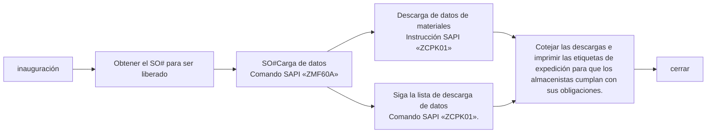

# Despacho de órdenes de trabajo

## Despacho de órdenes de trabajo «SO
### Resumen del proceso

### 1. Ver los formularios de órdenes de trabajo «SO» que necesitan ser liberados.
* **Sistema de notas***
    - Correo electrónico para ver la lista diaria de PMC de liberaciones de órdenes de trabajo para el día en cuestión `SO release form For 2/13a (B1)/(B2)`
    - Crear localmente una tabla con sólo dos columnas`Plant` `SO`
    - Ponga todas las órdenes de trabajo que necesitan ser liberadas en un `save` Excel local.
    - [SO_released_order_list.gif](https://github.com/dlelyw/VTX_6501/blob/68caeff4796d38c39a59355d96ecc5e7a46c8f6f/files/gif/SO_released_order_list.gif)
    - [Release of SO.xls](https://github.com/dlelyw/VTX_6501/blob/68caeff4796d38c39a59355d96ecc5e7a46c8f6f/files/Release%20of%20SO.xls)

### 2. Cargar las órdenes de trabajo en el sistema SAP
* **Sistema SAP
    - Abrir SAP Introducir código de transacción `ZMF60A`
    - pulse`Scanner Issue Order`botones
    - Selección de botones de radio`Upload` 
    - Coloque la ruta de Excel guardada en el primer paso en el campo`File Name`Cuadro de entrada después de
    - Haz clic en el icono del despertador de la esquina superior izquierda 🕥 o pulsa `F8` para ejecutarlo
    - [SO_released_order_UP.gif](https://github.com/dlelyw/VTX_6501/blob/68caeff4796d38c39a59355d96ecc5e7a46c8f6f/files/gif/SO_released_order_UP.gif)

::: alert-danger
**Nota**:
Todos los números de orden de trabajo cargados en SAP necesitan ser todos exitosos antes de que puedan ser liberados, si fallan, usted necesita encontrar PMC para tratar con él inmediatamente. La situación general es que el SO# se borra, o no se libera.
:::

### 3. Imprimir información de envío

#### 1. Imprimir información de despacho
* **Sistema SAP
    - Abra SAP e introduzca el código de transacción`ZCPK01A`
    - existe`Plant` Entrada `6501`.
    - `Production Order` Introducir el número de orden de trabajo a liberar puede introducirse en varias líneas Entrada por el mismo conjunto de órdenes de trabajo
    - `sort by` opción `summarized Pick list`Todo lo demás no es una opción.
    - Haz clic en el icono del despertador de la esquina superior izquierda 🕥 o pulsa `F8` para ejecutarlo
    - Seleccione el menú de la esquina superior izquierda`List`  → `Print` → `Seleccione la impresora en la que desea imprimir` → Selección del tiempo de impresión`Immediately`
    - O pulse el atajo de teclado`Ctrl + P`
    - [SO_released_order_print.gif](https://github.com/dlelyw/VTX_6501/blob/68caeff4796d38c39a59355d96ecc5e7a46c8f6f/files/gif/SO_released_order_print.gif)

#### 2. Imprimir información de la «lista de paquetes
* **Sistema SAP
    - Abra SAP e introduzca el código de transacción.`ZCPK01A`
    - existe`Plant` Entrada `6501`.
    - `Production Order` Introducir el número de orden de trabajo a liberar puede introducirse en varias líneas Entrada por el mismo conjunto de órdenes de trabajo
    - `sort by` opción `Follow list` Todo lo demás no es una opción.
    - Haz clic en el icono del despertador de la esquina superior izquierda 🕥 o pulsa `F8` para ejecutarlo
    - Seleccione el menú de la esquina superior izquierda`List`  → `Print` → `Seleccione la impresora en la que desea imprimir` → Selección del tiempo de impresión`Immediately`
    - O pulse el atajo de teclado `Ctrl + P`.
    - [SO_released_order_print_pick_list.gif](https://github.com/dlelyw/VTX_6501/blob/68caeff4796d38c39a59355d96ecc5e7a46c8f6f/files/gif/SO_released_order_print_pick_list.gif)

### 4. Descargue la información localmente
#### 1. Descargar las etiquetas a imprimir
* **Sistema SAP
    - Abra SAP e introduzca el código de transacción.`ZCPK01A`
    - existe`Plant` Entrada `6501`.
    - `Production Order` Introducir el número de orden de trabajo a liberar puede introducirse en varias líneas Entrada por el mismo conjunto de órdenes de trabajo
    - `sort by` opción `summarized Pick list`Todo lo demás no es una opción.
    - Haz clic en el icono del despertador de la esquina superior izquierda 🕥 o pulsa `F8` para ejecutarlo
    - Seleccione el menú de la esquina superior izquierda`List`  → `Save/Send` → `Local Flie..` →`Text with Tabs`
    - Seleccione la ubicación de almacenamiento Formato Seleccione el formato de Excel
    - [SO_released_order_print_downexcle.gif](https://github.com/dlelyw/VTX_6501/blob/68caeff4796d38c39a59355d96ecc5e7a46c8f6f/files/gif/SO_released_order_print_downexcle.gif)
    
#### 2. descargando "Follow List"
* **Sistema SAP
    - Abra SAP e introduzca el código de transacción.`ZCPK01A`
    - existe`Plant` importación `6501`
    - `Production Order` Introducir el número de orden de trabajo a liberar puede introducirse en varias líneas Entrada por el mismo conjunto de órdenes de trabajo
    - `sort by` opción `Follow list` responder cantando `Follow list > 0` Todo lo demás no es una opción.
    - Haz clic en el icono del despertador de la esquina superior izquierda 🕥 o pulsa `F8` para ejecutarlo
    - `Follow list` El archivo se guarda automáticamente en la carpeta`Follow list > 0`Vaya a la dirección de la ruta junto a
    - Busque esta información y envíela a PMC.
    - [SO_released_order_print_followlist.gif](https://github.com/dlelyw/VTX_6501/blob/68caeff4796d38c39a59355d96ecc5e7a46c8f6f/files/gif/SO_released_order_print_followlist.gif)
 
#### 3. Descarga de información SMT
* **Sistema SAP**
    - Abra la lista SO enviada por PMC
    - Copie la descripción específica SMT del SO que comienza con PCB y SMD y termina con capa R.
        - Método 1 `CO03` Los SO# individuales pueden descargarse Los SO# no liberados también pueden descargarse
            - Abrir SAP Introducir código de transacción`CO03`
            - Haga doble clic en este SO para entrar en la pantalla de detalles
            - Haga clic en el icono de la barra de herramientas denominado`Component Overview`
            - Haz clic de nuevo.`Component`icono
            - Haga clic con el botón derecho del ratón para descargar la información en su ordenador.
        - Método 2 `ZCPK01` Múltiples descargas por lotes de SO# Es necesario liberarlos y cargarlos antes de descargarlos
            - Abrir SAP Introducir código de transacción`ZCPK01A`
            - existe`Plant` importación `6501`
            - `Production Order` Introducir el número de orden de trabajo a liberar puede introducirse en varias líneas Entrada por el mismo conjunto de órdenes de trabajo
            - `sort by` opción `Follow list` Todo lo demás no es una opción.
            - Haz clic en el icono del despertador de la esquina superior izquierda 🕥 o pulsa `F8` para ejecutarlo
            - Guardar datos localmente
        - Organizar los datos SMT descargados
        - Sólo necesita el número de material y la cantidad y elimina el material con cantidad cero y el material con R8 al final del número de material.
        - utilizar[SmtAutoCalculated.xls](https://github.com/dlelyw/VTX_6501/blob/1aa59501516b797085faff3d34d238b0180b1f1f/files/SmtAutoCalculated.xls)Datos calculados
        - Hacer un documento de distribución según la plantilla[Sample SMT warehouse information.xls](https://github.com/dlelyw/VTX_6501/blob/1aa59501516b797085faff3d34d238b0180b1f1f/files/Sample%20SMT%20warehouse%20information.xls)
        - Hay un archivo de vídeo de 10 minutos en dos paquetes. Descárgalo localmente y descomprímelo [smt_document.7z.001](https://github.com/dlelyw/VTX_6501/blob/61d592a90bb72a70cf308b40459955676a4896af/files/mp4/smt_document.7z.001) [smt_document.7z.002](https://github.com/dlelyw/VTX_6501/blob/61d592a90bb72a70cf308b40459955676a4896af/files/mp4/smt_document.7z.002)

### 5. Imprimir etiquetas de expedición
* **dlelywpp_Impresión de etiquetas de horquilla programa***
    - Abrir el material descargado
    - Guardar como archivo Excle
    - Abrir el programa `dlelywpp_Impresión de etiquetas de horquilla.exe`
    - Arrastrar y soltar archivos en el software
    - Imprima todas las etiquetas
    - [Hairpin Label Printing Software.exe](https://github.com/dlelyw/VTX_6501/blob/78761c82f6bacd105d83a0eeb12adb896d5ab8bc/files/apps/Hairpin%20Label%20Printing%20Software.exe)
    - [SO_released_order_printlable.gif](https://github.com/dlelyw/VTX_6501/blob/650857b8bae306f793834e8798b6d0e8f078812c/files/gif/SO_released_order_printlable.gif)

> **archivo adjunto**<a href="https://github.com/dlelyw/VTX_6501/blob/0ecf0e8decf70686fdc0656ab4f7a64b32ba7241/files/gif/Download%20File%20Example.gif">Ejemplo de todas las descargas de archivos</a>**
- **clase de archivo**
- [Guidelines for Printing Warehouse Dispatch Labels（bilingualism）.pdf](https://github.com/dlelyw/VTX_6501/blob/b14a691dc7da014fbe7fc158a1661fea28ffd2f2/files/pdf/Guidelines%20for%20Printing%20Warehouse%20Dispatch%20Labels（bilingualism）.pdf)
- [SMT Dispatch Guidelines.pdf](https://github.com/dlelyw/VTX_6501/blob/b14a691dc7da014fbe7fc158a1661fea28ffd2f2/files/pdf/SMT%20Dispatch%20Guidelines.pdf)
