 <h1>Despacho de materiales de la orden de trabajo</h1> 

## Proceso de liberación de la orden de venta "SO"
### Resumen del proceso

```mermaid
graph LR
    A[Inicio] --> B[Obtener los números de SO# necesarios para liberar]
    B --> C[Cargar datos de SO#<br>Comando SAPI “ZMF60A”]
    C --> D[Descargar datos de emisión de materiales<br>Comando SAPI “ZCPK01”]
    C --> E[Descargar datos de la lista de seguimiento<br>Comando SAPI “ZCPK01”]
    D --> F[Organizar los datos descargados e imprimir etiquetas de emisión de materiales<br>Asignar al personal de almacén para la preparación]
    E --> F[Organizar los datos descargados e imprimir etiquetas de emisión de materiales<br>Asignar al personal de almacén para la preparación]
    F --> G[Fin]
```

# Despacho de materiales de la orden de trabajo

## Proceso de liberación de la orden de venta "SO"
### Resumen del proceso

### 1. Verificar la lista de órdenes "SO" que necesitan ser liberadas
* **Sistema Notes**
    - Revisar el correo electrónico para ver la lista de liberación de órdenes enviada por PMC diariamente. Generalmente tiene el formato `SO release form For 2/13a (B1)/(B2)`.
    - Crear una tabla local con dos columnas: `Plant` y `SO`.
    - Copiar todas las órdenes que necesitan ser liberadas en un archivo Excel local y guardarlo.
    - [SO_released_order_list.gif](https://github.com/dlelyw/VTX_6501/blob/main/files/gif/SO_released_order_list.gif)
    - [Release of SO.xls](https://github.com/dlelyw/VTX_6501/blob/main/files/Release%20of%20SO.xls)

### 2. Cargar las órdenes en el sistema SAP
* **Sistema SAP**
    - Abrir SAP e ingresar el código de transacción `ZMF60A`.
    - Presionar el botón `Scanner Issue Order`.
    - Seleccionar la opción `Upload`.
    - Colocar la ruta del archivo Excel guardado en el campo `File Name`.
    - Hacer clic en el ícono de reloj 🕥 en la esquina superior izquierda o presionar `F8` para ejecutar.
    - [SO_released_order_UP.gif](https://github.com/dlelyw/VTX_6501/blob/main/files/gif/SO_released_order_UP.gif)

> **Nota**:
Todas las órdenes cargadas en SAP deben ser exitosas. Si alguna falla, es necesario contactar a PMC inmediatamente. Los errores comunes incluyen que el número de SO haya sido eliminado o no esté liberado.

### 3. Imprimir la documentación de despacho

#### 1. Imprimir la documentación de despacho
* **Sistema SAP**
    - Abrir SAP e ingresar el código de transacción `ZCPK01A`.
    - En `Plant`, ingresar `6501`.
    - En `Production Order`, ingresar los números de las órdenes que necesitan ser liberadas (se pueden ingresar múltiples órdenes).
    - En `sort by`, seleccionar `summarized Pick list`. No seleccionar ninguna otra opción.
    - Hacer clic en el ícono de reloj 🕥 o presionar `F8` para ejecutar.
    - Seleccionar `List` → `Print` → `Seleccionar la impresora` → `Immediately`.
    - O presionar `Ctrl + P`.
    - [SO_released_order_print.gif](https://github.com/dlelyw/VTX_6501/blob/main/files/gif/SO_released_order_print.gif)

#### 2. Imprimir la lista de empaque ("pack list")
* **Sistema SAP**
    - Abrir SAP e ingresar el código de transacción `ZCPK01A`.
    - En `Plant`, ingresar `6501`.
    - En `Production Order`, ingresar los números de las órdenes que necesitan ser liberadas (se pueden ingresar múltiples órdenes).
    - En `sort by`, seleccionar `Follow list`. No seleccionar ninguna otra opción.
    - Hacer clic en el ícono de reloj 🕥 o presionar `F8` para ejecutar.
    - Seleccionar `List` → `Print` → `Seleccionar la impresora` → `Immediately`.
    - O presionar `Ctrl + P`.
    - [SO_released_order_print_pick_list.gif](https://github.com/dlelyw/VTX_6501/blob/main/files/gif/SO_released_order_print_pick_list.gif)

### 4. Descargar la documentación a local

#### 1. Descargar la documentación para imprimir etiquetas
* **Sistema SAP**
    - Abrir SAP e ingresar el código de transacción `ZCPK01A`.
    - En `Plant`, ingresar `6501`.
    - En `Production Order`, ingresar los números de las órdenes que necesitan ser liberadas (se pueden ingresar múltiples órdenes).
    - En `sort by`, seleccionar `summarized Pick list`. No seleccionar ninguna otra opción.
    - Hacer clic en el ícono de reloj 🕥 o presionar `F8` para ejecutar.
    - Seleccionar `List` → `Save/Send` → `Local File...` → `Text with Tabs`.
    - Seleccionar la ubicación de guardado y el formato Excel.
    - [SO_released_order_print_downexcle.gif](https://github.com/dlelyw/VTX_6501/blob/main/files/gif/SO_released_order_print_downexcle.gif)

#### 2. Descargar la lista de seguimiento ("Follow List")
* **Sistema SAP**
    - Abrir SAP e ingresar el código de transacción `ZCPK01A`.
    - En `Plant`, ingresar `6501`.
    - En `Production Order`, ingresar los números de las órdenes que necesitan ser liberadas (se pueden ingresar múltiples órdenes).
    - En `sort by`, seleccionar `Follow list` y `Follow list > 0`. No seleccionar ninguna otra opción.
    - Hacer clic en el ícono de reloj 🕥 o presionar `F8` para ejecutar.
    - El archivo `Follow list` se guardará automáticamente en la ruta especificada junto a `Follow list > 0`.
    - Enviar este archivo a PMC.
    - [SO_released_order_print_followlist.gif](https://github.com/dlelyw/VTX_6501/blob/main/files/gif/SO_released_order_print_followlist.gif)

#### 3. Descargar la documentación para SMT
* **Sistema SAP**
    - Abrir la lista de SO enviada por PMC.
    - Copiar las descripciones específicas para SMT que comienzan con "PCB" o "SMD" y terminan con "R".
        - Método 1: Usar `CO03` para descargar un solo SO# (incluso si no está liberado).
            - Abrir SAP e ingresar el código de transacción `CO03`.
            - Hacer doble clic en el SO para ver los detalles.
            - Hacer clic en el ícono `Component Overview`.
            - Luego, hacer clic en el ícono `Component`.
            - Hacer clic derecho para descargar el archivo localmente.
        - Método 2: Usar `ZCPK01` para descargar múltiples SO# (solo si están liberados y cargados).
            - Abrir SAP e ingresar el código de transacción `ZCPK01A`.
            - En `Plant`, ingresar `6501`.
            - En `Production Order`, ingresar los números de las órdenes que necesitan ser liberadas (se pueden ingresar múltiples órdenes).
            - En `sort by`, seleccionar `Follow list`. No seleccionar ninguna otra opción.
            - Hacer clic en el ícono de reloj 🕥 o presionar `F8` para ejecutar.
            - Guardar el archivo localmente.
        - Organizar los datos descargados para SMT.
        - Solo se necesitan el número de material y la cantidad. Eliminar los materiales con cantidad cero y aquellos que terminen con "R8".
        - Usar [SmtAutoCalculated.xls](https://github.com/dlelyw/VTX_6501/blob/main/files/SmtAutoCalculated.xls) para calcular los datos.
        - Crear un documento de despacho siguiendo la plantilla [Sample SMT warehouse information.xls](https://github.com/dlelyw/VTX_6501/blob/main/files/Sample%20SMT%20warehouse%20information.xls).
        - Hay un video de 10 minutos dividido en 2 partes que se puede descargar y ver localmente: [smt_document.7z.001](https://github.com/dlelyw/VTX_6501/blob/main/files/mp4/smt_document.7z.001) y [smt_document.7z.002](https://github.com/dlelyw/VTX_6501/blob/main/files/mp4/smt_document.7z.002).

### 5. Imprimir etiquetas de despacho
* **Programa dlelywpp_Impresión de etiquetas de horquilla**
    - Abrir el archivo descargado.
    - Guardarlo como un archivo Excel.
    - Abrir el software `dlelywpp_Impresión de etiquetas de horquilla.exe`.
    - Arrastrar el archivo al software.
    - Imprimir todas las etiquetas.
    - [Hairpin Label Printing Software.exe](https://github.com/dlelyw/VTX_6501/blob/main/files/apps/Hairpin%20Label%20Printing%20Software.exe)
    - [SO_released_order_printlable.gif](https://github.com/dlelyw/VTX_6501/blob/main/files/gif/SO_released_order_printlable.gif)

> **Anexos** **<a href="https://github.com/dlelyw/VTX_6501/blob/0ecf0e8decf70686fdc0656ab4f7a64b32ba7241/files/gif/Download%20File%20Example.gif">Ejemplo de descarga de archivos</a>**
- **Documentos**
- [Guidelines for Printing Warehouse Dispatch Labels（bilingualism）.pdf](https://github.com/dlelyw/VTX_6501/blob/main/files/pdf/Guidelines%20for%20Printing%20Warehouse%20Dispatch%20Labels（bilingualism）.pdf)
- [SMT Dispatch Guidelines.pdf](https://github.com/dlelyw/VTX_6501/blob/main/files/pdf/SMT%20Dispatch%20Guidelines.pdf)
