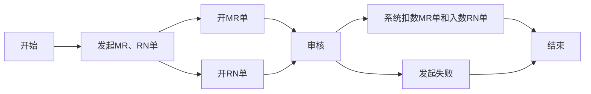

# 库存管控

## MR单和RN单
### 流程概览

### 1. 开MR单或者RN单
* **Notes系统 和 SAP系统**
    - 打开`MX MR & RN`系统
    - 点击按钮`New MR`如果是RN就点击`NEW RN`
    - `Select Type`选择`Departmental Drawing`然后点击`OK`按钮
    - 选择`Reason Code`（按需选择）
    - 选择部门
    - 输入生产拉号（如果为生产部时提供）
    - 在`Customer`输入相应的客户代码
    - 在`Remake`输入备注
    - 在`PN`和`Qty`输入料号和数量
    - 如果太多可以使用工具栏`Improt`导入需要的数据 只需要在表格中填写料号和数量
    - 上述步骤完成后 发起签批 等待相关领导签批完之后使用SAP
    - **MR单**
        - SAP输入事务代码`ZMMMR`
        - 在`MR NO`输入MR单产生的单号 在`Plant`输入6501
        - 进入界面后勾选需要扣数的物料
        - 点击`Post Goods Issue`
     - **RN单**
        - SAP输入事务代码`ZRNWH`
        - 在`MR/RN Number`输入RN单产生的单号 在`Plant`输入6501
        - 进入界面后勾选需要入数的物料
        - 在工具栏选择`Select Batch`
        - 然后勾选这个物料 在`SLoc`输入位置 然后点击`OK`
        - 点击`Post Goods Issue`
    - [mr_new.gif](https://github.com/dlelyw/VTX_6501/blob/main/files/gif/mr_new.gif)
    - [mr_deductions.gif](https://github.com/dlelyw/VTX_6501/blob/main/files/gif/mr_deductions.gif)
    

**常用的MR单`Reason Code`** 签批人为对应其部门负责人(所有的RN Type 不选择)

| 序号 | 代码 | 部门 | 生产拉号 |                            备注                            |
| ---- | ---- | ---- | -------- | --------------------------------------------------------- |
| 1    | SA   | 仓库 |          | 仓存调整，周期性盘点偏差，共用料平数                          |
| 2    | SA   | 生产 |          | PROD DISCREPANCY + B9821201680 生产差异 + 差异的单号        |
| 3    | LB   | 仓库 |          | 用于打包43LED灯                                            |
| 4    | LB   | SMT  | 1035     | 012986,012247,012082,011530,k10098,KLA881,KOA879多发板还仓 |
| 5    | LE   | SMT  | 1001     | 8/7/2024 SMD 打机共用料平数                                 |
| 6    | GF   | PMC  |          | 无需求物料，报废处理。                                       |
| 7    | G0   | PMC  |          | 送检索步海关，出检测报告前电池不能使用。                       |
| 8    | G3   | PMC  |          | 外发测试品平数,外发测试品平数,外发损耗品                       |

**常用的RN单`Reason Code`** RN单常用的几种，签批人对应其部门负责人(所有的RN Type 选择“Return to warehouse”)

| 序号 | 代码 | 部门 | 生产拉号 |                            备注                             |
| ---- | ---- | ---- | -------- | ---------------------------------------------------------- |
| 1    | SA   | 仓库 |          | 8月份周期性盘点偏差，好料入仓，共用料平数(PASS物料无需IOC再检查) |
| 2    | LE   | SMT  | 1001     | 打机共用料平数(PASS物料无需IOC再检查)                         |
| 3    | G0   | 仓库 |          | 打机共用料平数(PASS物料无需IOC再检查)                         |
| 4    | G0   | PMC  |          | NEC 回收包材，好料入仓                                       |

## 周期性物料盘点
### A类物料每月盘点
* **执行频率** **`每月一次`**
    - **SAP系统**
    - 输入事务指令`ZPP096`
    - 输入`6501`在字段`Plant`
    - 选择复选框`Only 80% Material`
    - 点击左上角闹钟图标🕥或按`F8`执行
    - 保存资料到本地
    - 整理资料打印（先按料号排序 再按位置排序）
    - [stock_Aitems.gif](https://github.com/dlelyw/VTX_6501/blob/main/files/gif/stock_Aitems.gif)
    

### 02 15 29字头贵重物料 每两周盘点
* **执行频率** **`每两周一次`**
    - **SAP系统**
    - 输入事务指令`MB52`
    - 在字段`Material`后面的按钮中输入`02*`分行`15*`分行`29*`
    - 输入`6501`在字段`Plant`
    - 点击左上角闹钟图标🕥或按`F8`执行
    - 保存资料到本地
    - 整理资料（使用SMT自动求和工具求和）
    - 打印资料
    - [stock_02.gif](https://github.com/dlelyw/VTX_6501/blob/main/files/gif/stock_02.gif)

---

> **相关指令**
> [SAP_Code.md](https://github.com/dlelyw/VTX_6501/blob/main/files/SAP_Code.md)
> [Movement_Code.md](https://github.com/dlelyw/VTX_6501/blob/main/files/Movement_Code.md)
> [MR_Code.md](https://github.com/dlelyw/VTX_6501/blob/main/files/MR_Code.md)

---