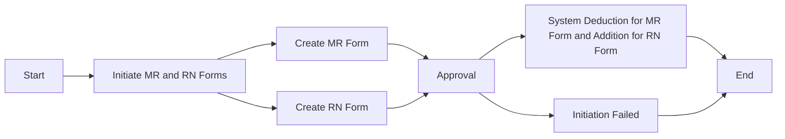

# Inventory Control

## MR and RN Forms
### Process Overview

### 1. Create MR or RN Form
* **Notes System and SAP System**
    - Open the `MX MR & RN` system
    - Click the `New MR` button, or `NEW RN` for RN
    - Select `Type` as `Departmental Drawing` and click `OK`
    - Choose `Reason Code` (as needed)
    - Select the department
    - Enter the production line number (if applicable for the production department)
    - Enter the corresponding customer code in `Customer`
    - Enter remarks in `Remake`
    - Enter part number and quantity in `PN` and `Qty`
    - If there are too many, use the `Import` tool to import the required data, only fill in the part number and quantity in the table
    - After completing the above steps, initiate the approval and wait for the relevant leaders to approve, then use SAP
    - **MR Form**
        - Enter transaction code `ZMMMR` in SAP
        - Enter the MR number generated in `MR NO` and `6501` in `Plant`
        - After entering the interface, check the materials that need to be deducted
        - Click `Post Goods Issue`
    - **RN Form**
        - Enter transaction code `ZRNWH` in SAP
        - Enter the RN number generated in `MR/RN Number` and `6501` in `Plant`
        - After entering the interface, check the materials that need to be added
        - Select `Select Batch` from the toolbar
        - Then check the material, enter the location in `SLoc`, and click `OK`
        - Click `Post Goods Issue`
    - [mr_new.gif](https://github.com/dlelyw/VTX_6501/blob/main/files/gif/mr_new.gif)
    - [mr_deductions.gif](https://github.com/dlelyw/VTX_6501/blob/main/files/gif/mr_deductions.gif)
    

**Common MR Form `Reason Codes`** The approver is the corresponding department head (All RN Types are not selected)

| No. | Code | Department | Production Line |                                            Remarks                                             |
| --- | ---- | ---------- | --------------- | ---------------------------------------------------------------------------------------------- |
| 1   | SA   | Warehouse  |                 | Inventory adjustment, periodic inventory discrepancies, shared material balancing              |
| 2   | SA   | Production |                 | PROD DISCREPANCY + B9821201680 Production discrepancy + discrepancy number                     |
| 3   | LB   | Warehouse  |                 | Used for packing 43LED lights                                                                  |
| 4   | LB   | SMT        | 1035            | 012986,012247,012082,011530,k10098,KLA881,KOA879 over-issued boards returned to warehouse      |
| 5   | LE   | SMT        | 1001            | 8/7/2024 SMD shared material balancing                                                         |
| 6   | GF   | PMC        |                 | No-demand materials, scrap disposal.                                                           |
| 7   | G0   | PMC        |                 | Sent to customs for inspection, batteries cannot be used before the test report is issued.     |
| 8   | G3   | PMC        |                 | Outsourced test material balancing, outsourced test material balancing, outsourced consumables |

**Common RN Form `Reason Codes`** Commonly used RN forms, the approver is the corresponding department head (All RN Types are selected as "Return to warehouse")

| No. | Code | Department | Production Line |                                                                          Remarks                                                                           |
| --- | ---- | ---------- | --------------- | ---------------------------------------------------------------------------------------------------------------------------------------------------------- |
| 1   | SA   | Warehouse  |                 | August periodic inventory discrepancies, good materials returned to warehouse, shared material balancing (PASS materials do not require IOC re-inspection) |
| 2   | LE   | SMT        | 1001            | Shared material balancing for machine operation (PASS materials do not require IOC re-inspection)                                                          |
| 3   | G0   | Warehouse  |                 | Shared material balancing for machine operation (PASS materials do not require IOC re-inspection)                                                          |
| 4   | G0   | PMC        |                 | NEC Recycling Package，good materials returned to warehouse                                                                                                 |

## Periodic Material Inventory
### Monthly Inventory for Category A Materials
* **Frequency** **`Monthly`**
    - **SAP System**
    - Enter transaction code `ZPP096`
    - Enter `6501` in the `Plant` field
    - Check the box `Only 80% Material`
    - Click the alarm clock icon 🕥 or press `F8` to execute
    - Save the data locally
    - Organize and print the data (sort by part number first, then by location)
    - [stock_Aitems.gif](https://github.com/dlelyw/VTX_6501/blob/main/files/gif/stock_Aitems.gif)

### Bi-weekly Inventory for High-value Materials Starting with 02, 15, 29
* **Frequency** **`Bi-weekly`**
    - **SAP System**
    - Enter transaction code `MB52`
    - In the `Material` field, enter `02*`, `15*`, and `29*` in separate lines
    - Enter `6501` in the `Plant` field
    - Click the alarm clock icon 🕥 or press `F8` to execute
    - Save the data locally
    - Organize the data (use SMT auto-sum tool for summation)
    - Print the data
    - [stock_02.gif](https://github.com/dlelyw/VTX_6501/blob/main/files/gif/stock_02.gif)

---
::: alert-success
**SAP Command Collection**
> [SAP_Code.md](https://github.com/dlelyw/VTX_6501/blob/main/files/SAP_Code.md)
:::

---