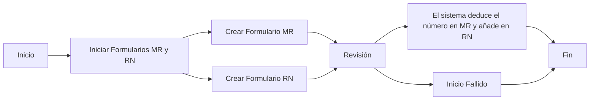

# Control de Inventario

## Formularios MR y RN
### Resumen del Proceso

### 1. Abrir MR o RN
* **Sistema Notes y SAP**
    - Abrir el sistema `MX MR & RN`
    - Hacer clic en el botón `New MR` si es RN, hacer clic en `NEW RN`
    - En `Select Type`, seleccionar `Departmental Drawing` y luego hacer clic en el botón `OK`
    - Seleccionar `Reason Code` (según sea necesario)
    - Seleccionar el departamento
    - Ingresar el número de línea de producción (si es para el departamento de producción)
    - En `Customer`, ingresar el código del cliente correspondiente
    - En `Remake`, ingresar notas
    - En `PN` y `Qty`, ingresar el número de pieza y la cantidad
    - Si hay demasiados datos, se puede usar la herramienta `Import` para importar los datos necesarios, solo se necesita completar el número de pieza y la cantidad en la tabla
    - Después de completar los pasos anteriores, iniciar la aprobación y esperar a que los líderes correspondientes aprueben antes de usar SAP
    - **MR**
        - En SAP, ingresar el código de transacción `ZMMMR`
        - En `MR NO`, ingresar el número generado por el MR, y en `Plant`, ingresar 6501
        - En la interfaz, marcar los materiales que necesitan ser deducidos
        - Hacer clic en `Post Goods Issue`
    - **RN**
        - En SAP, ingresar el código de transacción `ZRNWH`
        - En `MR/RN Number`, ingresar el número generado por el RN, y en `Plant`, ingresar 6501
        - En la interfaz, marcar los materiales que necesitan ser ingresados
        - En la barra de herramientas, seleccionar `Select Batch`
        - Luego marcar este material, en `SLoc` ingresar la ubicación y hacer clic en `OK`
        - Hacer clic en `Post Goods Issue`
    - [mr_new.gif](https://github.com/dlelyw/VTX_6501/blob/main/files/gif/mr_new.gif)
    - [mr_deductions.gif](https://github.com/dlelyw/VTX_6501/blob/main/files/gif/mr_deductions.gif)

**Códigos de razón comunes para MR** Los aprobadores son los responsables del departamento correspondiente (todos los tipos de RN no se seleccionan)

| Número | Código | Departamento | Número de línea de producción | Notas |
| ------ | ------ | ------------ | ---------------------------- | ----- |
| 1      | SA     | Almacén      |                              | Ajuste de inventario, desviación de inventario periódico, ajuste de materiales compartidos |
| 2      | SA     | Producción   |                              | PROD DISCREPANCY + B9821201680 Discrepancia de producción + número de discrepancia |
| 3      | LB     | Almacén      |                              | Para empaquetar luces LED 43 |
| 4      | LB     | SMT          | 1035                         | 012986,012247,012082,011530,k10098,KLA881,KOA879 Placas adicionales devueltas al almacén |
| 5      | LE     | SMT          | 1001                         | 8/7/2024 Ajuste de materiales compartidos para SMD |
| 6      | GF     | PMC          |                              | Material sin demanda, desecho. |
| 7      | G0     | PMC          |                              | Enviar a inspección aduanera, no usar baterías antes del informe de inspección. |
| 8      | G3     | PMC          |                              | Ajuste de muestras enviadas para pruebas, ajuste de productos de desgaste enviados |

**Códigos de razón comunes para RN** Los aprobadores son los responsables del departamento correspondiente (todos los tipos de RN seleccionan "Return to warehouse")

| Número | Código | Departamento | Número de línea de producción | Notas |
| ------ | ------ | ------------ | ---------------------------- | ----- |
| 1      | SA     | Almacén      |                              | Desviación de inventario periódico de agosto, materiales buenos ingresados al almacén, ajuste de materiales compartidos (materiales PASS no necesitan revisión de IOC) |
| 2      | LE     | SMT          | 1001                         | Ajuste de materiales compartidos para producción (materiales PASS no necesitan revisión de IOC) |
| 3      | G0     | Almacén      |                              | Ajuste de materiales compartidos para producción (materiales PASS no necesitan revisión de IOC) |
| 4      | G0     | PMC          |                              | Empaques recuperados de NEC, materiales buenos ingresados al almacén |

## Inventario periódico de materiales
### Materiales de clase A inventariados mensualmente
* **Frecuencia de ejecución** **`Mensual`**
    - **Sistema SAP**
    - Ingresar el código de transacción `ZPP096`
    - Ingresar `6501` en el campo `Plant`
    - Seleccionar la casilla `Only 80% Material`
    - Hacer clic en el ícono de reloj 🕥 en la esquina superior izquierda o presionar `F8` para ejecutar
    - Guardar los datos localmente
    - Organizar los datos e imprimir (primero ordenar por número de pieza, luego por ubicación)
    - [stock_Aitems.gif](https://github.com/dlelyw/VTX_6501/blob/main/files/gif/stock_Aitems.gif)

### Materiales valiosos con prefijo 02 15 29 inventariados cada dos semanas
* **Frecuencia de ejecución** **`Cada dos semanas`**
    - **Sistema SAP**
    - Ingresar el código de transacción `MB52`
    - En el campo `Material`, ingresar `02*` en una línea, `15*` en otra y `29*` en otra
    - Ingresar `6501` en el campo `Plant`
    - Hacer clic en el ícono de reloj 🕥 en la esquina superior izquierda o presionar `F8` para ejecutar
    - Guardar los datos localmente
    - Organizar los datos (usar la herramienta de suma automática de SMT)
    - Imprimir los datos
    - [stock_02.gif](https://github.com/dlelyw/VTX_6501/blob/main/files/gif/stock_02.gif)

---

::: alert-success
**Conjunto de comandos SAP**
> [SAP_Code.md](https://github.com/dlelyw/VTX_6501/blob/main/files/SAP_Code.md)
:::

--- 