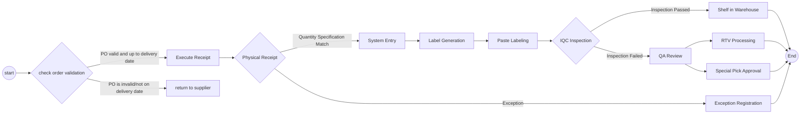

## <center>Warehouse Process and Operation Specifications

## <center>Receiving process overview


## Material Receiving Standardized Process

## 1. Order checking operation (SAP system operation)

**Standardized Operating Procedure**:
1. Enter the transaction code `ZME2O`. 2.
2. Enter the delivery order information in the “Plant” and “PO” fields. 3.
3. Click on the alarm clock icon in the upper left corner or press `F8` to execute.
4. Key information quadruple check:
   - ✅ Material code consistency
   - ✅ Order quantity consistency
   - ✅ Delivery date validity (compare OA DATE)
   - ✅ System delivery date and physical label consistency

**Exception Handling**:
> 🚨 When there is “PO countless/no delivery date”, immediately suspend the receiving process and contact the supplier to coordinate the processing.


## 2. Receiving point count standardization

**Standard Operating Procedures**:
1. Three-way comparison:
   - Physical package labeling
   - Supplier delivery note
   - SAP system order
2. appearance quality inspection:
   - 🔍 Check package integrity
   - ⚠️ Rule out abnormalities such as deformation/damage/moisture etc.
3. Post-signing operation:
   - Post-signing operation: 🔍 Labeling the location of the waiting area (format: `QA01`)
   - Move the goods to the yellow inspection area

## 3. Inventory posting operation (WMS 4.2)

**Standard operating procedures**:
1. Data entry:
   - Input Invoice No. → Packing List No. → PO No. → `[ Enter ]` in order.
2. Packaging Matching:
   - Match the physical material number/quantity in the upper right view area
   - The cursor is positioned to the receiving quantity field
3. Packaging information confirmation:
   - Enter the actual arrival package specifications (number of boxes/packing units)
4. System Operation:
   - Click `[ Save ]` to generate the batch number.  
   - Write the generated batch number to the document.


> **Download attachments**
<a href="https://github.com/dlelyw/VTX_6501/blob/c39a6921d8376c70f2af9b3e8e6fcf0235c06750/files/SmtAutoCalculated.xls"> Automatic Calculation File Excle </a>

**Hints**:
```code
The stock query command: ZMM138
The overdue batch is automatically transferred to the suspense bin.
```

## 4. Labeling Specifications

**Standard Operating Procedure**:
1. Label Positioning.
   - Upper right corner of the package 30cm clean area
   - Label positioning: 30cm clean area in the upper right corner of the outer packaging ≥ 5cm from the edge to prevent abrasion
2. Posting requirements: one label for each item, prohibited from covering the original factory logo.
   - One item, one label, prohibited to cover the original factory logo
   - The batch number must be completely visible
 
## 5. IQC process for over-ordering

**Standard Operating Procedures (SOPs)
1. Navigate to the function menu:  
   - `Location` → `Move location` → `Enter batch` → `Enter new location` → `Save`.
   
2. Batch number entry specification :
   - Format requirements: fixed 10-digit number
   - Complementary rules: leading complement “0”.  
   - Example: original batch “1234567” → enter “00001234567”.
---

# <center>Standardized process for material returns

    
## 1. System Initiated Returns
### 1.1 Daily operation specification
- **Execution frequency**: Daily timed operation
- **Standard Operating Procedures**:
  1. Login to Notes and SAP system
  2. Enter the “Returns” module
  3. Download the list of returns for the day
  4. collect these returns to the RTV warehouse
 
**Notes**:
```code
The RTV bin is an area or warehouse in a warehouse dedicated to Return To Vendor (RTV) merchandise. It is an important part of supply chain and warehouse management and is mainly used to store and manage merchandise that needs to be returned to suppliers.
The main functions of an RTV warehouse:
Storage of returned merchandise:
Stores merchandise that needs to be returned to suppliers due to quality issues, damage, expiration dates, order errors, or other reasons.
Role of the RTV Warehouse:
Reduce losses: Reduce inventory costs and losses by returning unqualified merchandise in a timely manner.
Optimize supply chain: Help suppliers understand merchandise problems and improve product quality.
Improve efficiency: Centralize the return process to improve warehouse operation efficiency.
```


## 2. Receiving Returns Processing
### 2.1 MRB returns collection process
**Standard Operating Procedures**:
1. **System login and download information**
   - Open the Notes system and find the menu `MX IQC Inspection Document on...'. `
   - Find the button `Gen Report` and click on it, select the serial number `5 Sotre Reject Report`.
   - Follow the downloaded information to the IQC to collect the return.

### 2.2 RN Returns Collection Process
**Standard Operating Procedure**:
1. **System Login and Downloading Information**
   - Open SAP and enter the transaction code `ZIMWH`.
   - Enter `6501` in the `Plant` field.
   - Click on the alarm icon in the upper left corner or press `F8` to execute.
   - Select all the data to be returned and download it to a local table.
   - Go to the IQC RN room and collect the returns to the RTV bin according to the returns list.

## 3 Returns count into returns bin
**Standard Operating Procedure**:
1. **SAP system**
   - Open SAP and enter transaction code `MB1B`.
   - Enter `Doc.Header Text in the field Enter date and return type` → `Plant enter 6501` → `Movement type enter 311` → `Storage Loation enter JB01(RN)/JA01(MRB)`.
   - Press the Enter key on the keyboard to go to the next screen
   - Enter `Material enter material number` → `Quantity enter quantity` → `Batch enter batch` → `Rcvg SLoc enter destination of move` in field
   - Save

## 4 Return to supplier
**Standard Operating Procedures**:
1. **Notes system**
    - Open the Notes system and locate the menu `MX Delivery Order on MEXCMS11`.
    - Select `New` in the upper left hand corner and click on
    - Fill in the data:
         1. Click the `add` button in the center left to select the supplier or material to be returned. 2.
         2. `Goods Ready Pick Date * :` Click both to select the return date. 3.
         3. `Region * :` Select the location of the return. 4.
         4. `CC to PUR/PMT *: `Copy mail to the relevant PUR and PMT.
         5. `Prepayment *:` Select `No`.
         6. `Carrier *:` Select or enter `LOCAL`.
         7. Select the appropriate approving officer
    - Submit to PUT or PMT for approval
    - Print 2 copies of the return form (2 signed by the supplier, 1 for the warehouse and 1 for the supplier).   
        
